# Perry — план автоматизации процессов (AI, n8n/Make, API)

> **Для кого:** Сергей Черныш ([GitHub Teslyar75](https://github.com/Teslyar75)), организатор команды и автор Product API дипломного проекта Perry (IT STEP).
> **Что это:** план, как превратить Perry из «дипломного магазина» в **магазин, где рутину делают роботы**: [AI](#g-ai) (искусственный интеллект), [n8n](#g-n8n) / [Make](#g-make) (конструкторы автоматизаций) и [API](#g-api) (программные «входы» в системы). Документ одновременно служит **кейсом для портфолио** под вакансию [AI Automation / Process Optimization Specialist в Race Expert](#vacancy).
> **Версия:** 1.0, 6 октября 2026. Код смотрим на коммите [`bcaec5f`](https://github.com/Teslyar75/My_Amazon2/commit/bcaec5fc8ab617830197b5fe69a976c6f214cb3e): все ссылки на код ведут на конкретные строки и не «уедут».
> **Условные знаки:** ✅ проверено по коду, скриншоту или источнику · ⚠️ **примерная оценка** или **допущение** · ❓ **требует уточнения**.

## <a id="toc"></a>Оглавление

1. [Коротко](#short): что делаем и сколько это даёт
2. [Что за проект](#project): Perry, команда, модули, архитектура
3. [Как выглядит Perry сейчас](#screens): 19 скриншотов с описанием и привязкой к автоматизациям
4. [Части проекта подробно](#modules): витрина, Product API, Auth, админка, мобильное приложение
5. [Админка: что неудобно и что автоматизировать](#admin-ux): по каждому экрану
6. [Развитие сервиса: чего не хватает магазину](#growth)
7. [Цель и метрики](#goals): часы, деньги, ошибки, скорость ответа
8. [Карта ручных процессов](#map): кто, как часто, сколько минут
9. Потоки автоматизации:
   [А. Склад и логистика](#stream-a) · [Б. Каталог и контент](#stream-b) · [В. Маркетинг](#stream-v) · [Г. Продажи и поддержка](#stream-g) · [Д. Отчётность и контроль](#stream-d)
10. [Система автоматизации целиком](#system): слои, события, данные
11. [AI-агенты и оркестрация](#agents): агент-диспетчер, одобрение человеком, журнал действий
12. [n8n или Make](#tools): сравнение и выбор
13. [Каких API не хватает в Perry](#api-gaps)
14. [Итоговая оценка эффекта](#effect): дотягиваем ли до 250 и 500 часов
15. [План внедрения и портфолио](#plan): график и 3 воркфлоу для собеседования
16. [Технические требования](#tech)
17. [Риски](#risks)
18. [Открытые вопросы](#questions)
19. [Итоговая схема: от заказа до доставки](#final)
20. [Источники](#sources) · [Глоссарий](#glossary)

У каждого потока одинаковые подразделы: **Цель → Как сейчас и как будет → Схема → Шаги → Связь с API Perry → Эффект → Технические требования → Сложность → Риски.** Процессы пронумерованы (А1…А6, Б1…Б4, В1…В7, Г1…Г3, Д1…Д2), на каждый можно сослаться: например, [А4](#a4) — накладные «Новой почты».

---

## <a id="short"></a>1. Коротко

**Идея в одной фразе.** Берём Perry так, как будто это работающий интернет-магазин, находим, где люди делают руками одно и то же, и отдаём это [воркфлоу](#g-workflow) в n8n, которые ходят в [API Perry](#mod-api), «Новую почту», Telegram и Google Sheets. Над ними стоит [AI-агент-оркестратор](#agents): он решает, какой воркфлоу запустить, а важные действия (деньги, публикации, письма клиентам) **отдаёт человеку на одобрение**.

| | |
|---|---|
| **Что уже есть** ✅ | Работающий магазин: витрина React, Product API на .NET 8 + PostgreSQL, вход через отдельный Auth-сервис, админка, мобильное приложение Expo. 15 автотестов, ~194 демо-товара. См. [Что за проект](#project) |
| **Сколько ручной работы** ⚠️ | ≈ 473 ч/мес при допущении «50 заказов в день» ([карта процессов](#map)) |
| **Сколько уберём** ⚠️ | ≈ 362 ч/мес после 12 недель внедрения ≈ **72 500 грн/мес** при примерной ставке 200 грн/ч ([эффект](#effect)) |
| **Цель вакансии** ✅ | 250 сэкономленных часов в месяц минимум, около 500 ч/мес к концу первых 3 месяцев ([вакансия](#vacancy)) |
| **Честный вывод** | 250 ч/мес достигаем на 2-м месяце. 500 ч/мес при 50 заказах в день **не достигаем**: нужно ≈ 90 заказов в день или ещё один поток (например, финансы). Расчёт в [разделе 14](#effect-500) |
| **Первые шаги для портфолио** | 3 воркфлоу, которые можно собрать в локальном n8n против локального Perry API за выходные: [KPI-дайджест](#pf-1), [бот «где мой заказ»](#pf-2), [AI-описание товара с одобрением](#pf-3) |
| **Чего не хватает в коде** | исходящих [вебхуков](#g-webhook), сервисного токена для n8n, точечного обновления остатков, полей доставки в заказе. Список в [разделе 13](#api-gaps) |

<a id="vacancy"></a>**Вакансия (проверено 06.10.2026 на [work.ua/jobs/8532037](https://www.work.ua/jobs/8532037/))** ✅:

- **Должность:** AI Automation, Process Optimization Specialist, компания Race Expert ([raceexpert.com.ua](https://raceexpert.com.ua/)), розничная торговля, 10–50 сотрудников, удалённо, полная занятость, 5/2, уровень Middle.
- **Зарплата:** 28 000 – 65 000 грн «после всех вычетов», ставка + бонус. Рассматривают бонусы, привязанные к реальному экономическому эффекту.
- **Задачи (дословно по смыслу):** самому находить процессы для автоматизации, раскладывать работу команд на операции, описывать будущую логику, собирать и запускать автоматизации (AI, API, Make, n8n), следить, чтобы ими реально пользовались, и **считать экономию времени и денег** каждого решения.
- **С чего начнут:** первым большим направлением названы **бухгалтерия и финансовые процессы**. Дальше: контент-маркетинг, продажи, операционные процессы, закупки, **склад**, аналитика. ⚠️ Уточнение: пользователь говорил про «складскую логистику и маркетинг», а в тексте вакансии первыми стоят финансы, склад и маркетинг идут следом.
- **Ориентир:** минимум **250** сэкономленных рабочих часов в месяц; за первые 3 месяца выйти примерно на **500** сэкономленных часов в месяц.
- **Плюсом будет:** n8n, Make, AI-модели и AI-агенты, API и webhooks, CRM, ClickUp, 1С или другие учётные системы, e-commerce. Глубокая разработка не обязательна.
- **Формат:** украинский язык обязателен, подчинение Project Manager, своей команды нет.
- **Главная фраза для портфолио:** «Нам не подойдёт человек, который говорит: "Я сделал классного AI-бота", но не может ответить, что этот бот дал бизнесу в часах или деньгах». Поэтому в этом документе **у каждого шага есть часы и гривны**.

> ❓ Внутренние процессы Race Expert нам неизвестны, мы их **не описываем**. Все процессы ниже относятся к Perry как к условному работающему магазину. Где в коде Perry чего-то нет, стоит пометка **допущение**.

<p class="navlinks"><a href="#toc">↑ к оглавлению</a> · <a href="#project">→ далее: Что за проект</a></p>

---

## <a id="project"></a>2. Что за проект

### <a id="project-what"></a>2.1. Perry одной картинкой

**Perry (PERRY)** — дипломный командный проект IT STEP: интернет-магазин-маркетплейс, «наша версия Амазона». Покупатель листает каталог с фильтрами, кладёт товары в корзину (даже без входа), оформляет заказ, следит за статусом, пишет отзывы и ведёт список избранного (wishlist). Администратор управляет товарами, категориями, отзывами, заказами и пользователями.

Репозитории: [Teslyar75/My_Amazon2](https://github.com/Teslyar75/My_Amazon2) (основной, его Сергей называет «Tesla 75 / Amazon 2») и командное зеркало [ITSTEP-PERRY/Back_end_for_our_poroject](https://github.com/ITSTEP-PERRY/Back_end_for_our_poroject). На ноутбуке Сергея проект лежит в `D:\Perry` (в этом плане его не трогаем). Клон на коммите `bcaec5f` лежит в `/workspace/perry`.

| Факт | Значение | Откуда |
|---|---|---|
| Роль Сергея | организатор команды (доска [Trello ITSTEP-PERRY](https://trello.com/b/bwEYs3Kq/itstep-perry), задачи, ежедневные отчёты) и автор **Product API** | [README](https://github.com/Teslyar75/My_Amazon2/blob/bcaec5fc8ab617830197b5fe69a976c6f214cb3e/README.md) |
| Чужие зоны | **Auth-сервис** (вход, JWT) — Влад; **бэкенд админки** — другой участник | [AUTH-INTEGRATION.md](https://github.com/Teslyar75/My_Amazon2/blob/bcaec5fc8ab617830197b5fe69a976c6f214cb3e/docs/%D1%81%D1%82%D1%8B%D0%BA%D0%B8/AUTH-INTEGRATION.md), [DEFENSE_BACKEND.md](https://github.com/Teslyar75/My_Amazon2/blob/bcaec5fc8ab617830197b5fe69a976c6f214cb3e/project_defense/DEFENSE_BACKEND.md) |
| Стек | React 19 + Vite (витрина, `localhost:3000`), ASP.NET Core 8 Product API со [Swagger](#g-swagger) (`:5272`), PostgreSQL 16, Expo (мобильное) | [Program.cs](https://github.com/Teslyar75/My_Amazon2/blob/bcaec5fc8ab617830197b5fe69a976c6f214cb3e/src/Perry.Api/Program.cs#L41-L80), [docker-compose.yml](https://github.com/Teslyar75/My_Amazon2/blob/bcaec5fc8ab617830197b5fe69a976c6f214cb3e/docker-compose.yml#L11-L59), [mobile/package.json](https://github.com/Teslyar75/My_Amazon2/blob/bcaec5fc8ab617830197b5fe69a976c6f214cb3e/mobile/package.json) |
| Цифры с защиты | 22 экрана Figma, 29 страниц, 10 разделов API, 15 тестов, 14 диаграмм, 25 ежедневных отчётов, готовность ~94–96 % | защита; 15 тестов ✅ по [tests/Perry.Tests](https://github.com/Teslyar75/My_Amazon2/tree/bcaec5fc8ab617830197b5fe69a976c6f214cb3e/tests/Perry.Tests), 25 файлов в [docs/журнал](https://github.com/Teslyar75/My_Amazon2/tree/bcaec5fc8ab617830197b5fe69a976c6f214cb3e/docs/%D0%B6%D1%83%D1%80%D0%BD%D0%B0%D0%BB) ✅ |
| Демо-данные | ~194 товара с фото из DummyJSON | [DbSeeder.cs](https://github.com/Teslyar75/My_Amazon2/blob/bcaec5fc8ab617830197b5fe69a976c6f214cb3e/src/Perry.Infrastructure/Persistence/DbSeeder.cs#L67-L77) |

### <a id="project-modules"></a>2.2. Из каких частей состоит

| Часть | Что это простыми словами | Где в коде | Подробно | Экраны |
|---|---|---|---|---|
| **Витрина** (frontend) | сайт для покупателя: главная, каталог, карточка товара, корзина, оформление, кабинет | [frontend/src/app/router.tsx](https://github.com/Teslyar75/My_Amazon2/blob/bcaec5fc8ab617830197b5fe69a976c6f214cb3e/frontend/src/app/router.tsx#L37-L74) | [4.1](#mod-front) | [рис. 1–10](#scr-home) |
| **Product API** (зона Сергея) | «мозг» магазина: товары, категории, корзина, заказы, отзывы, wishlist, остатки | [src/Perry.Api/Controllers](https://github.com/Teslyar75/My_Amazon2/tree/bcaec5fc8ab617830197b5fe69a976c6f214cb3e/src/Perry.Api/Controllers) | [4.2](#mod-api) | все экраны витрины |
| **Auth-сервис** (зона Влада) | отдельный сервис в Azure: регистрация, вход, коды на email, выдача [JWT](#g-jwt) | [AuthInternalClient.cs](https://github.com/Teslyar75/My_Amazon2/blob/bcaec5fc8ab617830197b5fe69a976c6f214cb3e/src/Perry.Infrastructure/Services/AuthInternalClient.cs#L21-L25) | [4.3](#mod-auth) | [рис. 11](#scr-login) |
| **Админка** (UI + Admin Service) | панель управления: товары, категории, отзывы, заказы, пользователи | [frontend/src/pages/admin](https://github.com/Teslyar75/My_Amazon2/tree/bcaec5fc8ab617830197b5fe69a976c6f214cb3e/frontend/src/pages/admin) | [4.4](#mod-admin) | [рис. 12–18](#scr-admin-dashboard) |
| **Мобильное приложение** | то же, что витрина, на телефоне (Expo, React Native) | [mobile/src/screens](https://github.com/Teslyar75/My_Amazon2/tree/bcaec5fc8ab617830197b5fe69a976c6f214cb3e/mobile/src/screens) | [4.5](#mod-mobile) | [рис. 19](#scr-mobile) |

### <a id="project-arch"></a>2.3. Как всё устроено (по диаграммам защиты)

На защите команда показала 18 диаграмм. Две главные, без пересказа:

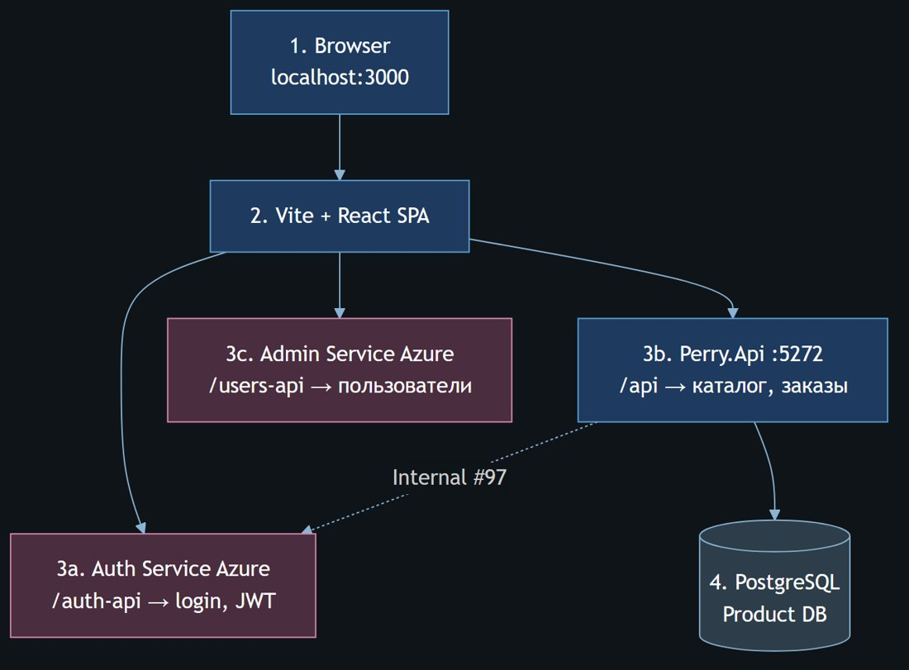

*Рис. A. Общая архитектура. Источник: диаграмма защиты [project_defense/views_project/01-diagram.png](https://github.com/Teslyar75/My_Amazon2/blob/bcaec5fc8ab617830197b5fe69a976c6f214cb3e/project_defense/views_project/01-diagram.png).*

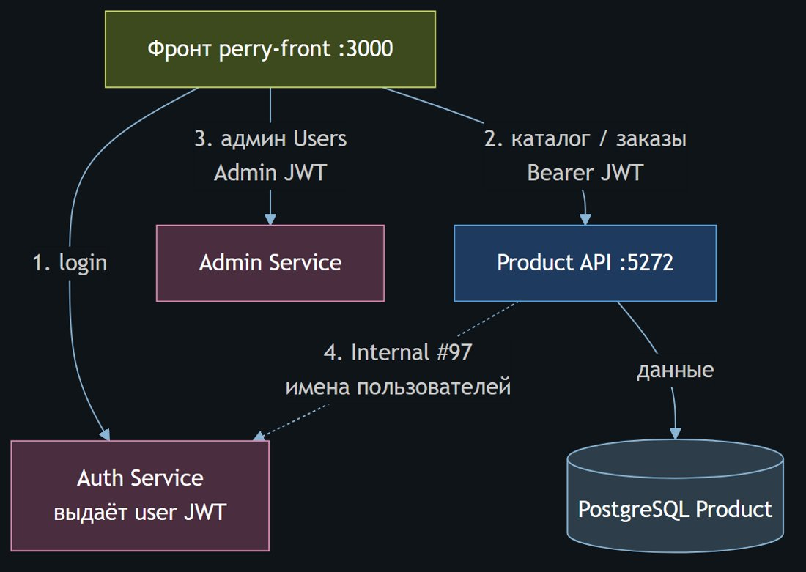

*Рис. B. Три сервиса и порядок вызовов: 1) вход в Auth, 2) каталог и заказы в Product API с JWT, 3) пользователи через Admin Service, 4) внутренний запрос Product API → Auth за именами пользователей (#97). Источник: [project_defense/views_project/13-diagram.png](https://github.com/Teslyar75/My_Amazon2/blob/bcaec5fc8ab617830197b5fe69a976c6f214cb3e/project_defense/views_project/13-diagram.png).*

Та же схема в Mermaid, с местом, куда встанет автоматизация (пунктир — то, чего ещё нет):

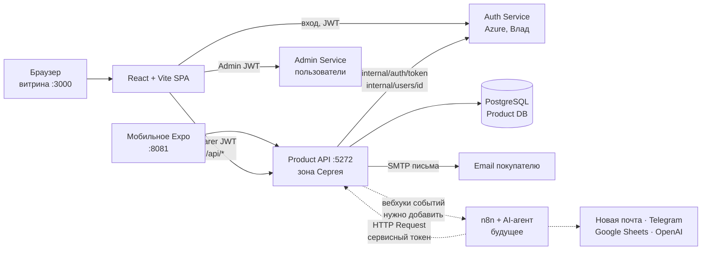
```mermaid
flowchart LR
  B["Браузер<br/>витрина :3000"] --> SPA["React + Vite SPA"]
  M["Мобильное Expo<br/>:8081"] --> API
  SPA -->|"вход, JWT"| AUTH["Auth Service<br/>Azure, Влад"]
  SPA -->|"Bearer JWT<br/>/api/*"| API["Product API :5272<br/>зона Сергея"]
  SPA -->|"Admin JWT"| ADM["Admin Service<br/>пользователи"]
  API -->|"internal/auth/token<br/>internal/users/id"| AUTH
  API --> DB[("PostgreSQL<br/>Product DB")]
  API -->|"SMTP письма"| MAIL["Email покупателю"]
  N8N["n8n + AI-агент<br/>будущее"] -.->|"HTTP Request<br/>сервисный токен"| API
  API -.->|"вебхуки событий<br/>нужно добавить"| N8N
  N8N -.-> EXT["Новая почта · Telegram<br/>Google Sheets · OpenAI"]
```

**Как ходит запрос (кратко).** Покупатель входит через Auth и получает JWT. Витрина шлёт его в Product API в заголовке `Authorization: Bearer …`. Product API сам проверяет подпись токена ([JwtAuthenticationService.cs](https://github.com/Teslyar75/My_Amazon2/blob/bcaec5fc8ab617830197b5fe69a976c6f214cb3e/src/Perry.Api/Extensions/JwtAuthenticationService.cs#L26-L40)) и берёт из него `UserId` ([AuthClaims.cs](https://github.com/Teslyar75/My_Amazon2/blob/bcaec5fc8ab617830197b5fe69a976c6f214cb3e/src/Perry.Api/Auth/AuthClaims.cs#L13-L22)). Своей таблицы пользователей в Product DB нет: email и имя Product API при необходимости спрашивает у Auth по внутреннему каналу ([AuthInternalClient.cs](https://github.com/Teslyar75/My_Amazon2/blob/bcaec5fc8ab617830197b5fe69a976c6f214cb3e/src/Perry.Infrastructure/Services/AuthInternalClient.cs#L64-L96)). Этот же приём, «сервис получает свой токен», нужен и для n8n: см. [сервисный токен, API-2](#api-2).

**Что важно для автоматизации** ✅:

- уже есть **письма** покупателю при заказе и смене статуса ([OrderService.cs](https://github.com/Teslyar75/My_Amazon2/blob/bcaec5fc8ab617830197b5fe69a976c6f214cb3e/src/Perry.Infrastructure/Services/OrderService.cs#L357-L368), [строки 387–403](https://github.com/Teslyar75/My_Amazon2/blob/bcaec5fc8ab617830197b5fe69a976c6f214cb3e/src/Perry.Infrastructure/Services/OrderService.cs#L387-L403)). Значит, точки «заказ создан» и «статус изменился» в коде уже есть, к ним легко прицепить вебхук ([API-1](#api-1));
- при заказе остаток **списывается** и товар уходит в `OutOfStock` на нуле ([строки 344–351](https://github.com/Teslyar75/My_Amazon2/blob/bcaec5fc8ab617830197b5fe69a976c6f214cb3e/src/Perry.Infrastructure/Services/OrderService.cs#L344-L351));
- есть подписка «сообщить о поступлении», но **письмо о поступлении никто не отправляет**: поле `NotifiedAtUtc` нигде в коде не заполняется ([StockNotifyRequest.cs](https://github.com/Teslyar75/My_Amazon2/blob/bcaec5fc8ab617830197b5fe69a976c6f214cb3e/src/Perry.Domain/Entities/StockNotifyRequest.cs#L19-L20)). Готовая быстрая победа для [А2](#a2);
- есть `/api/health` для мониторинга ([Program.cs](https://github.com/Teslyar75/My_Amazon2/blob/bcaec5fc8ab617830197b5fe69a976c6f214cb3e/src/Perry.Api/Program.cs#L180-L194)) и dev-вход администратора для локальных демо ([DevAdminAuthController.cs](https://github.com/Teslyar75/My_Amazon2/blob/bcaec5fc8ab617830197b5fe69a976c6f214cb3e/src/Perry.Api/Controllers/DevAdminAuthController.cs#L39-L45)), его используют [портфолио-воркфлоу](#portfolio).

<p class="navlinks"><a href="#toc">↑ к оглавлению</a> · <a href="#screens">→ далее: Как выглядит Perry сейчас</a></p>

---

## <a id="screens"></a>3. Как выглядит Perry сейчас

Здесь 19 настоящих скриншотов проекта. Под каждым: **что это за экран**, **что он делает**, **какой API за ним стоит** и **какие автоматизации к нему привязаны** (ссылки ведут в потоки А–Д, а оттуда есть ссылки обратно сюда).

> **Источник скриншотов.** Скрины с датой 04.10.2026 лежат в репозитории в [`docs/screenshots/2026-10-04/`](https://github.com/Teslyar75/My_Amazon2/tree/bcaec5fc8ab617830197b5fe69a976c6f214cb3e/docs/screenshots/2026-10-04): под каждым дана прямая ссылка на файл на коммите `bcaec5f`. Кадры спринта 19.09.2026 и мобильный скрин взяты из локальной копии `D:\Perry\My_Amazon2`. На коммите `bcaec5f` этих файлов в репозитории нет, поэтому GitHub-ссылки под ними не даём. Картинки сжаты до ширины 1024 px (JPG) и лежат рядом с документом в `img/`.
>
> ⚠️ Замечание: в папке спринта 19.09 имена трёх файлов не совпадают с содержимым. `12-account-my-orders.png` на самом деле показывает модерацию отзывов, `13-admin-reviews-approve.png` показывает модалку заказа, а `14-account-order-details-modal.png` — список «My orders». Подписи ниже сделаны **по тому, что на картинке**.

### <a id="scr-g-front"></a>3.1. Витрина: путь покупателя

#### <a id="scr-home"></a>Рис. 1. Главная

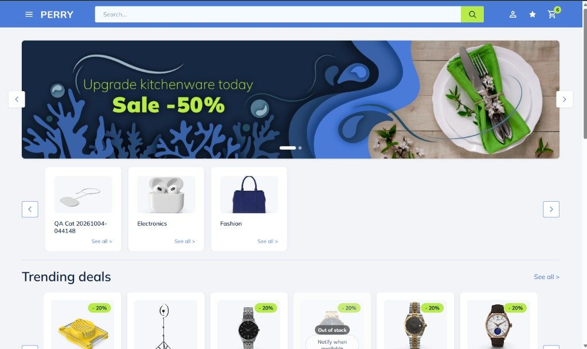

*Источник: [docs/screenshots/2026-10-04/home/01-home-hero.png](https://github.com/Teslyar75/My_Amazon2/blob/bcaec5fc8ab617830197b5fe69a976c6f214cb3e/docs/screenshots/2026-10-04/home/01-home-hero.png)*

- **Что видно:** синяя шапка с поиском, иконки аккаунта, избранного и корзины (на значке 6 товаров). Баннер-карусель «Upgrade kitchenware today — Sale −50 %». Карточки категорий (Electronics, Fashion и тестовая «QA Cat…»). Блок **Trending deals** с бейджами «−20 %» и одной карточкой **Out of stock / Notify when available**.
- **API:** категории — `GET /api/categories`, товары — `GET /api/products` ([frontend/src/api/index.ts](https://github.com/Teslyar75/My_Amazon2/blob/bcaec5fc8ab617830197b5fe69a976c6f214cb3e/frontend/src/api/index.ts#L222-L233)). Кнопка Notify шлёт `POST /api/products/{id}/notify` ([StockNotifyController.cs](https://github.com/Teslyar75/My_Amazon2/blob/bcaec5fc8ab617830197b5fe69a976c6f214cb3e/src/Perry.Api/Controllers/StockNotifyController.cs#L36-L79)).
- **Автоматизация:** письмо «товар снова в наличии» подписчикам Notify ([А2](#a2)); баннеры и подборки «Trending deals» из акций, собранные AI ([В1](#v1)); тестовые категории вроде «QA Cat…» ловит ежедневная проверка витрины ([Д2](#d2)).

#### <a id="scr-catalog"></a>Рис. 2. Каталог с фильтрами

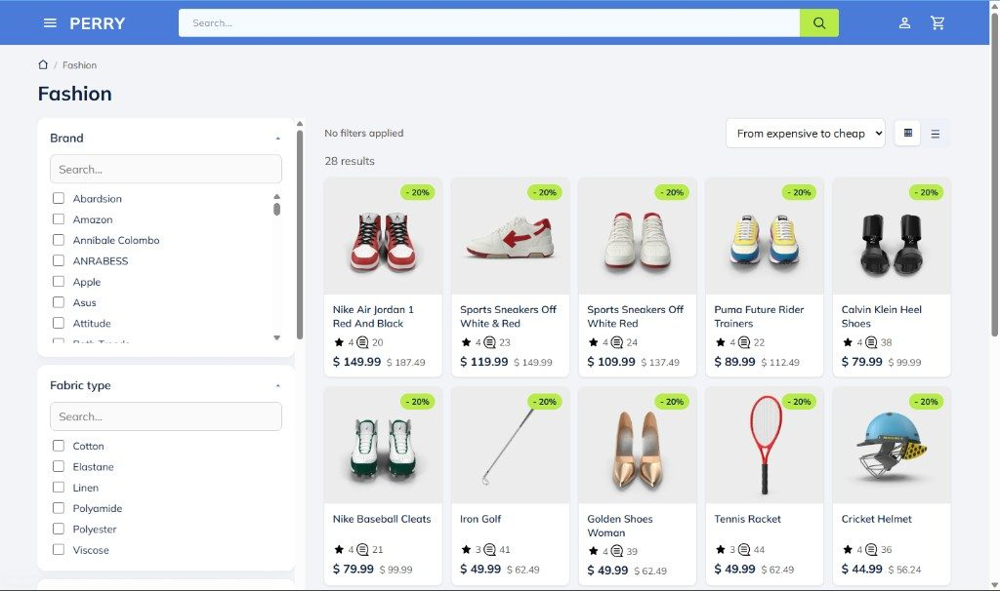

*Источник: [docs/screenshots/2026-10-04/catalog/06-catalog-fashion.png](https://github.com/Teslyar75/My_Amazon2/blob/bcaec5fc8ab617830197b5fe69a976c6f214cb3e/docs/screenshots/2026-10-04/catalog/06-catalog-fashion.png)*

- **Что видно:** раздел Fashion, 28 результатов, сетка карточек (фото, название, звёзды, число отзывов, цена и старая цена). Слева фильтры [фасеты](#g-facet): **Brand** (Abardsion, Amazon, Apple…) и **Fabric type** (Cotton, Elastane, Linen…). Сортировка «From expensive to cheap».
- **API:** `GET /api/products?categoryId=…&brands=…&fabrics=…&sort=…` ([ProductsController.cs](https://github.com/Teslyar75/My_Amazon2/blob/bcaec5fc8ab617830197b5fe69a976c6f214cb3e/src/Perry.Api/Controllers/ProductsController.cs#L43-L58)). Значения фильтров API собирает из характеристик с флагом `IsFilterable`, и имена жёстко заданы: «Fabric type», «Size», «Color» ([строки 147–175](https://github.com/Teslyar75/My_Amazon2/blob/bcaec5fc8ab617830197b5fe69a976c6f214cb3e/src/Perry.Api/Controllers/ProductsController.cs#L147-L175)).
- **Автоматизация:** нормализация характеристик, чтобы фильтры не «рассыпались» на «cotton / Cotton / хлопок» ([Б2](#b2)); мониторинг цен конкурентов и скидок ([Б4](#b4)).

#### <a id="scr-product"></a>Рис. 3. Карточка товара

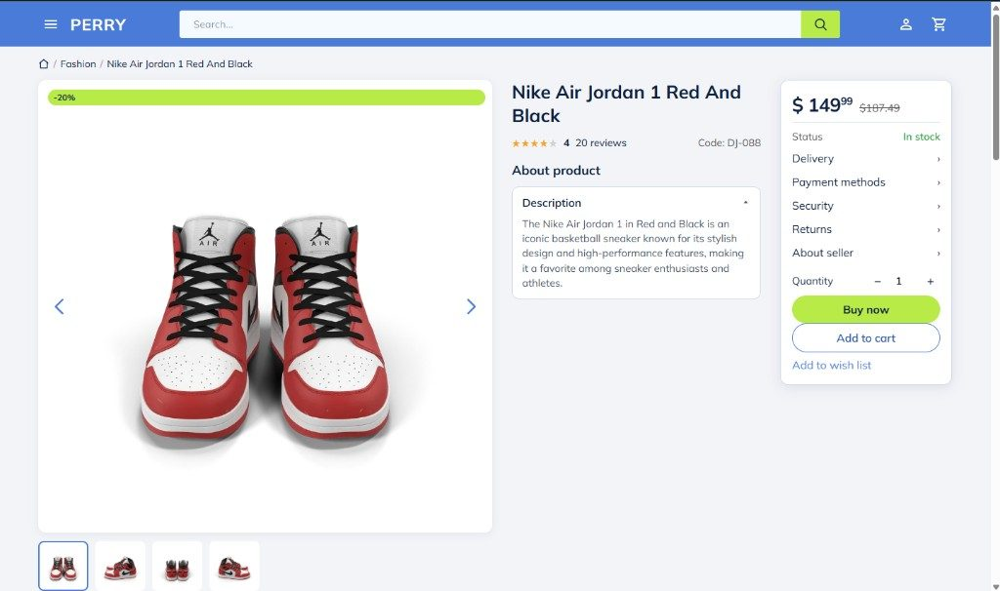

*Источник: [docs/screenshots/2026-10-04/product/07-product-nike-pdp.png](https://github.com/Teslyar75/My_Amazon2/blob/bcaec5fc8ab617830197b5fe69a976c6f214cb3e/docs/screenshots/2026-10-04/product/07-product-nike-pdp.png)*

- **Что видно:** галерея из 4 фото, бейдж «−20 %», название, 4 звезды и 20 отзывов, код (SKU) **DJ-088**, аккордеон **Description** с коротким описанием. Справа: цена $149.99 (старая $187.49), статус **In stock**, Delivery, Payment methods, Returns, About seller, количество, **Buy now / Add to cart / Add to wish list**.
- **API:** `GET /api/products/{id}` ([ProductsController.cs](https://github.com/Teslyar75/My_Amazon2/blob/bcaec5fc8ab617830197b5fe69a976c6f214cb3e/src/Perry.Api/Controllers/ProductsController.cs#L250-L251)), добавление в корзину — `POST /api/cart/add` ([CartController.cs](https://github.com/Teslyar75/My_Amazon2/blob/bcaec5fc8ab617830197b5fe69a976c6f214cb3e/src/Perry.Api/Controllers/CartController.cs#L61-L62)).
- **Автоматизация:** AI-описание и SEO-тексты ([Б1](#b1), портфолио [ПФ-3](#pf-3)); обработка фото: фон, размер, alt-текст ([Б3](#b3)); блоки Delivery и Returns заполняются из правил доставки «Новой почты» ([А4](#a4), [А6](#a6)).

#### <a id="scr-specs"></a>Рис. 4. Характеристики и отзывы на карточке

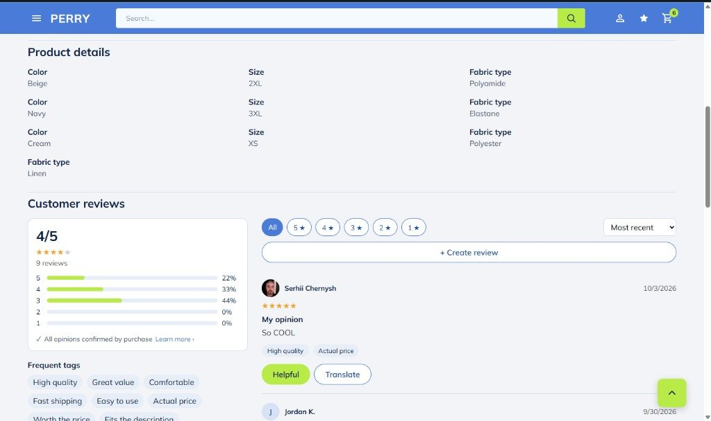

*Источник: [docs/screenshots/2026-10-04/product/09-product-specs-reviews.png](https://github.com/Teslyar75/My_Amazon2/blob/bcaec5fc8ab617830197b5fe69a976c6f214cb3e/docs/screenshots/2026-10-04/product/09-product-specs-reviews.png)*

- **Что видно:** таблица **Product details**: три значения Color (Beige, Navy, Cream), три Size (2XL, 3XL, XS) и четыре **Fabric type** (Polyamide, Elastane, Polyester, Linen), хотя это кроссовки. Ниже рейтинг 4/5, распределение звёзд, **Frequent tags**, кнопки **Helpful** и **Translate**.
- **Наблюдение ✅ по скриншоту:** характеристики похожи на «шум» демо-данных. Для живого магазина это и есть ручная работа [Б2](#b2): кто-то должен проверять, что у обуви нет «ткани Linen».
- **API:** характеристики приходят в `GET /api/products/{id}` из `ProductAttribute` ([ProductAttribute.cs](https://github.com/Teslyar75/My_Amazon2/blob/bcaec5fc8ab617830197b5fe69a976c6f214cb3e/src/Perry.Domain/Entities/ProductAttribute.cs#L8-L26)).
- **Автоматизация:** AI-проверка и нормализация характеристик ([Б2](#b2)); анализ тегов и отзывов ([В5](#v5)).

#### <a id="scr-reviews"></a>Рис. 5. Отзывы покупателей

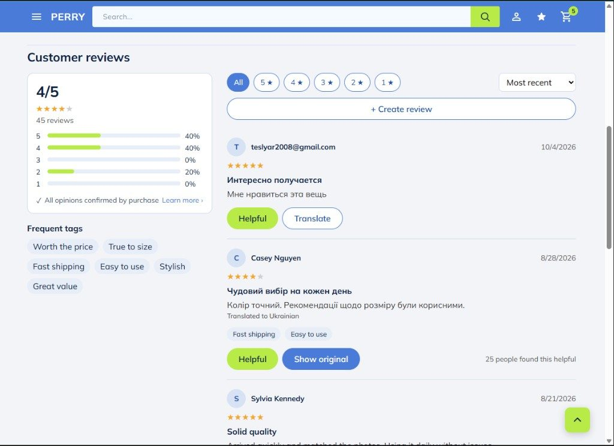

*Источник: [docs/screenshots/2026-10-04/product/10-product-reviews.png](https://github.com/Teslyar75/My_Amazon2/blob/bcaec5fc8ab617830197b5fe69a976c6f214cb3e/docs/screenshots/2026-10-04/product/10-product-reviews.png)*

- **Что видно:** 45 отзывов, фильтр по звёздам, **+ Create review**. Один отзыв переведён на украинский («Translated to Ukrainian», кнопка **Show original**), счётчик «25 people found this helpful». У одного отзыва вместо имени автора показан **email**.
- **API:** `GET /api/reviews` (публично только одобренные), `POST /api/reviews`, «Helpful» — `POST /api/reviews/grade/{id}` ([ReviewController.cs](https://github.com/Teslyar75/My_Amazon2/blob/bcaec5fc8ab617830197b5fe69a976c6f214cb3e/src/Perry.Api/Controllers/ReviewController.cs#L96-L117)). Перевод делает сам фронт через бесплатный MyMemory ([translateToUk.ts](https://github.com/Teslyar75/My_Amazon2/blob/bcaec5fc8ab617830197b5fe69a976c6f214cb3e/frontend/src/utils/translateToUk.ts#L1-L3)).
- **Автоматизация:** AI-модерация отзывов: спам, оскорбления, не по теме, **личные данные (email) вместо имени** ([В5](#v5)); запрос отзыва после доставки ([final, шаг 8](#final-steps)).

#### <a id="scr-cart"></a>Рис. 6. Корзина

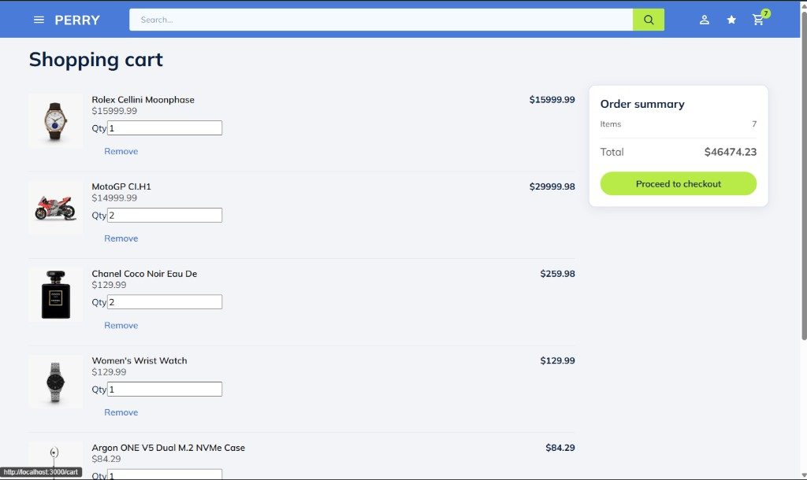

*Источник: [docs/screenshots/2026-10-04/cart-checkout/11-cart.png](https://github.com/Teslyar75/My_Amazon2/blob/bcaec5fc8ab617830197b5fe69a976c6f214cb3e/docs/screenshots/2026-10-04/cart-checkout/11-cart.png)*

- **Что видно:** позиции с полем Qty и ссылкой Remove, **Order summary**: 7 товаров, итог $46 474.23, кнопка **Proceed to checkout**.
- **API:** `GET /api/cart`, `PUT /api/cart/quantity`, `DELETE /api/cart/item/{id}`. Гостевая корзина живёт по `sessionId`, после входа сливается: `POST /api/cart/merge` ([CartController.cs](https://github.com/Teslyar75/My_Amazon2/blob/bcaec5fc8ab617830197b5fe69a976c6f214cb3e/src/Perry.Api/Controllers/CartController.cs#L116-L130)). У корзины есть `UpdatedAtUtc` ([Cart.cs](https://github.com/Teslyar75/My_Amazon2/blob/bcaec5fc8ab617830197b5fe69a976c6f214cb3e/src/Perry.Domain/Entities/Cart.cs#L11-L19)).
- **Автоматизация:** напоминание о брошенной корзине ([В3](#v3)). Нужен новый эндпоинт: [API-7](#api-7).

#### <a id="scr-checkout"></a>Рис. 7. Оформление заказа

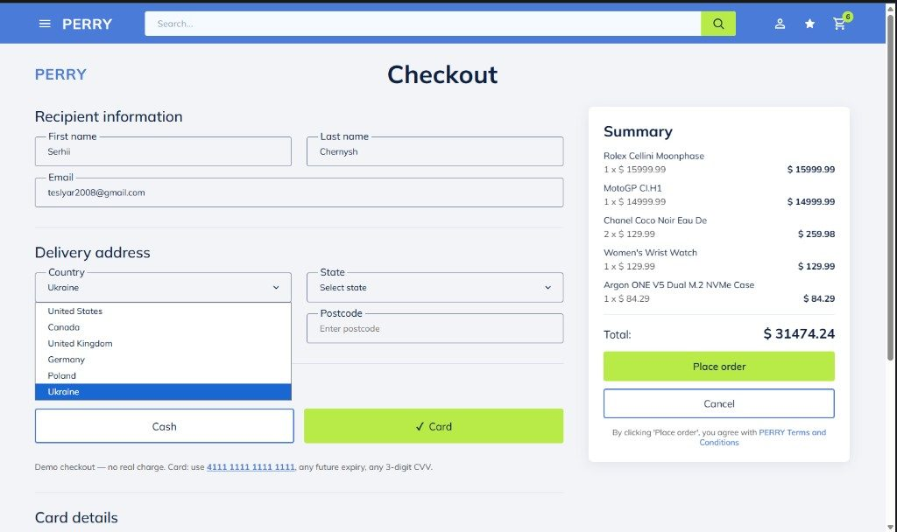

*Источник: [docs/screenshots/2026-10-04/cart-checkout/12-checkout-country.png](https://github.com/Teslyar75/My_Amazon2/blob/bcaec5fc8ab617830197b5fe69a976c6f214cb3e/docs/screenshots/2026-10-04/cart-checkout/12-checkout-country.png)*

- **Что видно:** имя, фамилия, email; **Delivery address**: Country (выбрана Ukraine), State, City, Postcode; оплата **Cash / Card** (демо, без реального списания); **Place order**. На соседнем кадре [13-checkout-state-ua](https://github.com/Teslyar75/My_Amazon2/blob/bcaec5fc8ab617830197b5fe69a976c6f214cb3e/docs/screenshots/2026-10-04/cart-checkout/13-checkout-state-ua.png) видно выпадающий список областей Украины.
- **API:** `POST /api/orders/checkout` ([OrdersController.cs](https://github.com/Teslyar75/My_Amazon2/blob/bcaec5fc8ab617830197b5fe69a976c6f214cb3e/src/Perry.Api/Controllers/OrdersController.cs#L52-L75)). Страна по умолчанию — Ukraine ([CheckoutPage.tsx](https://github.com/Teslyar75/My_Amazon2/blob/bcaec5fc8ab617830197b5fe69a976c6f214cb3e/frontend/src/pages/CheckoutPage.tsx#L299-L301)). Адрес склеивается в одну строку «город, область, индекс, страна» ([строка 390](https://github.com/Teslyar75/My_Amazon2/blob/bcaec5fc8ab617830197b5fe69a976c6f214cb3e/frontend/src/pages/CheckoutPage.tsx#L390)).
- **Наблюдение ✅:** **нет телефона и отделения «Новой почты»**, а без них накладную не создать. Это первое, что нужно добавить для [А4](#a4) ([API-5](#api-5)).
- **Автоматизация:** проверка адреса и выбор отделения по справочнику НП ([А4](#a4)); событие «заказ создан» запускает весь [конвейер от заказа до доставки](#final).

#### <a id="scr-my-orders"></a>Рис. 8. Кабинет: «Мои заказы»

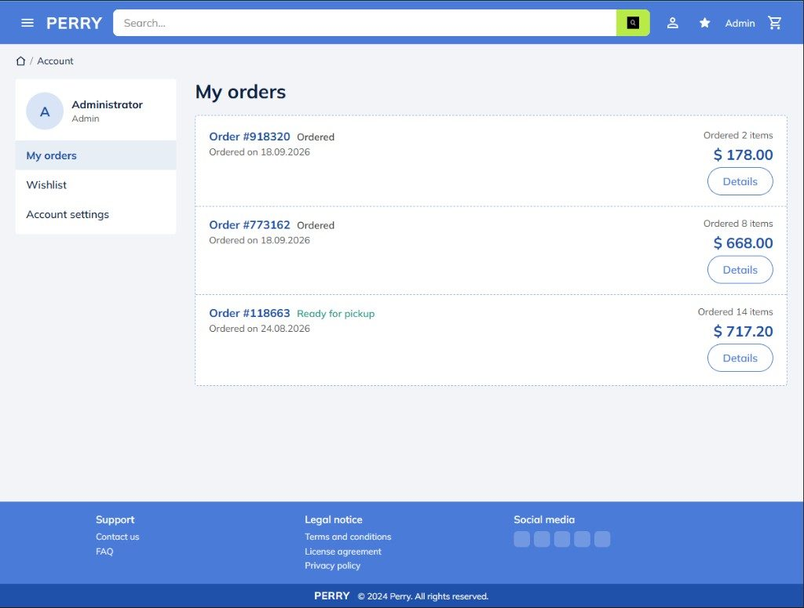

*Источник: локальная копия `D:\Perry\My_Amazon2`, спринт 19.09.2026 (файл `14-account-order-details-modal.png`). В репозитории на коммите `bcaec5f` не найден.*

- **Что видно:** список заказов с номером, статусом (**Ordered**, **Ready for pickup**), датой, количеством товаров и суммой, кнопка **Details**.
- **API:** `GET /api/orders` — только свои заказы ([OrdersController.cs](https://github.com/Teslyar75/My_Amazon2/blob/bcaec5fc8ab617830197b5fe69a976c6f214cb3e/src/Perry.Api/Controllers/OrdersController.cs#L29-L38)). Статусы: Ordered, Received, Shipped, ReadyToPickup, Cancelled, Returned ([OrderStatus.cs](https://github.com/Teslyar75/My_Amazon2/blob/bcaec5fc8ab617830197b5fe69a976c6f214cb3e/src/Perry.Domain/Enums/OrderStatus.cs#L7-L23)).
- **Автоматизация:** статус «Shipped» и номер [ТТН](#g-ttn) подставляются сами из трекинга «Новой почты» ([А5](#a5)); этот же статус отвечает [бот поддержки](#g1).

#### <a id="scr-order-modal"></a>Рис. 9. Детали заказа

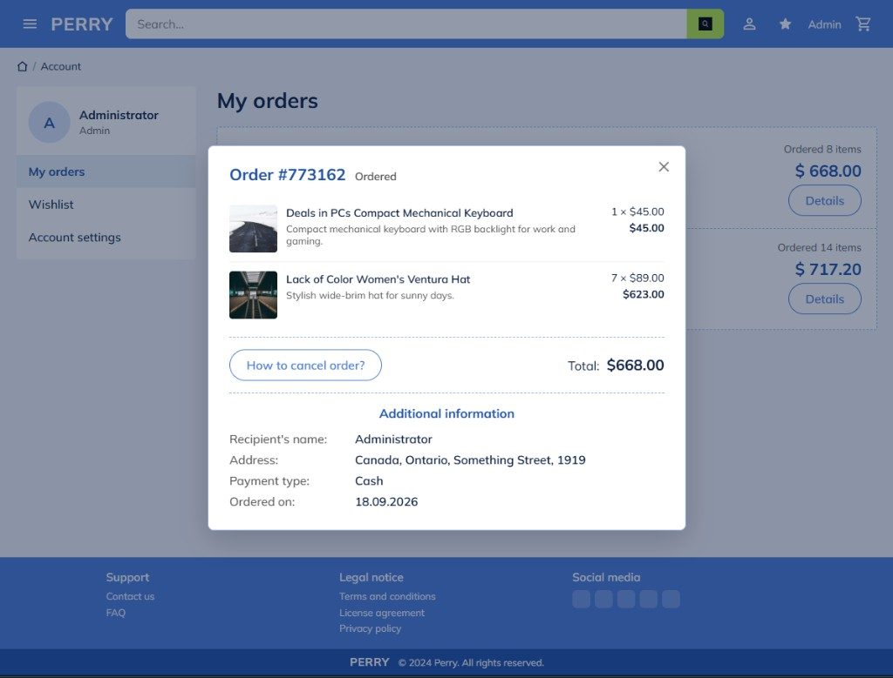

*Источник: локальная копия `D:\Perry\My_Amazon2`, спринт 19.09.2026 (файл `13-admin-reviews-approve.png`, по содержимому это модалка заказа). В репозитории на коммите `bcaec5f` не найден.*

- **Что видно:** состав заказа, итог, кнопка **How to cancel order?**, блок **Additional information**: получатель, адрес «Canada, Ontario, Something Street, 1919», оплата Cash, дата.
- **Наблюдение ✅:** этот адрес — значение по умолчанию в коде, если покупатель адрес не передал ([OrderService.cs](https://github.com/Teslyar75/My_Amazon2/blob/bcaec5fc8ab617830197b5fe69a976c6f214cb3e/src/Perry.Infrastructure/Services/OrderService.cs#L278-L284)). Для реальной доставки нужна валидация ([А4](#a4), [API-5](#api-5)).
- **Автоматизация:** ответ на «как отменить заказ» даёт [FAQ-бот](#g2); возврат запускает [А6](#a6).

#### <a id="scr-wishlist"></a>Рис. 10. Избранное (Wishlist)

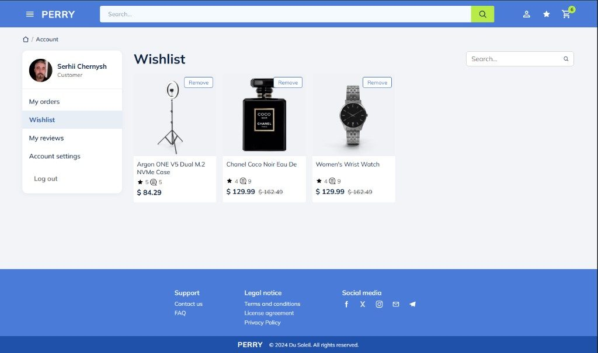

*Источник: [docs/screenshots/2026-10-04/account/16-account-wishlist.png](https://github.com/Teslyar75/My_Amazon2/blob/bcaec5fc8ab617830197b5fe69a976c6f214cb3e/docs/screenshots/2026-10-04/account/16-account-wishlist.png)*

- **Что видно:** три товара в избранном (два со скидкой), меню кабинета, футер с **Contact us, FAQ** и иконками соцсетей (Facebook, X, Instagram, email, Telegram).
- **API:** `GET/POST/DELETE /api/wishlist` ([WishlistController.cs](https://github.com/Teslyar75/My_Amazon2/blob/bcaec5fc8ab617830197b5fe69a976c6f214cb3e/src/Perry.Api/Controllers/WishlistController.cs#L12-L22)); для админа есть сводка «что чаще добавляют» — `GET /api/admin/wishlist/summary` ([AdminWishlistController.cs](https://github.com/Teslyar75/My_Amazon2/blob/bcaec5fc8ab617830197b5fe69a976c6f214cb3e/src/Perry.Api/Controllers/AdminWishlistController.cs#L101-L106)).
- **Автоматизация:** письмо «товар из вашего избранного подешевел» ([В4](#v4)); топ wishlist в еженедельном маркетинг-отчёте ([В7](#v7)); ссылка Telegram в футере ведёт к [боту поддержки](#g1).

### <a id="scr-g-auth"></a>3.2. Вход и регистрация (Auth)

#### <a id="scr-login"></a>Рис. 11. Вход


*Источник: [docs/screenshots/2026-10-04/auth/22-auth-login.png](https://github.com/Teslyar75/My_Amazon2/blob/bcaec5fc8ab617830197b5fe69a976c6f214cb3e/docs/screenshots/2026-10-04/auth/22-auth-login.png)*

- **Что видно:** форма входа (Email, Password, Stay signed in, Forgot password?), иллюстрация в стиле бренда. Рядом в репозитории кадры регистрации, подтверждения email 6-значным кодом и восстановления пароля ([папка auth](https://github.com/Teslyar75/My_Amazon2/tree/bcaec5fc8ab617830197b5fe69a976c6f214cb3e/docs/screenshots/2026-10-04/auth)).
- **API:** Auth Service (зона Влада), фронт ходит через прокси `/auth-api` ([client.ts](https://github.com/Teslyar75/My_Amazon2/blob/bcaec5fc8ab617830197b5fe69a976c6f214cb3e/frontend/src/api/client.ts#L29-L36)).
- **Автоматизация:** напрямую не трогаем, это чужая зона. Используем Auth только чтобы n8n получил **сервисный токен** ([API-2](#api-2)), и для приветственной серии писем после регистрации ([В4](#v4), ❓ нужен вебхук «пользователь зарегистрирован» от Auth: [вопрос 5](#q5)).

### <a id="scr-g-admin"></a>3.3. Админка

#### <a id="scr-admin-dashboard"></a>Рис. 12. Панель администратора

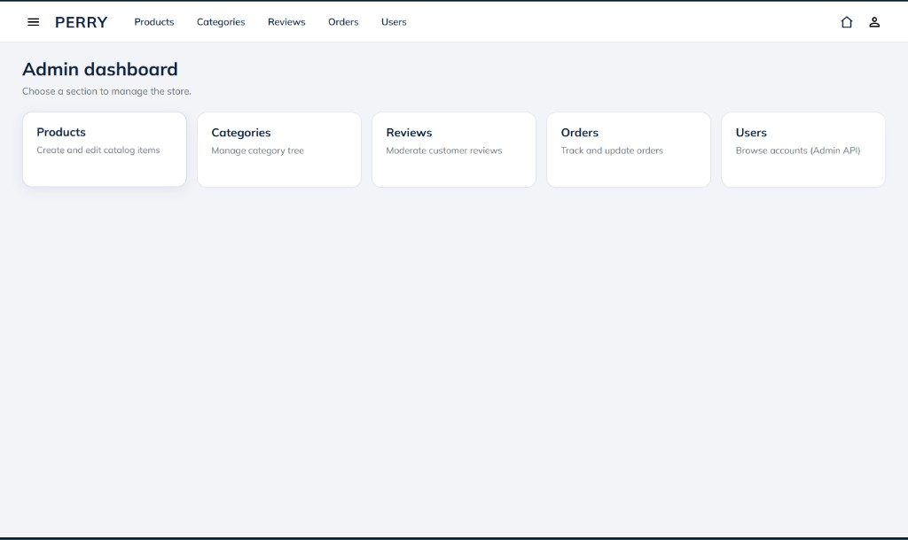

*Источник: [docs/screenshots/2026-10-04/admin/34-admin-dashboard.png](https://github.com/Teslyar75/My_Amazon2/blob/bcaec5fc8ab617830197b5fe69a976c6f214cb3e/docs/screenshots/2026-10-04/admin/34-admin-dashboard.png)*

- **Что видно:** пять плиток: **Products** (create and edit catalog items), **Categories**, **Reviews** (moderate customer reviews), **Orders** (track and update orders), **Users** (browse accounts, Admin API). Цифр (выручка, остатки) на панели нет.
- **Автоматизация:** то, чего нет на панели, приходит в Telegram: ежедневный [KPI-дайджест](#d1) и [алерты об аномалиях](#d2). В будущем сюда же встраивается окно **одобрений** от AI-агента ([раздел 11](#agents-hitl)).

#### <a id="scr-admin-products"></a>Рис. 13. Товары

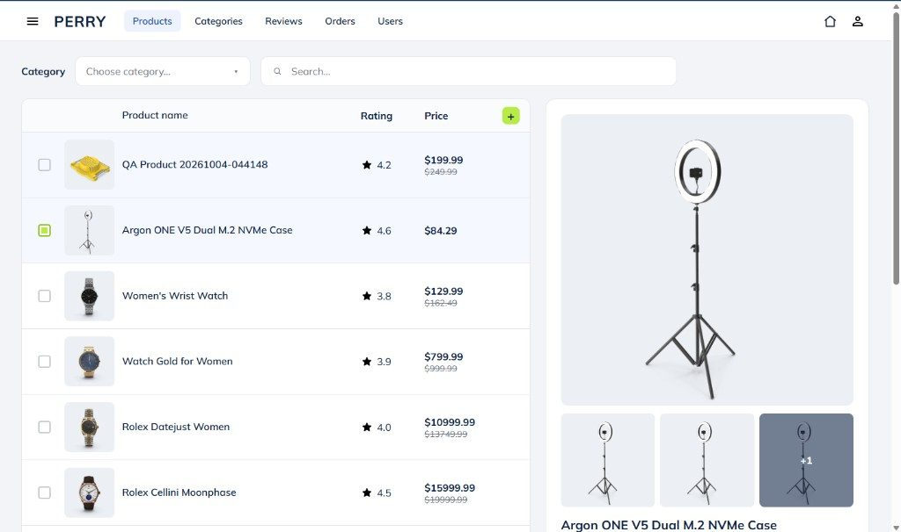

*Источник: [docs/screenshots/2026-10-04/admin/35-admin-products.png](https://github.com/Teslyar75/My_Amazon2/blob/bcaec5fc8ab617830197b5fe69a976c6f214cb3e/docs/screenshots/2026-10-04/admin/35-admin-products.png)*

- **Что видно:** фильтр по категории, поиск, таблица (миниатюра, название, рейтинг, цена и старая цена), кнопка «+», справа галерея выбранного товара. **Колонки «остаток» в списке нет.**
- **API:** `GET /api/products`; в ответе списка есть `Status`, но нет `StockQuantity` ([ProductsController.cs](https://github.com/Teslyar75/My_Amazon2/blob/bcaec5fc8ab617830197b5fe69a976c6f214cb3e/src/Perry.Api/Controllers/ProductsController.cs#L112-L139)). Остаток отдаёт только `GET /api/products/update/{id}` по одному товару ([строки 186–211](https://github.com/Teslyar75/My_Amazon2/blob/bcaec5fc8ab617830197b5fe69a976c6f214cb3e/src/Perry.Api/Controllers/ProductsController.cs#L187-L211)).
- **Автоматизация:** синхронизация остатков с поставщиками ([А1](#a1)), алерты «мало на складе» ([А2](#a2)). Для них нужен эндпоинт остатков ([API-3](#api-3)).

#### <a id="scr-admin-create"></a>Рис. 14. Создание товара

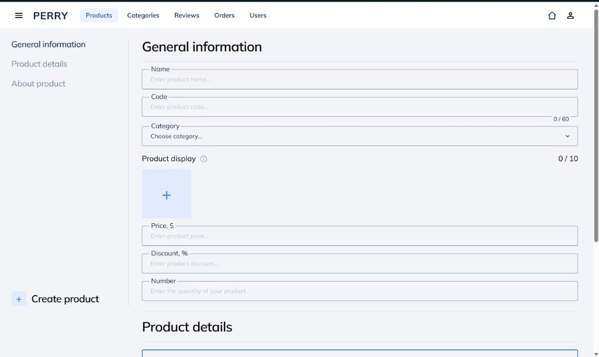

*Источник: [docs/screenshots/2026-10-04/admin/36-admin-create-product.png](https://github.com/Teslyar75/My_Amazon2/blob/bcaec5fc8ab617830197b5fe69a976c6f214cb3e/docs/screenshots/2026-10-04/admin/36-admin-create-product.png)*

- **Что видно:** форма в три блока (General information, Product details, About product): Name, Code, Category, до 10 фото, Price $, Discount %, **Number** (количество на складе).
- **API:** `POST /api/products` и `PUT /api/products/{id}` с ролями Admin или Seller ([ProductsController.cs](https://github.com/Teslyar75/My_Amazon2/blob/bcaec5fc8ab617830197b5fe69a976c6f214cb3e/src/Perry.Api/Controllers/ProductsController.cs#L545-L594)).
- **Автоматизация:** именно эту форму человек сейчас заполняет руками ≈ 25 минут на товар ⚠️. AI-агент заполняет черновик из прайса поставщика (описание, характеристики, about), человек проверяет ([Б1](#b1), [Б2](#b2), [Б3](#b3)).

#### <a id="scr-admin-categories"></a>Рис. 15. Категории

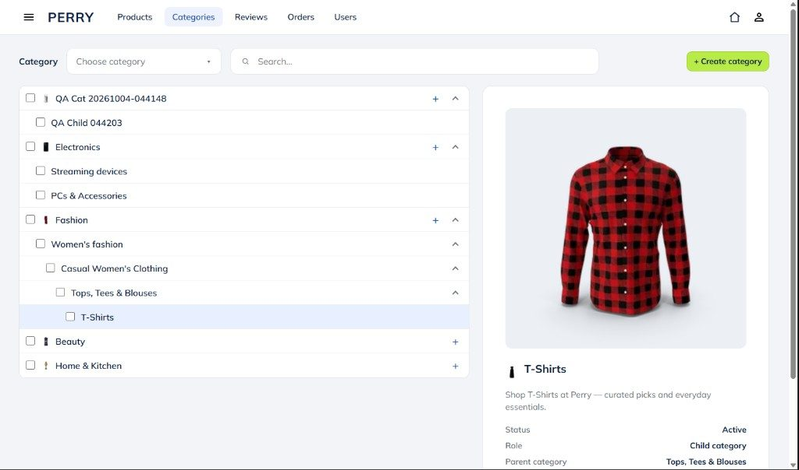

*Источник: [docs/screenshots/2026-10-04/admin/37-admin-categories.png](https://github.com/Teslyar75/My_Amazon2/blob/bcaec5fc8ab617830197b5fe69a976c6f214cb3e/docs/screenshots/2026-10-04/admin/37-admin-categories.png)*

- **Что видно:** дерево категорий до 5 уровней (Fashion → Women's fashion → Casual Women's Clothing → Tops, Tees & Blouses → T-Shirts), справа фото, описание «Shop T-Shirts at Perry — curated picks…», статус Active, роль, родитель. Вверху тестовые «QA Cat / QA Child».
- **API:** `GET/POST/PUT/DELETE /api/categories` (запись только Admin) ([CategoriesController.cs](https://github.com/Teslyar75/My_Amazon2/blob/bcaec5fc8ab617830197b5fe69a976c6f214cb3e/src/Perry.Api/Controllers/CategoriesController.cs#L162-L163)).
- **Автоматизация:** AI предлагает категорию для нового товара и SEO-описание категории ([Б1](#b1)); проверка «тестовые категории на витрине» ([Д2](#d2)).

#### <a id="scr-admin-reviews"></a>Рис. 16. Модерация отзывов

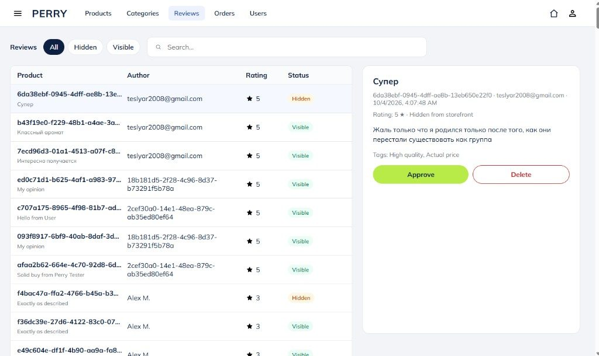

*Источник: [docs/screenshots/2026-10-04/admin/39-admin-reviews.png](https://github.com/Teslyar75/My_Amazon2/blob/bcaec5fc8ab617830197b5fe69a976c6f214cb3e/docs/screenshots/2026-10-04/admin/39-admin-reviews.png)*

- **Что видно:** фильтры All / Hidden / Visible, таблица Product / Author / Rating / Status. В колонке Product показан **GUID товара** вместо названия, в Author — email или GUID. Справа открыт скрытый отзыв с текстом, который **не относится к товару**, и кнопки **Approve / Delete**.
- **API:** `GET /api/reviews` (админ видит и скрытые), `PATCH /api/reviews/disable-many`, `DELETE /api/reviews/{id}` ([ReviewController.cs](https://github.com/Teslyar75/My_Amazon2/blob/bcaec5fc8ab617830197b5fe69a976c6f214cb3e/src/Perry.Api/Controllers/ReviewController.cs#L239-L262)); на фронте — [index.ts](https://github.com/Teslyar75/My_Amazon2/blob/bcaec5fc8ab617830197b5fe69a976c6f214cb3e/frontend/src/api/index.ts#L143-L201).
- **Автоматизация:** AI-модератор ставит каждому новому отзыву метку (ок / спам / не по теме / личные данные / жалоба на доставку) и предлагает решение; человек жмёт Approve или Delete уже по готовой подсказке ([В5](#v5)). Жалобы на доставку уходят в [А6](#a6) и [Г3](#g3).

#### <a id="scr-admin-orders"></a>Рис. 17. Заказы

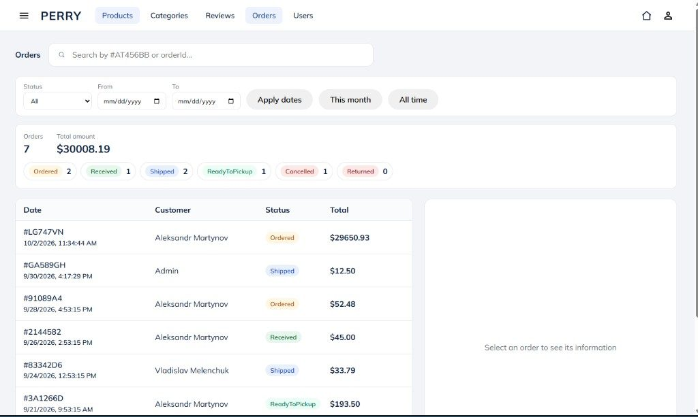

*Источник: [docs/screenshots/2026-10-04/admin/40-admin-orders.png](https://github.com/Teslyar75/My_Amazon2/blob/bcaec5fc8ab617830197b5fe69a976c6f214cb3e/docs/screenshots/2026-10-04/admin/40-admin-orders.png)*

- **Что видно:** поиск «by #AT456BB or orderId», фильтры статуса и дат, итоги **Orders 7 · Total $30 008.19**, счётчики Ordered 2 / Received 1 / Shipped 2 / ReadyToPickup 1 / Cancelled 1 / Returned 0, список с номером, датой, покупателем, статусом, суммой. На кадре спринта 19.09 (`10-admin-orders-details.png`, локальная копия) справа видно смену статуса выпадающим списком.
- **API:** `GET /api/orders/admin` с фильтрами и готовыми `statusCounts`, `totalAmount`, сравнением периодов ([OrdersController.cs](https://github.com/Teslyar75/My_Amazon2/blob/bcaec5fc8ab617830197b5fe69a976c6f214cb3e/src/Perry.Api/Controllers/OrdersController.cs#L82-L160)); смена статуса — `PUT /api/orders/{id}/status` ([строки 162–171](https://github.com/Teslyar75/My_Amazon2/blob/bcaec5fc8ab617830197b5fe69a976c6f214cb3e/src/Perry.Api/Controllers/OrdersController.cs#L162-L171)). Поиск по номеру `#AT456BB` работает через параметр `orderId` ([OrderService.cs](https://github.com/Teslyar75/My_Amazon2/blob/bcaec5fc8ab617830197b5fe69a976c6f214cb3e/src/Perry.Infrastructure/Services/OrderService.cs#L121-L138)).
- **Автоматизация:** **главный источник данных** для [KPI-дайджеста](#d1) (без доработок API), [сборочных листов](#a3), [ТТН](#a4) и [бота «где мой заказ»](#g1).

#### <a id="scr-admin-users"></a>Рис. 18. Пользователи

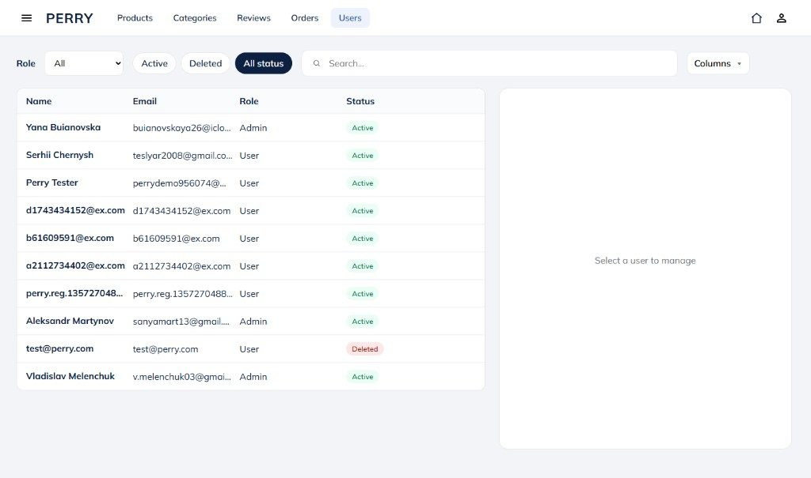

*Источник: [docs/screenshots/2026-10-04/admin/41-admin-users.png](https://github.com/Teslyar75/My_Amazon2/blob/bcaec5fc8ab617830197b5fe69a976c6f214cb3e/docs/screenshots/2026-10-04/admin/41-admin-users.png)*

- **Что видно:** роли (Admin, User), статусы Active / Deleted, настройка колонок.
- **API:** не Product API, а отдельный **Admin Service** (`/users-api`, `/api/admin/users`) ([index.ts](https://github.com/Teslyar75/My_Amazon2/blob/bcaec5fc8ab617830197b5fe69a976c6f214cb3e/frontend/src/api/index.ts#L600-L655)).
- **Автоматизация:** сегменты для рассылок (активные покупатели, без заказов 30 дней) ([В4](#v4)). ❓ Доступ n8n к Admin Service нужно согласовать с владельцем ([вопрос 4](#q4)). Персональные данные покупателей в AI-модель **не отправляем** ([риск R5](#r5)).

### <a id="scr-g-mobile"></a>3.4. Мобильное приложение

#### <a id="scr-mobile"></a>Рис. 19. Главная в мобильном приложении (Expo)

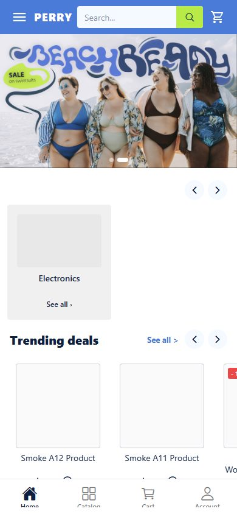

*Источник: локальная копия `D:\Perry\My_Amazon2` (файл `mobile-home.png`). В репозитории на коммите `bcaec5f` не найден. Код приложения — [mobile/src/screens](https://github.com/Teslyar75/My_Amazon2/tree/bcaec5fc8ab617830197b5fe69a976c6f214cb3e/mobile/src/screens).*

- **Что видно:** та же шапка, баннер «Beach Ready — Sale on swimsuits», карточка Electronics, **Trending deals** с тестовыми товарами «Smoke A12 / A11 Product» (картинки не загрузились), нижнее меню Home / Catalog / Cart / Account.
- **API:** тот же Product API ([mobile/src/api/client.ts](https://github.com/Teslyar75/My_Amazon2/blob/bcaec5fc8ab617830197b5fe69a976c6f214cb3e/mobile/src/api/client.ts)).
- **Автоматизация:** любые изменения каталога из [Б](#stream-b) сразу видны и в мобильном. Тестовые товары и пустые картинки на витрине ловит [Д2](#d2). Push-уведомления о статусе заказа ❓ — в будущем, после [API-1](#api-1).

<p class="navlinks"><a href="#toc">↑ к оглавлению</a> · <a href="#modules">→ далее: Части проекта подробно</a></p>

---

## <a id="modules"></a>4. Части проекта подробно

Для каждой части: **что это**, **как выглядит**, **что делает**, **какой API**, **где её касается автоматизация**.

### <a id="mod-front"></a>4.1. Витрина (frontend, React + Vite)

- **Что это:** одностраничное приложение ([SPA](#g-spa)) на React 19, макет по Figma. Запуск — `localhost:3000`, запросы `/api` проксируются на Product API `:5272` ([README](https://github.com/Teslyar75/My_Amazon2/blob/bcaec5fc8ab617830197b5fe69a976c6f214cb3e/README.md#L34)).
- **Как выглядит:** [рис. 1–10](#scr-home): синяя шапка с поиском, светлые карточки, салатовые кнопки.
- **Что делает:** маршруты главной, каталога, товара, корзины, checkout, кабинета, legal и 404 ([router.tsx](https://github.com/Teslyar75/My_Amazon2/blob/bcaec5fc8ab617830197b5fe69a976c6f214cb3e/frontend/src/app/router.tsx#L37-L74)); админка живёт в том же приложении под `/admin` ([строки 101–114](https://github.com/Teslyar75/My_Amazon2/blob/bcaec5fc8ab617830197b5fe69a976c6f214cb3e/frontend/src/app/router.tsx#L101-L114)).
- **API:** все вызовы собраны в одном файле [frontend/src/api/index.ts](https://github.com/Teslyar75/My_Amazon2/blob/bcaec5fc8ab617830197b5fe69a976c6f214cb3e/frontend/src/api/index.ts).
- **Автоматизация:** витрину почти не меняем. Добавляем телефон и отделение НП в checkout ([API-5](#api-5)), трекинг-номер в «Мои заказы» ([А5](#a5)), позже виджет чата с ботом ([Г1](#g1)).

### <a id="mod-api"></a>4.2. Product API (зона Сергея)

- **Что это:** REST-сервис на ASP.NET Core 8, три слоя: `Perry.Api` (контроллеры), `Perry.Domain` (сущности), `Perry.Infrastructure` (БД, сервисы). Swagger на `/swagger` ([Program.cs](https://github.com/Teslyar75/My_Amazon2/blob/bcaec5fc8ab617830197b5fe69a976c6f214cb3e/src/Perry.Api/Program.cs#L153-L159)).
- **Как выглядит:** экрана нет, его «лицо» — Swagger. Данные видны на всех экранах витрины.
- **Что делает:** каталог с фильтрами, карточка, корзина гостя и пользователя, checkout со списанием остатков, статусы заказа с письмами, отзывы с модерацией, wishlist, подписка «сообщить о поступлении», health-check.
- **Сущности:** товар с SKU, ценой, старой ценой, **остатком** и статусом ([Product.cs](https://github.com/Teslyar75/My_Amazon2/blob/bcaec5fc8ab617830197b5fe69a976c6f214cb3e/src/Perry.Domain/Entities/Product.cs#L40-L50)); заказ с номером `#AT456BB`, суммой, адресом, оплатой ([Order.cs](https://github.com/Teslyar75/My_Amazon2/blob/bcaec5fc8ab617830197b5fe69a976c6f214cb3e/src/Perry.Domain/Entities/Order.cs#L8-L45)); позиция заказа со «снимком» цены и названия ([OrderItem.cs](https://github.com/Teslyar75/My_Amazon2/blob/bcaec5fc8ab617830197b5fe69a976c6f214cb3e/src/Perry.Domain/Entities/OrderItem.cs#L6-L33)); отзыв с оценкой 1–5 и флагом `IsApproved` ([ProductReview.cs](https://github.com/Teslyar75/My_Amazon2/blob/bcaec5fc8ab617830197b5fe69a976c6f214cb3e/src/Perry.Domain/Entities/ProductReview.cs#L27-L37)).
- **Права:** политики `AdminAccess` и `SellerAccess` по роли из JWT ([Program.cs](https://github.com/Teslyar75/My_Amazon2/blob/bcaec5fc8ab617830197b5fe69a976c6f214cb3e/src/Perry.Api/Program.cs#L135-L141)).
- **Автоматизация:** **главная точка интеграции**. Все потоки А–Д читают данные отсюда, а [раздел 13](#api-gaps) перечисляет, что сюда нужно добавить.

### <a id="mod-auth"></a>4.3. Auth-сервис (зона Влада)

- **Что это:** отдельный сервис в Azure: регистрация, вход, подтверждение email кодом, сброс пароля, выдача JWT (HS256, общий секрет с Product API).
- **Как выглядит:** [рис. 11](#scr-login) и кадры регистрации и кода.
- **Что делает для Product API:** выдаёт **сервисный токен** по `POST /internal/auth/token` (имя сервиса + секрет из env) и отдаёт данные пользователя по `GET /internal/users/{id}` ([AuthInternalClient.cs](https://github.com/Teslyar75/My_Amazon2/blob/bcaec5fc8ab617830197b5fe69a976c6f214cb3e/src/Perry.Infrastructure/Services/AuthInternalClient.cs#L21-L25)).
- **Автоматизация:** просим у Влада отдельный сервисный аккаунт `n8n-automation` с узкими правами ([API-2](#api-2), [вопрос 3](#q3)).

### <a id="mod-admin"></a>4.4. Админка (UI + Admin Service)

- **Что это:** раздел `/admin` той же витрины ([frontend/src/pages/admin](https://github.com/Teslyar75/My_Amazon2/tree/bcaec5fc8ab617830197b5fe69a976c6f214cb3e/frontend/src/pages/admin)) плюс отдельный **Admin Service** для пользователей. Бэкенд админки — зона другого участника команды.
- **Как выглядит:** [рис. 12–18](#scr-admin-dashboard): светлая шапка, таблица слева, детали справа.
- **Что делает:** товары, категории, модерация отзывов, заказы со сменой статуса, пользователи с ролями. Поток админских заказов на защите показан диаграммой [16-admin-orders-flow](https://github.com/Teslyar75/My_Amazon2/blob/bcaec5fc8ab617830197b5fe69a976c6f214cb3e/project_defense/views_project/16-admin-orders-flow.png): `GET /api/orders/admin` → `PUT /orders/{id}/status` → `UpdatedAtUtc`.
- **Автоматизация:** админка становится местом, где человек **одобряет** то, что подготовил агент: черновики товаров, ответы на отзывы, закупки ([раздел 11](#agents-hitl)). Пока окна одобрений нет, роль играет Telegram с кнопками.

### <a id="mod-mobile"></a>4.5. Мобильное приложение (Expo)

- **Что это:** React Native на Expo, экраны Home, Products, Product, Cart, Checkout, Orders, Order details, Account, Login, Register ([mobile/src/screens](https://github.com/Teslyar75/My_Amazon2/tree/bcaec5fc8ab617830197b5fe69a976c6f214cb3e/mobile/src/screens)). Токен хранится в `expo-secure-store` ([package.json](https://github.com/Teslyar75/My_Amazon2/blob/bcaec5fc8ab617830197b5fe69a976c6f214cb3e/mobile/package.json)).
- **Как выглядит:** [рис. 19](#scr-mobile).
- **Автоматизация:** пользуется тем же API, поэтому получает плоды потоков А–Д бесплатно. ❓ Push-уведомления — после того как появятся вебхуки ([API-1](#api-1)).

<p class="navlinks"><a href="#toc">↑ к оглавлению</a> · <a href="#admin-ux">→ далее: Админка: что неудобно</a></p>

---

## <a id="admin-ux"></a>5. Админка: что неудобно и что автоматизировать

Админка Perry аккуратная и рабочая, но сделана как «таблица + карточка справа»: **каждое действие — руками, по одному объекту**. Для дипломного проекта это нормально. Для магазина на 50 заказов в день ⚠️ это и есть те самые часы, которые ищет вакансия. Ниже разбор по каждому экрану: сначала **что неудобно** (✅ видно на скрине или в коде), потом **что поправить в интерфейсе** (дёшево, без AI) и **что отдать автоматизации**.

> Бэкенд админки и Admin Service — зона другого участника команды. Всё, что ниже касается их кода, это **предложения для обсуждения**, а не готовые решения ([вопрос 4](#q4)).

| Экран | Что неудобно сейчас | Что улучшить в интерфейсе | Что автоматизировать |
|---|---|---|---|
| [Панель](#scr-admin-dashboard) | ✅ Только 5 плиток-ссылок, **ни одной цифры**: не видно выручки за день, новых заказов, товаров на нуле, отзывов на модерации | Счётчики на плитках: «Orders: 12 новых», «Reviews: 7 ждут» | [Д1](#d1) KPI-дайджест в Telegram каждое утро, [Д2](#d2) алерты; позже — лента «ждёт вашего одобрения» от агента ([раздел 11](#agents-hitl)) |
| [Товары](#scr-admin-products) | ✅ В списке **нет колонки остатка** и фильтра по статусу (Draft / OutOfStock). ✅ Нет массового редактирования и импорта из файла. ✅ Сохранение товара перезаписывает фото и характеристики целиком ([код](https://github.com/Teslyar75/My_Amazon2/blob/bcaec5fc8ab617830197b5fe69a976c6f214cb3e/src/Perry.Api/Controllers/ProductsController.cs#L617-L627)) | Колонка «Stock», фильтр «мало на складе», массовая смена цены и статуса | [А1](#a1) остатки и цены из прайсов поставщиков, [А2](#a2) алерты и черновик закупки, [Б4](#b4) цены конкурентов |
| [Создание товара](#scr-admin-create) | ✅ Всё заполняется руками: название, код, категория, до 10 фото, цена, скидка, количество, характеристики, about. ⚠️ ≈ 25 мин на товар | Кнопка «Дублировать товар», шаблоны характеристик по категории | [Б1](#b1) AI-черновик описания и SEO, [Б2](#b2) характеристики из прайса, [Б3](#b3) обработка фото. Человек только проверяет ([ПФ-3](#pf-3)) |
| [Категории](#scr-admin-categories) | ✅ В боевом дереве видны тестовые «QA Cat / QA Child». Описание категории пишется вручную | Флаг «скрыть с витрины», отдельная тестовая среда | [Б1](#b1) AI-описания категорий, [Д2](#d2) проверка «тестовые данные на витрине» |
| [Отзывы](#scr-admin-reviews) | ✅ В колонке Product **GUID вместо названия**, в Author — email или GUID: модератор не понимает, о чём отзыв, не открыв его. ✅ Решение по одному отзыву. ✅ Нет причины скрытия | Название товара и имя автора вместо ID; массовое одобрение (в API уже есть `disable-many`, [код](https://github.com/Teslyar75/My_Amazon2/blob/bcaec5fc8ab617830197b5fe69a976c6f214cb3e/src/Perry.Api/Controllers/ReviewController.cs#L248-L258)) | [В5](#v5) AI-метка и предложенное решение для каждого отзыва, сводка тем «на что жалуются»; жалобы на доставку → [Г3](#g3) |
| [Заказы](#scr-admin-orders) | ✅ Нет телефона, отделения НП и **номера ТТН**. ✅ Статус меняется вручную по одному заказу. ✅ Нет печати сборочного листа и выгрузки | Поля доставки в карточке заказа, массовая смена статуса, кнопка «Печать» | [А3](#a3) сборочные листы, [А4](#a4) ТТН одним кликом или автоматически, [А5](#a5) статус из трекинга НП, [Г1](#g1) бот отвечает клиентам сам |
| [Пользователи](#scr-admin-users) | ✅ Видно только имя, email, роль, статус. Нет числа заказов, суммы покупок, даты последнего заказа | Колонки «Orders», «Spent», «Last order» | [В4](#v4) сегменты для рассылок, [В6](#v6) лиды в CRM |

**Главная мысль для собеседования:** автоматизация не заменяет админку, а **меняет роль админа** с «оператора, который вбивает данные» на «контролёра, который одобряет то, что подготовил робот». Как это устроено технически, показано в [разделе 10](#system) и на [итоговой схеме](#final).

<p class="navlinks"><a href="#toc">↑ к оглавлению</a> · <a href="#growth">→ далее: Развитие сервиса</a></p>

---

## <a id="growth"></a>6. Развитие сервиса: чего не хватает магазину

Что нужно Perry, чтобы стать настоящим магазином в Украине. Список собран по коду и скриншотам. Где-то это доработка Product API (зона Сергея), где-то — других частей.

| № | Чего не хватает | Как видно, что этого нет | Что сделать | Связь с автоматизацией |
|---|---|---|---|---|
| G1 | **Доставка «Новой почтой»**: телефон, город и отделение из справочника НП, номер ТТН | ✅ В checkout только страна, область, город, индекс ([рис. 7](#scr-checkout)); в `Order` одна строка адреса ([Order.cs](https://github.com/Teslyar75/My_Amazon2/blob/bcaec5fc8ab617830197b5fe69a976c6f214cb3e/src/Perry.Domain/Entities/Order.cs#L28-L33)) | Поля в заказе + выбор отделения на checkout | [А4](#a4), [А5](#a5), [API-5](#api-5) |
| G2 | **Реальная оплата** (эквайринг) | ✅ «Demo checkout — no real charge» на [рис. 7](#scr-checkout); допустимы только Cash, Card, Online ([код](https://github.com/Teslyar75/My_Amazon2/blob/bcaec5fc8ab617830197b5fe69a976c6f214cb3e/src/Perry.Infrastructure/Services/OrderService.cs#L281-L284)) | ❓ Подключить платёжного провайдера, статус «оплачен» по его вебхуку | шаг «оплата» на [итоговой схеме](#final) |
| G3 | **Гривна и украинский интерфейс** | ✅ Цены в $ на всех скринах, интерфейс на английском; переводятся только отзывы ([рис. 5](#scr-reviews)) | Валюта UAH, локализация UA | [Б1](#b1) AI-переводы карточек |
| G4 | **Письмо «снова в наличии»** | ✅ Подписка есть, а `NotifiedAtUtc` никто не заполняет ([код](https://github.com/Teslyar75/My_Amazon2/blob/bcaec5fc8ab617830197b5fe69a976c6f214cb3e/src/Perry.Domain/Entities/StockNotifyRequest.cs#L19-L20)) | Отправка при пополнении остатка | [А2](#a2), [API-6](#api-6) |
| G5 | **Возвраты с возвратом на склад** | ✅ Статус `Returned` есть ([OrderStatus.cs](https://github.com/Teslyar75/My_Amazon2/blob/bcaec5fc8ab617830197b5fe69a976c6f214cb3e/src/Perry.Domain/Enums/OrderStatus.cs#L22)), но смена статуса остаток не трогает ([код](https://github.com/Teslyar75/My_Amazon2/blob/bcaec5fc8ab617830197b5fe69a976c6f214cb3e/src/Perry.Infrastructure/Services/OrderService.cs#L373-L385)) | Возврат товара на склад и причина возврата | [А6](#a6), [API-8](#api-8) |
| G6 | **Промокоды и акции** | ✅ В коде нет ни промокодов, ни купонов (поиск по `promo|coupon` пуст); скидка только через «старую цену» ([Product.cs](https://github.com/Teslyar75/My_Amazon2/blob/bcaec5fc8ab617830197b5fe69a976c6f214cb3e/src/Perry.Domain/Entities/Product.cs#L40-L44)) | ❓ Сущность «промокод» | [В3](#v3), [В4](#v4) |
| G7 | **Брошенные корзины** | ✅ Есть `Cart.UpdatedAtUtc`, но никто корзины не перебирает | Эндпоинт списка «старых» корзин | [В3](#v3), [API-7](#api-7) |
| G8 | **Поддержка в мессенджере** | ✅ В футере иконка Telegram ([рис. 10](#scr-wishlist)), бота нет | Telegram-бот | [Г1](#g1)–[Г3](#g3) |
| G9 | **Аналитика и источники трафика** | ✅ Есть просмотры, продажи, wishlist ([ProductStatisticsService](https://github.com/Teslyar75/My_Amazon2/blob/bcaec5fc8ab617830197b5fe69a976c6f214cb3e/src/Perry.Infrastructure/Services/ProductStatisticsService.cs)), но нет UTM и воронки | Сохранять UTM в заказе | [В6](#v6), [В7](#v7) |
| G10 | **События для внешних систем** (вебхуки) | ✅ Product API умеет только слать письма по SMTP ([IEmailSender.cs](https://github.com/Teslyar75/My_Amazon2/blob/bcaec5fc8ab617830197b5fe69a976c6f214cb3e/src/Perry.Infrastructure/Services/IEmailSender.cs#L6)) | Исходящие вебхуки | вся [система автоматизации](#system), [API-1](#api-1) |

<p class="navlinks"><a href="#toc">↑ к оглавлению</a> · <a href="#goals">→ далее: Цель и метрики</a></p>

---

## <a id="goals"></a>7. Цель и метрики

**Цель:** снять с людей повторяющуюся работу и **доказать цифрами**, сколько часов и денег это дало, как требует [вакансия](#vacancy).

| Метрика | Как считаем | Целевое значение ⚠️ примерная оценка | Откуда берём данные |
|---|---|---|---|
| **Сэкономленные часы в месяц** | (запусков воркфлоу за месяц) × (минут ручной работы на 1 запуск до автоматизации) ÷ 60. Запуски, где человек всё равно доделывал руками, считаем с понижающим коэффициентом | ≥ 250 ч/мес к 8-й неделе, ≈ 362 ч/мес к 12-й ([раздел 14](#effect)) | журнал запусков n8n ([execution log](#g-execution)) + замер «до» секундомером |
| **Деньги** | часы × стоимость часа сотрудника | **пример ставки: 200 грн/ч** ⚠️ (≈ 33 600 грн за 168 ч; это не данные Race Expert, а условное число для расчёта) | бухгалтерия ❓ |
| **Ошибки** | доля заказов с ошибкой в ТТН, адресе, количестве | с ≈ 2 % до < 0,3 % ⚠️ | возвраты НП «адресат не найден», жалобы |
| **Скорость ответа клиенту** | время от вопроса «где мой заказ» до ответа | с ≈ 2 ч до < 1 мин ⚠️ | логи [бота](#g1) |
| **Скорость обработки заказа** | время от «заказ создан» до «ТТН создана» | с ≈ 4 ч до < 10 мин ⚠️ | события [API-1](#api-1) |
| **Использование** | доля процессов, которые реально идут через автоматизацию | > 80 % | n8n Insights ✅ (есть в планах n8n, [раздел 12](#tools)) |
| **Стоимость автоматизации** | сервер + AI-вызовы + платные тарифы | < 3 % от сэкономленных денег ⚠️ | [раздел 11.4](#agents-cost), [раздел 12](#tools) |

**Допущения о магазине** ⚠️ (Perry пока не продаёт по-настоящему, поэтому берём «условный магазин размера Race Expert»: 10–50 сотрудников):

| Параметр | Значение | Почему так |
|---|---|---|
| Заказов в день | **50** (≈ 1 500 в месяц) | средний интернет-магазин такого размера; **требует уточнения** |
| Активных товаров (SKU) | ≈ 1 200 | в демо 194, умножаем «на живой ассортимент» |
| Поставщиков | 6 | допущение |
| Новых товаров в месяц | 100 | допущение |
| Обращений в поддержку | 30 в день (900 в месяц), из них ≈ 60 % «где мой заказ» | типичная доля для e-commerce, допущение |
| Возвратов | 3 % заказов (45 в месяц) | допущение |
| Отзывов | 300 в месяц | допущение |

<p class="navlinks"><a href="#toc">↑ к оглавлению</a> · <a href="#map">→ далее: Карта ручных процессов</a></p>

---

## <a id="map"></a>8. Карта ручных процессов

Все цифры — ⚠️ **примерная оценка** при [допущениях выше](#goals). «Доля» — какую часть работы забирает автоматизация. Остальное остаётся человеку (проверка, исключения).

| № | Процесс | Кто делает | Раз в месяц | Мин на раз | Ручных ч/мес | Доля | **Экономия ч/мес** |
|---|---|---|---|---|---|---|---|
| [А1](#a1) | Сверка остатков и цен с прайсами поставщиков | закупки | 180 (6 × 30 дней) | 15 | 45,0 | 85 % | **38** |
| [А2](#a2) | Низкие остатки, заявка поставщику, «снова в наличии» | закупки | 48 | 30 | 24,0 | 70 % | **17** |
| [А3](#a3) | Сборочный лист по заказам | склад | 1 500 | 1,5 | 37,5 | 80 % | **30** |
| [А4](#a4) | Накладная (ТТН) «Новой почты» | склад / оператор | 1 500 | 3 | 75,0 | 85 % | **64** |
| [А5](#a5) | Трекинг и уведомления клиенту | оператор | 1 500 | 1 | 25,0 | 90 % | **22** |
| [А6](#a6) | Возвраты | оператор + склад | 45 | 20 | 15,0 | 50 % | **7,5** |
| [Б1](#b1) | Описания и SEO для новых товаров | контент | 100 | 25 | 41,7 | 70 % | **29** |
| [Б2](#b2) | Нормализация характеристик (фильтров) | контент | 100 | 10 | 16,7 | 75 % | **12,5** |
| [Б3](#b3) | Обработка фото | контент | 500 фото | 3 | 25,0 | 80 % | **20** |
| [Б4](#b4) | Мониторинг цен конкурентов | категорийный менеджер | 30 | 30 | 15,0 | 80 % | **12** |
| [В1](#v1) | Посты и объявления о новинках и скидках | маркетолог | 30 | 40 | 20,0 | 60 % | **12** |
| [В2](#v2) | Публикация по расписанию | маркетолог | 30 | 10 | 5,0 | 80 % | **4** |
| [В3](#v3) | Напоминания о брошенной корзине | сейчас **никто** | 500 корзин | — | 0 | — | **0** (эффект в продажах) |
| [В4](#v4) | Email- и Telegram-рассылки | маркетолог | 8 | 90 | 12,0 | 60 % | **7** |
| [В5](#v5) | Модерация и анализ отзывов | контент | 300 | 2 | 10,0 | 70 % | **7** |
| [В6](#v6) | Лиды и UTM в CRM | продажи | 200 | 3 | 10,0 | 90 % | **9** |
| [В7](#v7) | Еженедельный отчёт маркетинга | маркетолог | 4 | 180 | 12,0 | 85 % | **10** |
| [Г1](#g1) | Ответы «где мой заказ» | поддержка | 540 | 4 | 36,0 | 70 % | **25** |
| [Г2](#g2) | Ответы на частые вопросы | поддержка | 360 | 3 | 18,0 | 60 % | **11** |
| [Г3](#g3) | Передача сложных вопросов человеку с резюме | поддержка | 300 | 1 | 5,0 | 80 % | **4** |
| [Д1](#d1) | Ежедневная сводка KPI | руководитель | 30 | 30 | 15,0 | 90 % | **13,5** |
| [Д2](#d2) | Поиск аномалий | руководитель | 30 | 20 | 10,0 | 80 % | **8** |
| | **Итого** | | | | **≈ 473** | | **≈ 362,5** |

Ручная работа по потокам (ч/мес, ⚠️ оценка):

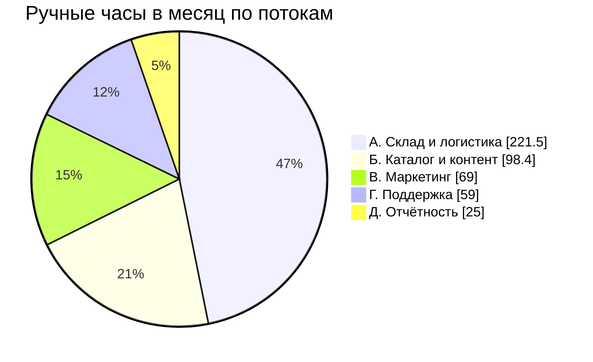
```mermaid
pie showData
  title Ручные часы в месяц по потокам
  "А. Склад и логистика" : 221.5
  "Б. Каталог и контент" : 98.4
  "В. Маркетинг" : 69
  "Г. Поддержка" : 59
  "Д. Отчётность" : 25
```

**Вывод:** почти половина ручной работы — склад и логистика, и она растёт **вместе с числом заказов**. Поэтому [поток А](#stream-a) идёт первым, а [поток Д](#stream-d) берём как самую быструю победу: данные уже отдаёт `GET /api/orders/admin`.

<p class="navlinks"><a href="#toc">↑ к оглавлению</a> · <a href="#stream-a">→ далее: Поток А. Склад и логистика</a></p>

---

## <a id="stream-a"></a>9А. Поток А. Склад и логистика

### <a id="a-goal"></a>Цель

Чтобы заказ сам доходил от «оформлен» до «ТТН создана, клиент получил номер», а остатки на сайте совпадали со складом и поставщиками. Человек на складе собирает коробки, а не переписывает адреса.

### <a id="a-now"></a>Как сейчас → как будет

| Сейчас (⚠️ типичный ручной процесс, в Perry ещё не реализован) | Будет |
|---|---|
| Менеджер утром открывает прайсы 6 поставщиков (Excel, email) и правит остатки в [форме товара](#scr-admin-create) по одному | n8n раз в час читает прайсы, сверяет по SKU и обновляет остатки одним запросом ([А1](#a1)) |
| Товар закончился — узнают, когда клиент пожалуется | Алерт «осталось < 5 шт.» в Telegram и готовый черновик заказа поставщику ([А2](#a2)) |
| Кладовщик переписывает состав заказов на бумагу | Сборочный лист в Google Sheets и PDF появляется сам при новом заказе ([А3](#a3)) |
| Оператор копирует адрес в кабинет «Новой почты» и создаёт ТТН руками, ≈ 3 мин на заказ | ТТН создаётся через API НП, номер сохраняется в заказ ([А4](#a4)) |
| Клиент пишет «где посылка?» | Статус НП подтягивается каждые 2 часа, клиент получает уведомление сам ([А5](#a5)) |
| Возврат оформляют по переписке | Форма возврата → проверка → ТТН возврата → остаток обратно на склад ([А6](#a6)) |

### <a id="a-scheme"></a>Схема

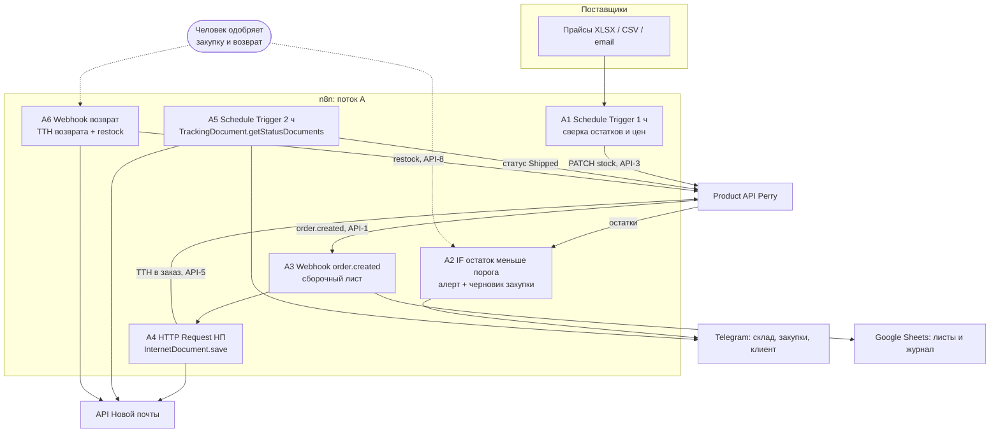
```mermaid
flowchart TB
  subgraph SUP["Поставщики"]
    P1["Прайсы XLSX / CSV / email"]
  end
  subgraph N8N["n8n: поток А"]
    A1["А1 Schedule Trigger 1 ч<br/>сверка остатков и цен"]
    A2["А2 IF остаток меньше порога<br/>алерт + черновик закупки"]
    A3["А3 Webhook order.created<br/>сборочный лист"]
    A4["А4 HTTP Request НП<br/>InternetDocument.save"]
    A5["А5 Schedule Trigger 2 ч<br/>TrackingDocument.getStatusDocuments"]
    A6["А6 Webhook возврат<br/>ТТН возврата + restock"]
  end
  API["Product API Perry"]
  NP["API Новой почты"]
  TG["Telegram: склад, закупки, клиент"]
  GS["Google Sheets: листы и журнал"]
  P1 --> A1 -->|"PATCH stock, API-3"| API
  API -->|"остатки"| A2 --> TG
  API -->|"order.created, API-1"| A3 --> GS
  A3 --> A4 --> NP
  A4 -->|"ТТН в заказ, API-5"| API
  A5 --> NP
  A5 -->|"статус Shipped"| API
  A5 --> TG
  A6 --> NP
  A6 -->|"restock, API-8"| API
  HUMAN(["Человек одобряет<br/>закупку и возврат"]) -.-> A2
  HUMAN -.-> A6
```

### <a id="a-steps"></a>Шаги автоматизации

#### <a id="a1"></a>А1. Синхронизация остатков и цен с поставщиками

Экраны: [товары](#scr-admin-products), [создание товара](#scr-admin-create) · модуль: [Product API](#mod-api) · нужно: [API-3](#api-3), [API-4](#api-4)

1. **Schedule Trigger** — раз в час (или **Gmail Trigger** на письмо с прайсом).
2. **HTTP Request** / **Read Binary File** / **Gmail** — забрать файл прайса поставщика.
3. **Extract from File** — XLSX или CSV в строки.
4. **Code** — привести к общему виду `{sku, qty, purchasePrice}`; разные поставщики называют колонки по-разному, правила лежат в **Data table** n8n.
5. **HTTP Request** → `GET /api/admin/stock?skus=…` ([API-3](#api-3)) — текущие остатки Perry.
6. **Compare Datasets** — найти расхождения по SKU.
7. **IF** — расхождение больше 30 % или цена изменилась больше чем на 10 %? → в **Telegram «Send and Wait for Response»** на одобрение человеку ([HITL](#g-hitl)). Мелкие расхождения проходят сами.
8. **HTTP Request** → `PATCH /api/admin/stock/bulk` ([API-3](#api-3)) с ключом идемпотентности ([API-9](#api-9)).
9. **Google Sheets** — строка в журнал: сколько SKU обновлено, кем, когда.

Важно ✅: сейчас обновить остаток можно только через `PUT /api/products/{id}`, который **перезаписывает фото, характеристики и about целиком** ([ProductsController.cs](https://github.com/Teslyar75/My_Amazon2/blob/bcaec5fc8ab617830197b5fe69a976c6f214cb3e/src/Perry.Api/Controllers/ProductsController.cs#L617-L627)). А `GET /api/products/update/{id}` отдаёт характеристики **без флага `IsFilterable`** ([строки 221–223](https://github.com/Teslyar75/My_Amazon2/blob/bcaec5fc8ab617830197b5fe69a976c6f214cb3e/src/Perry.Api/Controllers/ProductsController.cs#L221-L223)), и при обратной отправке флаг станет `false` ([строка 685](https://github.com/Teslyar75/My_Amazon2/blob/bcaec5fc8ab617830197b5fe69a976c6f214cb3e/src/Perry.Api/Controllers/ProductsController.cs#L685), по умолчанию `IsFilterable = false`, [строка 528](https://github.com/Teslyar75/My_Amazon2/blob/bcaec5fc8ab617830197b5fe69a976c6f214cb3e/src/Perry.Api/Controllers/ProductsController.cs#L528)). Фильтры каталога ([рис. 2](#scr-catalog)) после такой синхронизации **сломаются**. Поэтому для А1 обязателен отдельный эндпоинт остатков ([API-3](#api-3)).

#### <a id="a2"></a>А2. Низкие остатки, черновик закупки и «снова в наличии»

Экраны: [главная, карточка Notify](#scr-home), [товары](#scr-admin-products) · нужно: [API-3](#api-3), [API-6](#api-6)

1. **Schedule Trigger** — каждое утро в 08:00 (или вебхук `product.stock_low`, [API-1](#api-1)).
2. **HTTP Request** → остатки ([API-3](#api-3)) и продажи за 14 дней (`GET /api/orders/admin?fromUtc=…`, [код](https://github.com/Teslyar75/My_Amazon2/blob/bcaec5fc8ab617830197b5fe69a976c6f214cb3e/src/Perry.Api/Controllers/OrdersController.cs#L82-L98)).
3. **Code** — «дней до нуля» = остаток ÷ средние продажи в день; порог 7 дней ⚠️.
4. **OpenAI** (или **AI Agent**) — собрать черновик письма поставщику: таблица SKU и количество, вежливый текст на украинском.
5. **Telegram «Send and Wait for Response»** — менеджер закупок жмёт «Отправить» или «Исправить».
6. **Gmail** — письмо поставщику после одобрения.
7. Ветка «снова в наличии»: вебхук `product.back_in_stock` → **HTTP Request** `GET /api/admin/stock-notify/pending?productId=…` ([API-6](#api-6)) → **Send Email** каждому подписчику → `PATCH …/notified`. Сегодня подписка сохраняется ([StockNotifyController.cs](https://github.com/Teslyar75/My_Amazon2/blob/bcaec5fc8ab617830197b5fe69a976c6f214cb3e/src/Perry.Api/Controllers/StockNotifyController.cs#L56-L70)), а письма о поступлении нет совсем ([G4](#growth)).

#### <a id="a3"></a>А3. Сборочный лист по заказу

Экраны: [заказы](#scr-admin-orders), [детали заказа](#scr-order-modal) · нужно: [API-1](#api-1)

1. **Webhook** — событие `order.created` от Perry ([API-1](#api-1)). До появления вебхука — **Schedule Trigger** каждые 10 минут + **HTTP Request** `GET /api/orders/admin?status=Ordered&fromUtc=…` (работает **уже сейчас**, [код](https://github.com/Teslyar75/My_Amazon2/blob/bcaec5fc8ab617830197b5fe69a976c6f214cb3e/src/Perry.Api/Controllers/OrdersController.cs#L82-L126)).
2. **Split Out** — позиции заказа (в ответе есть `items` с названием, количеством, ценой, картинкой, [код](https://github.com/Teslyar75/My_Amazon2/blob/bcaec5fc8ab617830197b5fe69a976c6f214cb3e/src/Perry.Api/Controllers/OrdersController.cs#L226-L235)).
3. **Code** — сгруппировать по ячейкам склада ❓ (в Perry нет адреса ячейки, [вопрос 7](#q7)).
4. **Google Sheets** — строка в лист «Сборка на сегодня»; **HTML** + **Convert to File** — PDF для печати.
5. **Telegram** — складу: «Новый заказ #AT456BB, 3 позиции, лист готов».
6. **HTTP Request** → `PUT /api/orders/{id}/status` = `Received` ([код](https://github.com/Teslyar75/My_Amazon2/blob/bcaec5fc8ab617830197b5fe69a976c6f214cb3e/src/Perry.Api/Controllers/OrdersController.cs#L162-L171)). Клиент сразу получает письмо, его уже шлёт Perry ([OrderService.cs](https://github.com/Teslyar75/My_Amazon2/blob/bcaec5fc8ab617830197b5fe69a976c6f214cb3e/src/Perry.Infrastructure/Services/OrderService.cs#L387-L403)).

#### <a id="a4"></a>А4. Накладная (ТТН) «Новой почты»

Экраны: [checkout](#scr-checkout), [детали заказа](#scr-order-modal), [заказы](#scr-admin-orders) · нужно: [API-5](#api-5), [G1](#growth)

API «Новой почты» ✅ ([документация](https://api-portal.novapost.com/methods/ua/api-docs-ua/eng)): один адрес `https://api.novaposhta.ua/v2.0/json/`, метод POST, в теле JSON `apiKey`, `modelName`, `calledMethod`, `methodProperties`. Ключ бесплатный, создаётся в бизнес-кабинете: «Настройки → Безопасность» ([novaposhta.ua](https://novaposhta.ua/en/for-business/cooperation/integration/)).

1. **Webhook** `order.created` (или кнопка «Создать ТТН» в админке → **Webhook**).
2. **HTTP Request** → `GET /api/orders/{id}` + контакты получателя ([API-5](#api-5)).
3. **IF** — есть телефон и `warehouseRef`? Нет → **Telegram** оператору «заполните доставку» (ручная ветка).
4. **HTTP Request** → НП: справочник городов и отделений (модель `Address`, методы поиска населённых пунктов и отделений ❓ сверить точные имена методов с документацией) — только если в заказе пришёл текст, а не `Ref`.
5. **HTTP Request** → НП: получатель (модель `Counterparty`) ❓ уточнить порядок вызовов.
6. **Code** — вес и объём из товаров ❓ (в `Product` нет веса, [вопрос 8](#q8)); по умолчанию 1 кг ⚠️.
7. **HTTP Request** → НП `InternetDocument` / `save` ✅ — создать ТТН; в ответе номер `IntDocNumber` и `Ref`.
8. **HTTP Request** → `PUT /api/orders/{id}/shipment` ([API-5](#api-5)) — сохранить номер ТТН; статус `Shipped`.
9. **Telegram** / **Send Email** — клиенту номер ТТН и ссылку на трекинг.
10. **Error Trigger** — любая ошибка НП → в чат операторов, заказ помечается «нужен человек».

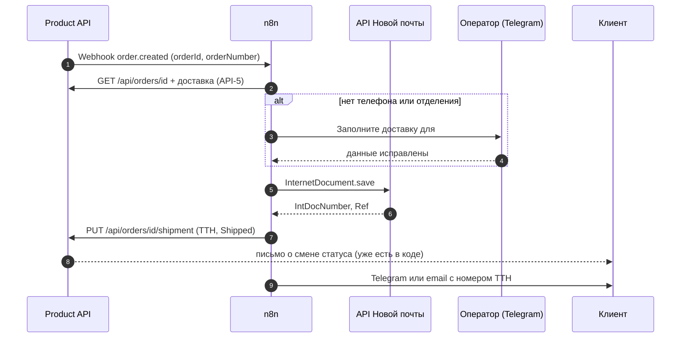
```mermaid
sequenceDiagram
  autonumber
  participant P as Product API
  participant N as n8n
  participant NP as API Новой почты
  participant O as Оператор (Telegram)
  participant C as Клиент
  P->>N: Webhook order.created (orderId, orderNumber)
  N->>P: GET /api/orders/id + доставка (API-5)
  alt нет телефона или отделения
    N->>O: Заполните доставку для #AT456BB
    O-->>N: данные исправлены
  end
  N->>NP: InternetDocument.save
  NP-->>N: IntDocNumber, Ref
  N->>P: PUT /api/orders/id/shipment (ТТН, Shipped)
  P-->>C: письмо о смене статуса (уже есть в коде)
  N->>C: Telegram или email с номером ТТН
```

#### <a id="a5"></a>А5. Трекинг и уведомления клиенту

Экраны: [Мои заказы](#scr-my-orders), [заказы в админке](#scr-admin-orders) · связано: [Г1](#g1)

1. **Schedule Trigger** — каждые 2 часа с 8:00 до 22:00.
2. **HTTP Request** → Perry: заказы в статусе `Shipped` с ТТН ([API-5](#api-5)).
3. **Code** — пачки по 100 номеров ⚠️ (ограничение на запрос сверить с документацией ❓).
4. **HTTP Request** → НП `TrackingDocument` / `getStatusDocuments` ✅ (`Documents: [{DocumentNumber, Phone}]`); в ответе `Status`, `StatusCode`, дата доставки.
5. **Switch** по `StatusCode`: «прибыл в отделение» → `ReadyToPickup`; «получено» → `Received` ❓ (в Perry статус `Received` назван «бывший Paid», [OrderStatus.cs](https://github.com/Teslyar75/My_Amazon2/blob/bcaec5fc8ab617830197b5fe69a976c6f214cb3e/src/Perry.Domain/Enums/OrderStatus.cs#L9-L18); нужна договорённость, что значит каждый статус, [вопрос 6](#q6)).
6. **HTTP Request** → `PUT /api/orders/{id}/status` — Perry сам шлёт письмо.
7. **Telegram** — клиенту, если он подключил бота ([Г1](#g1)).
8. Через 3 дня после «получено» → запрос отзыва ([шаг 8 итоговой схемы](#final-steps)).

#### <a id="a6"></a>А6. Возвраты

Экраны: [детали заказа](#scr-order-modal) · нужно: [API-8](#api-8), [G5](#growth)

1. **Form Trigger** (форма n8n) или **Telegram Trigger** — клиент: номер заказа, причина, фото.
2. **HTTP Request** → `GET /api/orders/admin?orderId=…` — заказ существует и получен не больше 14 дней назад ⚠️.
3. **OpenAI** — классифицировать причину (брак, не подошёл размер, не то прислали) и тон.
4. **Telegram «Send and Wait for Response»** — оператор одобряет возврат (**обязательно человек**: это деньги).
5. **HTTP Request** → НП — ТТН возврата (модель `InternetDocument`, ❓ параметры возврата уточнить).
6. **HTTP Request** → `PUT /api/orders/{id}/status` = `Returned` и `POST /api/admin/orders/{id}/restock` ([API-8](#api-8)).
7. **Google Sheets** — журнал возвратов по причинам → в [Д1](#d1) и [В5](#v5).

### <a id="a-api"></a>Связь с API Perry

| Что нужно | Есть сейчас ✅ | Нужно добавить |
|---|---|---|
| Новые заказы | `GET /api/orders/admin?status=Ordered` ([код](https://github.com/Teslyar75/My_Amazon2/blob/bcaec5fc8ab617830197b5fe69a976c6f214cb3e/src/Perry.Api/Controllers/OrdersController.cs#L82-L98)) | вебхук `order.created` ([API-1](#api-1)) |
| Смена статуса | `PUT /api/orders/{id}/status`, письмо клиенту ([код](https://github.com/Teslyar75/My_Amazon2/blob/bcaec5fc8ab617830197b5fe69a976c6f214cb3e/src/Perry.Api/Controllers/OrdersController.cs#L162-L171)) | — |
| Остатки | только по одному товару: `GET /api/products/update/{id}` | `GET /api/admin/stock`, `PATCH …/stock/bulk` ([API-3](#api-3)) |
| Доставка | одна строка адреса ([Order.cs](https://github.com/Teslyar75/My_Amazon2/blob/bcaec5fc8ab617830197b5fe69a976c6f214cb3e/src/Perry.Domain/Entities/Order.cs#L28-L33)) | телефон, `cityRef`, `warehouseRef`, ТТН ([API-5](#api-5)) |
| Возврат на склад | статус `Returned` без возврата остатка | restock ([API-8](#api-8)) |
| Подписчики Notify | таблица `StockNotifyRequests` | выдача и отметка ([API-6](#api-6)) |

### <a id="a-effect"></a>Эффект ⚠️ примерная оценка

**≈ 178,5 ч/мес** из 221,5 ручных → при ставке 200 грн/ч **≈ 35 700 грн/мес**. Плюс меньше ошибок в ТТН и меньше вопросов «где посылка» (часть эффекта посчитана в [Г1](#g1), не дублируем).

### <a id="a-tech"></a>Технические требования

API-ключ НП (бизнес-кабинет), `Ref` отправителя и его отделения; доступ к почте или папке с прайсами; сервисный токен Perry ([API-2](#api-2)); Telegram-бот для склада; Google-аккаунт для Sheets. Всё хранится в Credentials n8n, не в воркфлоу ([раздел 16](#tech)).

### <a id="a-complexity"></a>Сложность

А3 и А5 — **низкая** (1–2 дня каждый ⚠️). А4 — **средняя** (3–5 дней: справочники и контрагенты НП). А1 — **средняя** (по 0,5–1 дню на формат каждого поставщика). А2, А6 — **средняя**. Код Perry: [API-1, 3, 5, 6, 8](#api-gaps) ≈ 5–8 дней ⚠️.

### <a id="a-risks"></a>Риски

Ошибка в прайсе поставщика обнулит остатки → порог «большого расхождения» и одобрение ([R2](#r2)). Неверное отделение → посылка уедет не туда → проверка `warehouseRef` по справочнику НП. Изменения API НП → **Error Trigger** и алерт ([R4](#r4)).

<p class="navlinks"><a href="#toc">↑ к оглавлению</a> · <a href="#stream-b">→ далее: Поток Б. Каталог и контент</a></p>

---

## <a id="stream-b"></a>9Б. Поток Б. Каталог и контент

### <a id="b-goal"></a>Цель

Новый товар появляется на витрине за минуты, а не за полчаса: с нормальным описанием, правильными характеристиками для фильтров и одинаковыми фото. Цены не отстают от конкурентов.

### <a id="b-now"></a>Как сейчас → как будет

| Сейчас | Будет |
|---|---|
| Контент-менеджер заполняет [форму товара](#scr-admin-create) с нуля, ≈ 25 мин ⚠️ | AI-агент готовит черновик из прайса и сайта производителя, человек правит ≈ 7 мин ([Б1](#b1)) |
| Характеристики вбиваются как попало: на [рис. 4](#scr-specs) у кроссовок четыре «Fabric type» ✅ | AI приводит имена и значения к справочнику, фильтры [каталога](#scr-catalog) чистые ([Б2](#b2)) |
| Фото разного размера и фона | Автообрезка, белый фон, сжатие, alt-текст ([Б3](#b3)) |
| Цены конкурентов смотрят глазами раз в неделю | Ежедневная сводка «где мы дороже» ([Б4](#b4)) |

### <a id="b-scheme"></a>Схема

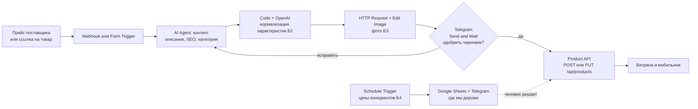
```mermaid
flowchart LR
  SRC["Прайс поставщика<br/>или ссылка на товар"] --> T["Webhook или Form Trigger"]
  T --> AG["AI Agent: контент<br/>описание, SEO, категория"]
  AG --> NORM["Code + OpenAI<br/>нормализация характеристик Б2"]
  NORM --> IMG["HTTP Request + Edit Image<br/>фото Б3"]
  IMG --> HITL{"Telegram<br/>Send and Wait<br/>одобрить черновик?"}
  HITL -->|"да"| API["Product API<br/>POST или PUT /api/products"]
  HITL -->|"исправить"| AG
  API --> SITE["Витрина и мобильное"]
  CMP["Schedule Trigger<br/>цены конкурентов Б4"] --> REP["Google Sheets + Telegram<br/>где мы дороже"]
  REP -.->|"человек решает"| API
```

### <a id="b-steps"></a>Шаги автоматизации

#### <a id="b1"></a>Б1. AI-описание и SEO

Экраны: [карточка товара](#scr-product), [создание товара](#scr-admin-create), [категории](#scr-admin-categories) · портфолио: [ПФ-3](#pf-3)

1. **Webhook** — `product.created` со статусом Draft ([API-1](#api-1)) или **Form Trigger** «добавить товар по ссылке».
2. **HTTP Request** → `GET /api/products/update/{id}` — название, бренд, категория, характеристики ([код](https://github.com/Teslyar75/My_Amazon2/blob/bcaec5fc8ab617830197b5fe69a976c6f214cb3e/src/Perry.Api/Controllers/ProductsController.cs#L187-L211)).
3. **AI Agent** (модель OpenAI или другая) с системным [промптом](#g-prompt): «описание 600–900 знаков на украинском, 3–5 пунктов About product, SEO title ≤ 60 знаков, meta description ≤ 160, без выдуманных характеристик». Инструмент агента: **HTTP Request** к сайту производителя ❓.
4. **Code** — проверка: нет ли в тексте цифр и материалов, которых нет в характеристиках (защита от [галлюцинаций](#g-hallucination)).
5. **Telegram «Send and Wait for Response»** — контент-менеджер видит черновик и жмёт «Одобрить / Переписать».
6. **HTTP Request** → `PATCH /api/products/{id}/content` ([API-4](#api-4)), а не полный `PUT`, чтобы не потерять фото и фильтры ([см. А1](#a1)).

#### <a id="b2"></a>Б2. Нормализация характеристик и фильтров

Экраны: [каталог](#scr-catalog), [характеристики](#scr-specs)

1. **Webhook** `product.created` / `product.updated` или ночной **Schedule Trigger** по всему каталогу.
2. **HTTP Request** → товар с характеристиками.
3. **Data table** n8n — справочник: разрешённые имена («Color», «Size», «Fabric type» — именно их ищет API, [код](https://github.com/Teslyar75/My_Amazon2/blob/bcaec5fc8ab617830197b5fe69a976c6f214cb3e/src/Perry.Api/Controllers/ProductsController.cs#L147-L149)) и значения для каждой категории.
4. **Code** — точные совпадения и синонимы («cotton», «Cotton », «хлопок» → «Cotton»).
5. **OpenAI** — только для неизвестных значений: предложить вариант из справочника или «неприменимо» (ткань у обуви).
6. **IF** — уверенность модели < 0,8 → человеку; иначе → `PATCH /api/products/{id}/attributes` ([API-4](#api-4)) с правильным `IsFilterable`.

#### <a id="b3"></a>Б3. Обработка фото

Экраны: [карточка](#scr-product), [создание товара](#scr-admin-create)

1. **Webhook** — новое фото у товара.
2. **HTTP Request** — скачать.
3. **Edit Image** (n8n) — обрезка до квадрата, размер 1200 px, сжатие; удаление фона — **HTTP Request** во внешний сервис ❓ (платный, выбрать).
4. **OpenAI** (vision) — alt-текст для доступности и SEO.
5. **HTTP Request** → загрузить обратно ([API-4](#api-4)); Perry уже хранит файлы на диске в `/uploads` ([Program.cs](https://github.com/Teslyar75/My_Amazon2/blob/bcaec5fc8ab617830197b5fe69a976c6f214cb3e/src/Perry.Api/Program.cs#L163-L172)).

#### <a id="b4"></a>Б4. Мониторинг цен конкурентов

Экраны: [каталог](#scr-catalog), [товары](#scr-admin-products)

1. **Schedule Trigger** — раз в день в 06:00.
2. **Google Sheets** — список «наш SKU → ссылки конкурентов» (ведёт человек).
3. **HTTP Request** + **HTML** (Extract HTML Content) — цена со страницы ❓ (проверить правила сайтов; где можно, брать официальные фиды).
4. **Code** — разница с нашей ценой из `GET /api/products` (в ответе есть `Price` и `OldPrice`, [код](https://github.com/Teslyar75/My_Amazon2/blob/bcaec5fc8ab617830197b5fe69a976c6f214cb3e/src/Perry.Api/Controllers/ProductsController.cs#L115-L124)).
5. **Telegram** — сводка «мы дороже на > 5 % по 12 SKU». **Цены сам робот не меняет**: решение за человеком ([R2](#r2)).

### <a id="b-api"></a>Связь с API Perry

Есть: `GET /api/products`, `GET /api/products/update/{id}`, `POST` / `PUT /api/products` для ролей Admin и Seller ([код](https://github.com/Teslyar75/My_Amazon2/blob/bcaec5fc8ab617830197b5fe69a976c6f214cb3e/src/Perry.Api/Controllers/ProductsController.cs#L545-L547)). Нужно: точечные `PATCH` для контента, характеристик и фото ([API-4](#api-4)), вебхук `product.created` ([API-1](#api-1)).

### <a id="b-effect"></a>Эффект ⚠️ примерная оценка

**≈ 73,5 ч/мес** → **≈ 14 700 грн/мес**. Плюс фильтры каталога начинают работать правильно, а это конверсия, которую в часах не посчитать.

### <a id="b-tech"></a>Технические требования

Ключ AI-провайдера; справочник характеристик по категориям (составляет человек один раз, ≈ 1 день ⚠️); сервис удаления фона ❓.

### <a id="b-complexity"></a>Сложность

Б1 — **низкая–средняя**, Б2 — **средняя** (справочник), Б3 — **средняя**, Б4 — **средняя** (каждый сайт конкурента свой).

### <a id="b-risks"></a>Риски

AI придумывает характеристики → проверка в шаге Б1.4 и одобрение ([R1](#r1)). Парсинг конкурентов может нарушать их правила → только разрешённые источники ([R6](#r6)).

<p class="navlinks"><a href="#toc">↑ к оглавлению</a> · <a href="#stream-v">→ далее: Поток В. Маркетинг</a></p>

---

## <a id="stream-v"></a>9В. Поток В. Маркетинг

### <a id="v-goal"></a>Цель

Каждая новинка и скидка сама превращается в пост, рассылку и объявление; брошенные корзины и избранное возвращают покупателей; маркетолог раз в неделю получает готовый отчёт, а не собирает его полдня.

### <a id="v-now"></a>Как сейчас → как будет

| Сейчас | Будет |
|---|---|
| Маркетолог вручную пишет пост про каждую акцию | AI-агент делает 3 варианта поста и объявления, человек выбирает ([В1](#v1)) |
| Публикация руками в нужное время | Очередь в Google Sheets, публикация по расписанию ([В2](#v2)) |
| Брошенные корзины никто не трогает ✅ (в коде нет такого процесса) | Напоминание через 2 и 24 часа ([В3](#v3)) |
| Рассылки собираются вручную | Сегменты из данных Perry, текст от AI, одобрение ([В4](#v4)) |
| Отзывы читают по одному в [модерации](#scr-admin-reviews) | AI-метки и сводка тем ([В5](#v5)) |
| Заявки и источники трафика теряются | UTM и лиды в CRM ([В6](#v6)) |
| Отчёт собирается полдня | Готовый отчёт в понедельник в 9:00 ([В7](#v7)) |

### <a id="v-scheme"></a>Схема

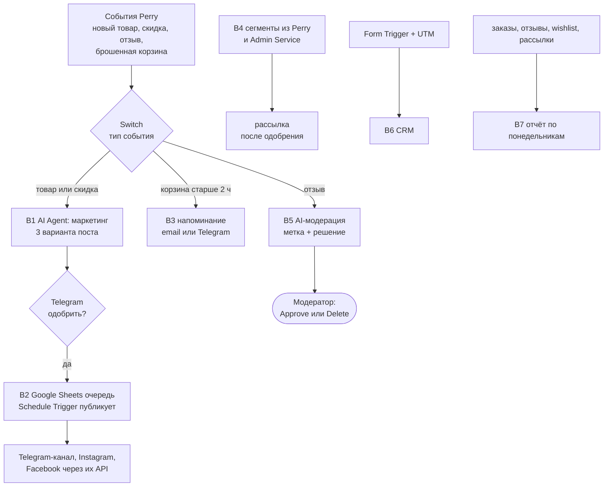
```mermaid
flowchart TB
  EV["События Perry<br/>новый товар, скидка, отзыв,<br/>брошенная корзина"] --> ROUTE{"Switch<br/>тип события"}
  ROUTE -->|"товар или скидка"| V1["В1 AI Agent: маркетинг<br/>3 варианта поста"]
  V1 --> APR{"Telegram<br/>одобрить?"}
  APR -->|"да"| V2["В2 Google Sheets очередь<br/>Schedule Trigger публикует"]
  V2 --> SOC["Telegram-канал, Instagram,<br/>Facebook через их API"]
  ROUTE -->|"корзина старше 2 ч"| V3["В3 напоминание<br/>email или Telegram"]
  ROUTE -->|"отзыв"| V5["В5 AI-модерация<br/>метка + решение"]
  V5 --> MOD(["Модератор:<br/>Approve или Delete"])
  SEG["В4 сегменты из Perry<br/>и Admin Service"] --> V4["рассылка<br/>после одобрения"]
  LEAD["Form Trigger + UTM"] --> V6["В6 CRM"]
  ALL["заказы, отзывы, wishlist, рассылки"] --> V7["В7 отчёт по понедельникам"]
```

### <a id="v-steps"></a>Шаги автоматизации

#### <a id="v1"></a>В1. AI-посты и объявления о новинках и скидках

Экраны: [главная, Trending deals](#scr-home), [карточка](#scr-product)

1. **Webhook** `product.created` или `product.price_dropped` ([API-1](#api-1)); резерв — **Schedule Trigger** + `GET /api/products?sort=newest` ([код](https://github.com/Teslyar75/My_Amazon2/blob/bcaec5fc8ab617830197b5fe69a976c6f214cb3e/src/Perry.Api/Controllers/ProductsController.cs#L104-L107)).
2. **IF** — у товара есть скидка (`OldPrice` > `Price`, бейдж «−20 %» на [рис. 1](#scr-home)) или он новый.
3. **AI Agent** — 3 варианта: пост для Telegram-канала, подпись для Instagram, текст объявления (заголовок ≤ 30 знаков, описание ≤ 90) ⚠️ по типичным лимитам рекламных систем, ❓ сверить.
4. **Telegram «Send and Wait for Response»** — маркетолог выбирает вариант или правит.
5. **Google Sheets** — в очередь публикаций с датой и UTM-меткой.

#### <a id="v2"></a>В2. Публикация по расписанию

1. **Schedule Trigger** — каждые 15 минут.
2. **Google Sheets** — строки «время пришло, не опубликовано».
3. **Telegram** (канал), **Facebook Graph API** / Instagram через **HTTP Request** ❓ (нужны бизнес-аккаунты и права).
4. **Google Sheets** — отметка «опубликовано», ссылка на пост.

#### <a id="v3"></a>В3. Брошенные корзины

Экран: [корзина](#scr-cart) · нужно: [API-7](#api-7)

1. **Schedule Trigger** — каждый час.
2. **HTTP Request** → `GET /api/admin/carts/abandoned?olderThanHours=2` ([API-7](#api-7)). Только корзины **вошедших** пользователей: у гостя есть лишь `SessionId`, связаться с ним нельзя ([Cart.cs](https://github.com/Teslyar75/My_Amazon2/blob/bcaec5fc8ab617830197b5fe69a976c6f214cb3e/src/Perry.Domain/Entities/Cart.cs#L11-L15)).
3. **IF** — уже напоминали? (**Data table** с историей).
4. **Send Email** / **Telegram** — «Вы оставили 3 товара», ссылка на `/cart`. Второе письмо через 24 часа, промокод ❓ (промокодов в Perry нет, [G6](#growth)).
5. Эффект считаем **в продажах**, не в часах: при 500 брошенных корзинах, возврате 5 % ⚠️ и среднем чеке 1 200 грн ⚠️ ≈ 25 заказов ≈ **30 000 грн оборота в месяц**.

#### <a id="v4"></a>В4. Email- и Telegram-рассылки

Экраны: [wishlist](#scr-wishlist), [пользователи](#scr-admin-users)

1. **Schedule Trigger** — по плану рассылок (Google Sheets).
2. **HTTP Request** — сегменты: топ товаров из wishlist (`GET /api/admin/wishlist/summary`, [код](https://github.com/Teslyar75/My_Amazon2/blob/bcaec5fc8ab617830197b5fe69a976c6f214cb3e/src/Perry.Api/Controllers/AdminWishlistController.cs#L101-L106)), покупатели без заказов 30 дней ([API-10](#api-10)).
3. **AI Agent** — текст и тема письма; **без персональных данных в промпте** ([R5](#r5)): имена подставляет **Code** после генерации.
4. **Telegram «Send and Wait for Response»** — одобрение.
5. **Send Email** (SMTP) или сервис рассылок ❓; учёт отписок обязателен.

#### <a id="v5"></a>В5. AI-модерация и анализ отзывов

Экраны: [отзывы на витрине](#scr-reviews), [модерация](#scr-admin-reviews), [характеристики](#scr-specs)

1. **Webhook** `review.created` ([API-1](#api-1)) или **Schedule Trigger** + `GET /api/reviews` (админ видит и скрытые, [код](https://github.com/Teslyar75/My_Amazon2/blob/bcaec5fc8ab617830197b5fe69a976c6f214cb3e/src/Perry.Api/Controllers/ReviewController.cs#L96-L117)).
2. **OpenAI** — метка: `ok`, `spam`, `offensive`, `off_topic` (как скрытый отзыв на [рис. 16](#scr-admin-reviews)), `personal_data` (email вместо имени, как на [рис. 5](#scr-reviews)), `delivery_complaint`; тональность; краткое резюме.
3. **Switch** — `ok` и рейтинг ≥ 4 → в очередь «одобрить пачкой»; `spam` / `offensive` → предложить скрыть; `delivery_complaint` → в [Г3](#g3).
4. **Telegram «Send and Wait for Response»** — модератор одним нажатием подтверждает пачку → `PATCH /api/reviews/disable-many` ([код](https://github.com/Teslyar75/My_Amazon2/blob/bcaec5fc8ab617830197b5fe69a976c6f214cb3e/src/Perry.Api/Controllers/ReviewController.cs#L248-L258)).
5. **Google Sheets** — темы недели («жмут кроссовки», «долгая доставка») → в [В7](#v7).

#### <a id="v6"></a>В6. Лиды и UTM в CRM

1. **Webhook** — `order.created` с UTM ([API-1](#api-1); UTM в заказе нужно сохранять, [G9](#growth)) и **Form Trigger** для заявок «подобрать товар».
2. **Code** — источник, кампания, сумма.
3. **HubSpot** / **Pipedrive** / **Google Sheets** ❓ (какую CRM — [вопрос 9](#q9)) — создать или обновить контакт и сделку.

#### <a id="v7"></a>В7. Еженедельный отчёт маркетинга

1. **Schedule Trigger** — понедельник 09:00.
2. **HTTP Request** — заказы и суммы за неделю и прошлую неделю (`GET /api/orders/admin` уже отдаёт `totalAmountCompare`, [код](https://github.com/Teslyar75/My_Amazon2/blob/bcaec5fc8ab617830197b5fe69a976c6f214cb3e/src/Perry.Api/Controllers/OrdersController.cs#L142-L159)); популярные товары `GET /api/products/popular` ([код](https://github.com/Teslyar75/My_Amazon2/blob/bcaec5fc8ab617830197b5fe69a976c6f214cb3e/src/Perry.Api/Controllers/ProductsController.cs#L238-L243)); wishlist; темы отзывов из [В5](#v5); публикации из [В2](#v2).
3. **Code** — таблица и проценты.
4. **OpenAI** — 5 выводов простым языком и 3 идеи на неделю.
5. **Google Sheets** + **Telegram** / **Gmail** — отчёт команде.

### <a id="v-api"></a>Связь с API Perry

Есть: товары, popular, wishlist summary и monthly, отзывы с модерацией, админские заказы со сравнением периодов. Нужно: вебхуки ([API-1](#api-1)), брошенные корзины ([API-7](#api-7)), сегменты покупателей ([API-10](#api-10)), UTM в заказе.

### <a id="v-effect"></a>Эффект ⚠️ примерная оценка

**≈ 49 ч/мес** → **≈ 9 800 грн/мес**, плюс **≈ 30 000 грн оборота** от брошенных корзин ([В3](#v3)), который считаем отдельно, не как экономию часов.

### <a id="v-tech"></a>Технические требования

Бизнес-аккаунты соцсетей и их API-доступы ❓; Telegram-канал; SMTP или сервис рассылок с отписками; CRM ❓.

### <a id="v-complexity"></a>Сложность

В1, В2, В5, В7 — **низкая–средняя**; В3, В4 — **средняя** (нужны [API-7](#api-7), [API-10](#api-10)); В6 — зависит от CRM.

### <a id="v-risks"></a>Риски

Публикация без проверки (неверная цена в посте) → одобрение обязательно ([R1](#r1)). Рассылки без согласия → учёт подписок ([R5](#r5)).

<p class="navlinks"><a href="#toc">↑ к оглавлению</a> · <a href="#stream-g">→ далее: Поток Г. Продажи и поддержка</a></p>

---

## <a id="stream-g"></a>9Г. Поток Г. Продажи и поддержка

### <a id="sg-goal"></a>Цель

70 % вопросов «где мой заказ» и частых вопросов закрывает бот за секунды, днём и ночью. Сложные вопросы приходят человеку уже с резюме и данными заказа.

### <a id="sg-now"></a>Как сейчас → как будет

| Сейчас | Будет |
|---|---|
| Иконка Telegram в футере ([рис. 10](#scr-wishlist)), бота нет ✅ | Telegram-бот Perry |
| Оператор ищет заказ в [админке](#scr-admin-orders) по номеру и пересказывает статус | Бот сам находит заказ по номеру и email и отвечает ([Г1](#g1)) |
| «Как отменить заказ?» ([рис. 9](#scr-order-modal)), «какая доставка?» — каждый раз заново | Ответы из базы знаний ([Г2](#g2)) |
| Оператор читает всю переписку с начала | Получает резюме и ссылку на заказ ([Г3](#g3)) |

### <a id="sg-scheme"></a>Схема

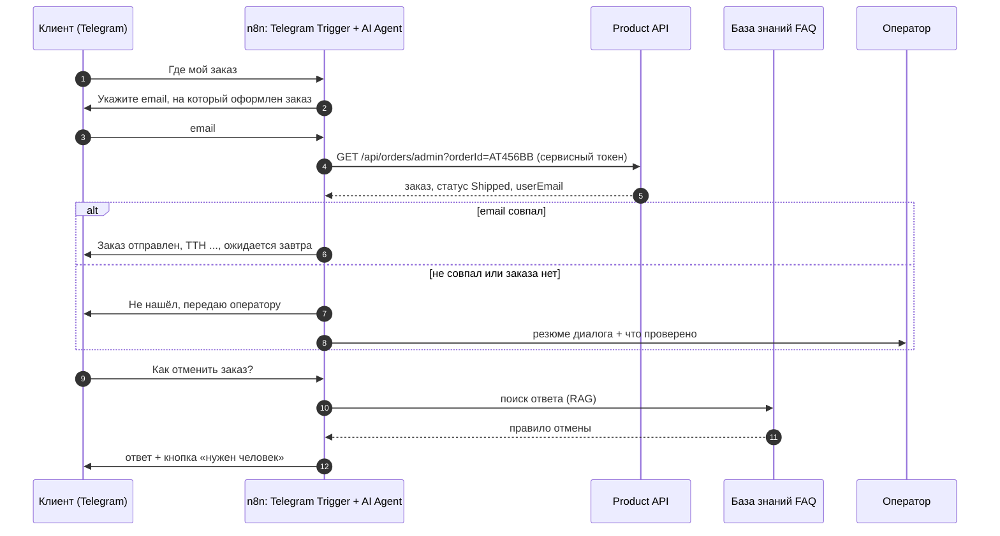
```mermaid
sequenceDiagram
  autonumber
  participant C as Клиент (Telegram)
  participant B as n8n: Telegram Trigger + AI Agent
  participant P as Product API
  participant K as База знаний FAQ
  participant H as Оператор
  C->>B: Где мой заказ #AT456BB?
  B->>C: Укажите email, на который оформлен заказ
  C->>B: email
  B->>P: GET /api/orders/admin?orderId=AT456BB (сервисный токен)
  P-->>B: заказ, статус Shipped, userEmail
  alt email совпал
    B->>C: Заказ отправлен, ТТН ..., ожидается завтра
  else не совпал или заказа нет
    B->>C: Не нашёл, передаю оператору
    B->>H: резюме диалога + что проверено
  end
  C->>B: Как отменить заказ?
  B->>K: поиск ответа (RAG)
  K-->>B: правило отмены
  B->>C: ответ + кнопка «нужен человек»
```

### <a id="sg-steps"></a>Шаги автоматизации

#### <a id="g1"></a>Г1. Бот «где мой заказ»

Экраны: [Мои заказы](#scr-my-orders), [детали заказа](#scr-order-modal), [заказы в админке](#scr-admin-orders) · портфолио: [ПФ-2](#pf-2)

1. **Telegram Trigger** — новое сообщение боту.
2. **AI Agent** с памятью (**Simple Memory** / **Postgres Chat Memory**) — понять намерение: статус заказа, FAQ, жалоба, «позовите человека».
3. Инструмент агента **HTTP Request Tool** → `GET /api/orders/admin?orderId=AT456BB` — поиск по номеру уже работает ✅ ([OrderService.cs](https://github.com/Teslyar75/My_Amazon2/blob/bcaec5fc8ab617830197b5fe69a976c6f214cb3e/src/Perry.Infrastructure/Services/OrderService.cs#L121-L138)); в ответе есть `status`, `items`, `userEmail` (если настроен канал к Auth) ([OrdersController.cs](https://github.com/Teslyar75/My_Amazon2/blob/bcaec5fc8ab617830197b5fe69a976c6f214cb3e/src/Perry.Api/Controllers/OrdersController.cs#L203-L222)).
4. **Code** — **проверка владельца**: email из ответа должен совпасть с тем, что ввёл клиент. Без этого бот выдаст чужой заказ ([R3](#r3)). Лучше — отдельный узкий эндпоинт ([API-2](#api-2)), который сам сверяет email и возвращает только статус.
5. **Code** — перевести статус на человеческий язык (`ReadyToPickup` → «ждёт в отделении»); при наличии — номер ТТН из [А4](#a4).
6. **Telegram** — ответ клиенту.

#### <a id="g2"></a>Г2. Частые вопросы (FAQ)

Экраны: [детали заказа, «How to cancel order?»](#scr-order-modal), [страница FAQ](https://github.com/Teslyar75/My_Amazon2/blob/bcaec5fc8ab617830197b5fe69a976c6f214cb3e/frontend/src/pages/SupportPages.tsx)

1. База знаний: тексты FAQ, условия доставки, возврата, оплаты, legal-страниц (`/terms`, `/privacy`, `/license`, [router.tsx](https://github.com/Teslyar75/My_Amazon2/blob/bcaec5fc8ab617830197b5fe69a976c6f214cb3e/frontend/src/app/router.tsx#L50-L54)) → **Vector Store** n8n ([RAG](#g-rag)).
2. Инструмент агента **Vector Store Tool** — найти ответ.
3. Правило в промпте: «отвечай только из базы знаний; не знаешь — скажи и предложи оператора».
4. **Telegram** — ответ + кнопка «Позвать человека».

#### <a id="g3"></a>Г3. Передача человеку с резюме

1. **IF** — клиент просит человека, агент не уверен, тема «деньги / возврат / жалоба», или пришла жалоба из [В5](#v5).
2. **OpenAI** — резюме: кто, что хочет, номер заказа, что бот уже проверил.
3. **Telegram** — в чат операторов с кнопкой «Взять»; клиенту — «оператор ответит до …».
4. **Google Sheets** — журнал обращений: время ответа, кто закрыл → в [Д1](#d1).

### <a id="sg-api"></a>Связь с API Perry

Есть: поиск заказа по номеру в `GET /api/orders/admin`. Но это **админский** эндпоинт: боту он даёт доступ ко всем заказам. Нужно: сервисный токен с узкой ролью и эндпоинт `POST /api/support/order-status` (номер + email → только статус и ТТН) ([API-2](#api-2)).

### <a id="sg-effect"></a>Эффект ⚠️ примерная оценка

**≈ 40 ч/мес** → **≈ 8 000 грн/мес**; время ответа с часов до секунд ([метрики](#goals)).

### <a id="sg-tech"></a>Технические требования

Telegram-бот (BotFather), публичный HTTPS-адрес n8n для Telegram Trigger (через туннель или сервер, [раздел 16](#tech)), ключ AI-провайдера, тексты FAQ (пишет человек).

### <a id="sg-complexity"></a>Сложность

Г1 — **низкая** на демо, **средняя** в бою (проверка владельца); Г2 — **средняя** (качество базы знаний); Г3 — **низкая**.

### <a id="sg-risks"></a>Риски

Утечка чужого заказа ([R3](#r3)); бот обещает то, чего нет в правилах ([R1](#r1)); [prompt injection](#g-prompt-injection) в сообщениях клиентов — агенту не даём инструментов, которые что-то меняют.

<p class="navlinks"><a href="#toc">↑ к оглавлению</a> · <a href="#stream-d">→ далее: Поток Д. Отчётность и контроль</a></p>

---

## <a id="stream-d"></a>9Д. Поток Д. Отчётность и контроль

### <a id="d-goal"></a>Цель

Руководитель утром за 30 секунд видит главное, а о проблемах (упали заказы, лежит API, тестовые товары на витрине) узнаёт **раньше клиентов**.

### <a id="d-now"></a>Как сейчас → как будет

| Сейчас | Будет |
|---|---|
| На [панели админки](#scr-admin-dashboard) нет цифр ✅; итоги видны только в [заказах](#scr-admin-orders) за выбранный период | Telegram-сводка в 09:00 ([Д1](#d1)) |
| Проблемы замечают случайно | Алерты по правилам и аномалиям ([Д2](#d2)) |

### <a id="d-scheme"></a>Схема

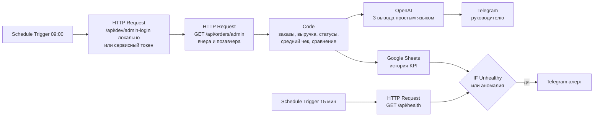
```mermaid
flowchart LR
  S1["Schedule Trigger 09:00"] --> L["HTTP Request<br/>/api/dev/admin-login локально<br/>или сервисный токен"]
  L --> O["HTTP Request<br/>GET /api/orders/admin<br/>вчера и позавчера"]
  O --> C["Code<br/>заказы, выручка, статусы,<br/>средний чек, сравнение"]
  C --> AI["OpenAI<br/>3 вывода простым языком"]
  AI --> TG["Telegram<br/>руководителю"]
  C --> GS["Google Sheets<br/>история KPI"]
  S2["Schedule Trigger 15 мин"] --> H["HTTP Request<br/>GET /api/health"]
  H --> IF{"IF Unhealthy<br/>или аномалия"}
  GS --> IF
  IF -->|"да"| AL["Telegram алерт"]
```

### <a id="d-steps"></a>Шаги автоматизации

#### <a id="d1"></a>Д1. Ежедневный KPI-дайджест

Экраны: [панель](#scr-admin-dashboard), [заказы](#scr-admin-orders) · портфолио: [ПФ-1](#pf-1)

1. **Schedule Trigger** — каждый день 09:00 (Europe/Kyiv).
2. **HTTP Request** → токен: локально `POST /api/dev/admin-login` (только в Development, [код](https://github.com/Teslyar75/My_Amazon2/blob/bcaec5fc8ab617830197b5fe69a976c6f214cb3e/src/Perry.Api/Controllers/DevAdminAuthController.cs#L39-L45)); в бою — сервисный токен ([API-2](#api-2)).
3. **HTTP Request** → `GET /api/orders/admin?fromUtc=…&toUtc=…&pageSize=100` — в ответе уже есть `totalOrders`, `totalAmount`, `statusCounts`, `totalOrderCompare`, `totalAmountCompare` ✅ ([код](https://github.com/Teslyar75/My_Amazon2/blob/bcaec5fc8ab617830197b5fe69a976c6f214cb3e/src/Perry.Api/Controllers/OrdersController.cs#L142-L159)). **Ничего дописывать в Perry не нужно.**
4. **HTTP Request** → `GET /api/products/popular?take=5`, `GET /api/admin/wishlist/summary?take=5`.
5. **Code** — средний чек, доля отмен, сравнение со вчера в %.
6. **OpenAI** — 3 коротких вывода («отмены выросли до 14 %: проверьте товар X»).
7. **Telegram** — сообщение руководителю; **Google Sheets** — строка в историю.

#### <a id="d2"></a>Д2. Алерты и аномалии

Экраны: [главная](#scr-home), [категории](#scr-admin-categories), [мобильное](#scr-mobile)

1. **Schedule Trigger** — каждые 15 минут: `GET /api/health` ([код](https://github.com/Teslyar75/My_Amazon2/blob/bcaec5fc8ab617830197b5fe69a976c6f214cb3e/src/Perry.Api/Program.cs#L180-L194)); `Unhealthy` два раза подряд → алерт.
2. **Schedule Trigger** — каждый час: заказы за час против среднего за тот же час прошлой недели (из Google Sheets); падение > 50 % ⚠️ → алерт.
3. **Schedule Trigger** — раз в день: `GET /api/products` и `GET /api/categories` → **Code** ищет тестовые названия («QA Cat…», «Smoke A12 Product» — они видны на [рис. 1](#scr-home), [рис. 15](#scr-admin-categories), [рис. 19](#scr-mobile)) и товары без картинок.
4. **Error Trigger** — любой упавший воркфлоу n8n → алерт (контроль самой автоматизации).
5. **Telegram** — алерт с кнопкой «Принято».

### <a id="d-api"></a>Связь с API Perry

Д1 и Д2 работают **на существующих эндпоинтах**. Это самая быстрая победа и первый [портфолио-воркфлоу](#pf-1).

### <a id="d-effect"></a>Эффект ⚠️ примерная оценка

**≈ 21,5 ч/мес** → **≈ 4 300 грн/мес**, плюс простои ловятся за 15–30 минут, а не к вечеру.

### <a id="d-tech"></a>Технические требования

Только n8n, Telegram-бот и доступ к Perry API.

### <a id="d-complexity"></a>Сложность

**Низкая**: 0,5–1 день на каждый ⚠️.

### <a id="d-risks"></a>Риски

Ложные алерты утомляют → пороги подбираем 2 недели ([R7](#r7)).

<p class="navlinks"><a href="#toc">↑ к оглавлению</a> · <a href="#system">→ далее: Система автоматизации целиком</a></p>

---

## <a id="system"></a>10. Система автоматизации целиком

Потоки А–Д — это не 22 отдельных «робота», а **одна система** из пяти слоёв. Если строить их по отдельности, через полгода получится зоопарк: у каждого воркфлоу свой токен, свои копии справочников, ошибки никто не видит. Поэтому сначала договариваемся об общей архитектуре.

### <a id="system-layers"></a>10.1. Пять слоёв

| Слой | Что это | Из чего состоит | Где описано |
|---|---|---|---|
| **1. Источники событий** | всё, что «происходит» в магазине | Product API (заказ, статус, остаток, отзыв, товар), Telegram (сообщения клиентов), почта (прайсы), расписание | [API-1](#api-1), [Г1](#g1), [А1](#a1) |
| **2. Шина событий** | единая точка входа | один **Webhook** n8n `/perry-events` с проверкой подписи [HMAC](#g-hmac) → **Switch** по типу события → **Execute Workflow** нужного потока | [10.2](#system-scheme) |
| **3. Исполнители** | воркфлоу n8n, по одному на процесс | А1…Д2, каждый — маленький под-воркфлоу с одной задачей | [потоки](#stream-a) |
| **4. AI-слой** | думает, но ничего не делает сам | **AI-оркестратор** выбирает, что запустить; специализированные агенты (контент, маркетинг, поддержка, модерация) пишут тексты и метки | [раздел 11](#agents) |
| **5. Контроль** | человек и журнал | одобрения в Telegram (позже в админке), журнал действий, алерты об ошибках, метрики сэкономленных часов | [11.2](#agents-hitl), [11.3](#agents-audit), [Д2](#d2) |

Общие правила для всех воркфлоу:

- **Один сервисный токен** Perry на всю систему, хранится в Credentials n8n, обновляется сам ([API-2](#api-2)).
- **Справочники в одном месте**: Data table n8n (характеристики, пороги, правила поставщиков).
- **Каждая запись в Perry — с ключом идемпотентности** ([API-9](#api-9)), чтобы повторный запуск не создал вторую ТТН.
- **Каждый воркфлоу пишет строку в журнал**: что сделал, сколько минут ручной работы это заменило. Из журнала считаются [часы и деньги](#effect).
- **Всё, что касается денег, клиентов и публикаций, проходит через человека** ([11.2](#agents-hitl)).

### <a id="system-scheme"></a>10.2. Схема системы

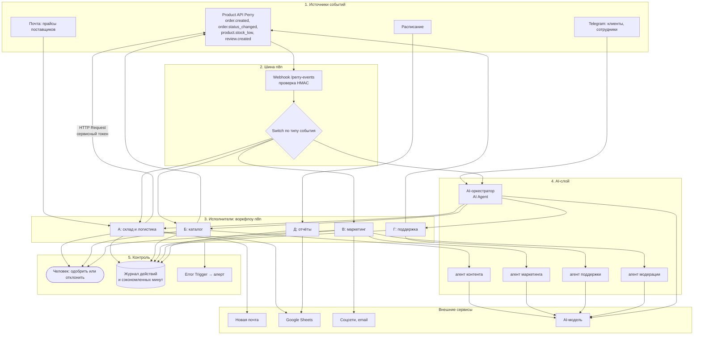
```mermaid
flowchart TB
  subgraph SRC["1. Источники событий"]
    PAPI["Product API Perry<br/>order.created, order.status_changed,<br/>product.stock_low, review.created"]
    TGIN["Telegram: клиенты, сотрудники"]
    MAILIN["Почта: прайсы поставщиков"]
    CRON["Расписание"]
  end
  subgraph BUS["2. Шина n8n"]
    WH["Webhook /perry-events<br/>проверка HMAC"]
    SW{"Switch по типу события"}
  end
  subgraph AI["4. AI-слой"]
    ORC["AI-оркестратор<br/>AI Agent"]
    AGC["агент контента"]
    AGM["агент маркетинга"]
    AGS["агент поддержки"]
    AGR["агент модерации"]
  end
  subgraph EXE["3. Исполнители: воркфлоу n8n"]
    WA["А: склад и логистика"]
    WB["Б: каталог"]
    WV["В: маркетинг"]
    WG["Г: поддержка"]
    WD["Д: отчёты"]
  end
  subgraph CTRL["5. Контроль"]
    HITL(["Человек: одобрить или отклонить"])
    LOG[("Журнал действий<br/>и сэкономленных минут")]
    ERR["Error Trigger → алерт"]
  end
  subgraph EXT["Внешние сервисы"]
    NP["Новая почта"]
    GS["Google Sheets"]
    SOC["Соцсети, email"]
    LLM["AI-модель"]
  end
  PAPI --> WH
  TGIN --> ORC
  MAILIN --> WA
  CRON --> WD
  WH --> SW
  SW --> WA
  SW --> WB
  SW --> WV
  SW --> ORC
  ORC --> WG
  ORC --> WA
  ORC --> WB
  WB --> AGC
  WV --> AGM
  WG --> AGS
  WV --> AGR
  AGC --> LLM
  AGM --> LLM
  AGS --> LLM
  AGR --> LLM
  ORC --> LLM
  WA --> NP
  WA --> GS
  WV --> SOC
  WD --> GS
  WA -->|"HTTP Request<br/>сервисный токен"| PAPI
  WB --> PAPI
  WG --> PAPI
  WA --> HITL
  WB --> HITL
  WV --> HITL
  WA --> LOG
  WB --> LOG
  WV --> LOG
  WG --> LOG
  WD --> LOG
  EXE --> ERR
```

### <a id="system-data"></a>10.3. Где живут данные

| Данные | Главный источник | Кто читает | Кто пишет |
|---|---|---|---|
| Товары, остатки, цены | Product API (PostgreSQL) | все потоки | А1 (остатки), Б1–Б3 (контент) — только через API |
| Заказы и статусы | Product API | А3–А6, Г1, Д1 | А3–А6 через `PUT …/status` |
| Пользователи, email | Auth / Admin Service | Perry API по внутреннему каналу | не пишем |
| ТТН и статусы доставки | «Новая почта» | А5, Г1 | А4, А6 |
| Журнал автоматизации, KPI, очереди публикаций | Google Sheets на старте ⚠️, позже отдельная таблица в PostgreSQL | Д1, В7, отчёт об эффекте | все воркфлоу |
| Справочники, пороги | Data table n8n | все воркфлоу | человек |

**Правило:** n8n **не ходит в базу Perry напрямую**, только через API. Так сохраняются проверки, которые уже есть в коде (остаток не уходит в минус, [OrderService.cs](https://github.com/Teslyar75/My_Amazon2/blob/bcaec5fc8ab617830197b5fe69a976c6f214cb3e/src/Perry.Infrastructure/Services/OrderService.cs#L293-L301)), и письма клиентам.

<p class="navlinks"><a href="#toc">↑ к оглавлению</a> · <a href="#agents">→ далее: AI-агенты и оркестрация</a></p>

---

## <a id="agents"></a>11. AI-агенты и оркестрация

### <a id="agents-orc"></a>11.1. Оркестратор над воркфлоу

**Оркестратор** ([глоссарий](#g-orchestrator)) — это AI-агент-диспетчер, такой же по смыслу, как Grok Bot у Сергея: он получает задачу на обычном языке («почему вчера мало заказов?», «оформи возврат по #AT456BB», «подготовь посты про новые кроссовки»), **сам выбирает, какие воркфлоу вызвать**, собирает результат и отвечает.

Как это собрать в n8n:

1. **Telegram Trigger** (чат сотрудников) или **Chat Trigger** (окно в админке, позже).
2. **AI Agent** — системный промпт: роль, правила, список инструментов, запреты.
3. Инструменты агента — **Call n8n Workflow Tool**: каждый воркфлоу А–Д подключён как «инструмент» с понятным описанием и схемой входа. Агент не знает про НП или SQL, он знает «есть инструмент `create_ttn(orderId)`».
4. Инструменты только для чтения (KPI, статус заказа, остатки) агент вызывает **сам**. Инструменты, которые что-то меняют, по умолчанию идут **через одобрение**.
5. **MCP Server Trigger** ✅ (есть в n8n) — тот же набор воркфлоу можно открыть внешнему агенту, например Grok Bot, по протоколу [MCP](#g-mcp).

### <a id="agents-hitl"></a>11.2. Человек в контуре (human-in-the-loop)

| Действие | Кто решает | Как |
|---|---|---|
| Чтение данных: KPI, статус, остатки | агент сам | сразу |
| Тексты-черновики (описания, посты) | агент готовит, **человек одобряет** | Telegram «Send and Wait for Response»; в n8n есть «Human approval for tool calls» ✅ |
| Смена статуса заказа по трекингу НП | автоматически по правилу | правило, а не AI |
| ТТН для заказа с полными данными | автоматически | при ошибке — человек |
| Закупка у поставщика, возврат, изменение цены | **только человек** | кнопка «Одобрить» с суммой |
| Публикация в соцсетях, рассылка клиентам | **только человек** | одобрение конкретного текста |
| Удаление отзыва | **только человек** | предложение от AI, решение модератора |

### <a id="agents-audit"></a>11.3. Журнал действий (audit log)

Каждое действие пишется одной строкой: время, воркфлоу, кто запустил (агент, расписание, человек), что сделано, ID объекта в Perry, кто одобрил, **сколько минут ручной работы заменено**. В Perry нужна пометка «изменено автоматизацией» ([API-9](#api-9)), чтобы в админке было видно, кто поменял остаток: человек или робот.

### <a id="agents-cost"></a>11.4. Сколько стоят AI-вызовы ⚠️ примерная оценка

| Где AI | Вызовов в месяц | Токенов на вызов (вход / выход) | Всего, млн токенов (вход / выход) |
|---|---|---|---|
| Бот поддержки [Г1–Г3](#stream-g) | 900 диалогов × 4 = 3 600 | 3 000 / 300 | 10,8 / 1,08 |
| Описания и характеристики [Б1–Б2](#stream-b) | 200 | 2 000 / 1 000 | 0,4 / 0,2 |
| Модерация отзывов [В5](#v5) | 300 | 800 / 150 | 0,24 / 0,05 |
| Посты, рассылки, отчёты [В1, В4, В7](#stream-v) | 60 | 3 000 / 1 500 | 0,18 / 0,09 |
| Оркестратор и Д1–Д2 | 300 | 3 000 / 500 | 0,9 / 0,15 |
| **Итого** | | | **≈ 12,5 / 1,6** |

Цены OpenAI на 06.10.2026 ✅ ([страница цен](https://developers.openai.com/api/docs/pricing)): у «малых» моделей порядок **$0,10–0,25 за 1 млн входных** и **$0,50–2,00 за 1 млн выходных** токенов, у средних — около $2 / $10. Отсюда:

- малая модель: 12,5 × 0,25 + 1,6 × 2 ≈ **$6–7 в месяц** (≈ 250–300 грн ⚠️ по курсу ≈ 41–42 грн/$, ❓ сверить);
- средняя модель для сложных задач: 12,5 × 2 + 1,6 × 10 ≈ **$41 в месяц**.

Вывод: AI-вызовы стоят **меньше 1 %** от сэкономленных ≈ 72 500 грн. Главная статья расходов — время на настройку и контроль, а не токены.

<p class="navlinks"><a href="#toc">↑ к оглавлению</a> · <a href="#tools">→ далее: n8n или Make</a></p>

---

## <a id="tools"></a>12. n8n или Make

Цены проверены 06.10.2026. n8n — по [n8n.io/pricing](https://n8n.io/pricing/) ✅. У Make официальная страница [make.com/en/pricing](https://www.make.com/en/pricing) не отдала цифры в текстовом виде, поэтому цены Make взяты из обзора [jetadmin.io](https://www.jetadmin.io/blog/make-pricing/) ⚠️, а лимиты — с официальной страницы ✅.

| Критерий | n8n | Make |
|---|---|---|
| **Модель оплаты** | за **запуск воркфлоу целиком** ([execution](#g-execution)), сколько бы шагов в нём ни было ✅ | за **каждое действие модуля** ([credit](#g-credit)): 1 модуль ≈ 1 кредит ✅ |
| **Облако, цена** | Starter **€24/мес** помесячно или €20/мес при оплате за год, **2 500 запусков**; Pro **€60/мес** или €50/мес за год, **10 000 запусков**; Business €667/мес за год ✅ | Free — 1 000 кредитов ✅; Core ≈ **$10,59/мес** или $9/мес за год за 10 000 кредитов; Pro ≈ $18,82; Teams ≈ $34,12 ⚠️ |
| **Свой сервер (self-host)** | **Да**: Community Edition бесплатно, исходники на GitHub ✅; платишь только за сервер | **Нет**, только облако (AWS EU / Северная Америка) ✅ |
| **Лимиты** | Starter: 5 одновременных запусков ✅; на своём сервере лимиты задаёт железо | Free: 2 активных сценария, интервал от 15 мин, 5 мин на запуск; платные: интервал от 1 мин, до 40 мин на запуск ✅ |
| **AI** | узел **AI Agent**, MCP Server Trigger и MCP Client, одобрение человеком для вызова инструментов ✅ | Make AI Agents (beta), MCP server ✅ |
| **Код** | узел **Code** (JavaScript / Python) без доплат ✅ | Make Code App: 2 кредита за 1 с выполнения ✅ |
| **Порог входа** | выше, ближе к программированию | ниже, очень наглядный |
| **Подходит Perry** | ✅ свой .NET API, нужен Code, много событий | годится для простых связок «форма → таблица» |

**Сколько запусков нужно Perry** ⚠️: `order.created` 1 500 + смены статуса ≈ 4 500 + трекинг каждые 2 часа ≈ 240 + сообщения бота ≈ 3 600 + отчёты и алерты ≈ 3 500 (health каждые 15 мин ≈ 2 900) ≈ **13 000 запусков в месяц**. Это больше лимита n8n Pro в облаке (10 000). В Make тот же объём при 5–10 модулях на сценарий — **65 000–130 000 кредитов**, далеко за пределами 10 000 тарифа Core.

**Рекомендация: n8n на своём сервере.** Причины: (1) объём не упирается в тарифы, (2) данные клиентов остаются у магазина, (3) можно в Docker рядом с Perry, (4) Сергей уже ставит n8n локально, значит [портфолио-воркфлоу](#portfolio) переносятся на сервер без переделки. Make оставляем как вариант для отделов, которым нужен очень простой визуальный конструктор.

Локально (Windows, ноутбук Сергея) ❓ пример команды:

```bash
docker run -it --rm --name n8n -p 5678:5678 \
  -e GENERIC_TIMEZONE=Europe/Kyiv \
  -v n8n_data:/home/node/.n8n \
  docker.n8n.io/n8nio/n8n
```

Из контейнера n8n локальный Perry API открывается по адресу `http://host.docker.internal:5272` (не `localhost`: внутри контейнера это сам контейнер).

<p class="navlinks"><a href="#toc">↑ к оглавлению</a> · <a href="#api-gaps">→ далее: Каких API не хватает</a></p>

---

## <a id="api-gaps"></a>13. Каких API не хватает в Perry

Это работа в коде Product API, то есть **в зоне Сергея**: хороший кусок для портфолио «бэкенд под автоматизацию». Пункты, которые касаются Auth или админского бэкенда, помечены ❓ и требуют согласования.

| № | Что добавить | Зачем | Что есть сейчас | Сложность ⚠️ |
|---|---|---|---|---|
| <a id="api-1"></a>API-1 | **Исходящие вебхуки**: `order.created`, `order.status_changed`, `product.created`, `product.stock_low`, `product.back_in_stock`, `review.created`. Подпись HMAC в заголовке, повтор при ошибке | запуск потоков без опроса | только письма в тех же местах кода ([создание](https://github.com/Teslyar75/My_Amazon2/blob/bcaec5fc8ab617830197b5fe69a976c6f214cb3e/src/Perry.Infrastructure/Services/OrderService.cs#L357-L368), [статус](https://github.com/Teslyar75/My_Amazon2/blob/bcaec5fc8ab617830197b5fe69a976c6f214cb3e/src/Perry.Infrastructure/Services/OrderService.cs#L387-L403)) | 2–3 дня |
| <a id="api-2"></a>API-2 | **Сервисный токен для n8n** с ролью `Automation` и узкими правами; эндпоинт `POST /api/support/order-status` (номер + email → статус) | безопасный доступ без админского JWT | для локальных демо есть `/api/dev/admin-login` (только Development, [код](https://github.com/Teslyar75/My_Amazon2/blob/bcaec5fc8ab617830197b5fe69a976c6f214cb3e/src/Perry.Api/Controllers/DevAdminAuthController.cs#L39-L45)); образец канала сервис-сервис — `internal/auth/token` ([код](https://github.com/Teslyar75/My_Amazon2/blob/bcaec5fc8ab617830197b5fe69a976c6f214cb3e/src/Perry.Infrastructure/Services/AuthInternalClient.cs#L64-L96)); политики ролей ([код](https://github.com/Teslyar75/My_Amazon2/blob/bcaec5fc8ab617830197b5fe69a976c6f214cb3e/src/Perry.Api/Program.cs#L135-L141)) | 1–2 дня + ❓ Auth ([вопрос 3](#q3)) |
| <a id="api-3"></a>API-3 | **Остатки**: `GET /api/admin/stock?skus=…`, `PATCH /api/admin/stock/bulk` (SKU → количество) | синхронизация без порчи товара | только полный `PUT`, который перезаписывает фото и характеристики ([код](https://github.com/Teslyar75/My_Amazon2/blob/bcaec5fc8ab617830197b5fe69a976c6f214cb3e/src/Perry.Api/Controllers/ProductsController.cs#L617-L627)) | 1 день |
| <a id="api-4"></a>API-4 | **Точечные правки**: `PATCH /api/products/{id}/content`, `/attributes` (с `IsFilterable`), `/images`; поиск по SKU | AI-контент без потери данных | поиск каталога только по названию и бренду ([код](https://github.com/Teslyar75/My_Amazon2/blob/bcaec5fc8ab617830197b5fe69a976c6f214cb3e/src/Perry.Api/Controllers/ProductsController.cs#L99-L100)) | 1–2 дня |
| <a id="api-5"></a>API-5 | **Доставка в заказе**: телефон, `cityRef`, `warehouseRef`, `trackingNumber`, `carrierStatus`; `PUT /api/orders/{id}/shipment` | ТТН и трекинг НП | одна строка `ShippingAddress` ([Order.cs](https://github.com/Teslyar75/My_Amazon2/blob/bcaec5fc8ab617830197b5fe69a976c6f214cb3e/src/Perry.Domain/Entities/Order.cs#L28-L33)), адрес-заглушка по умолчанию ([код](https://github.com/Teslyar75/My_Amazon2/blob/bcaec5fc8ab617830197b5fe69a976c6f214cb3e/src/Perry.Infrastructure/Services/OrderService.cs#L278-L280)) | 2 дня + поля на [checkout](#scr-checkout) |
| <a id="api-6"></a>API-6 | **Подписчики Notify**: `GET …/stock-notify/pending`, `PATCH …/notified` | письма «снова в наличии» | подписка пишется ([код](https://github.com/Teslyar75/My_Amazon2/blob/bcaec5fc8ab617830197b5fe69a976c6f214cb3e/src/Perry.Api/Controllers/StockNotifyController.cs#L56-L70)), `NotifiedAtUtc` не используется | 0,5 дня |
| <a id="api-7"></a>API-7 | **Брошенные корзины**: `GET /api/admin/carts/abandoned?olderThanHours=…` | напоминания | `Cart.UpdatedAtUtc` есть ([Cart.cs](https://github.com/Teslyar75/My_Amazon2/blob/bcaec5fc8ab617830197b5fe69a976c6f214cb3e/src/Perry.Domain/Entities/Cart.cs#L19)) | 0,5 дня |
| <a id="api-8"></a>API-8 | **Возврат на склад**: `POST /api/admin/orders/{id}/restock`, причина возврата | возвраты | `Returned` без возврата остатка ([код](https://github.com/Teslyar75/My_Amazon2/blob/bcaec5fc8ab617830197b5fe69a976c6f214cb3e/src/Perry.Infrastructure/Services/OrderService.cs#L373-L385)) | 1 день |
| <a id="api-9"></a>API-9 | **Идемпотентность и аудит**: заголовок `Idempotency-Key`, поле «кем изменено» (`human` / `automation:<workflow>`) | без дублей, понятный журнал | нет | 1–2 дня |
| <a id="api-10"></a>API-10 | **Сегменты покупателей**: число заказов, сумма, дата последнего заказа по `userId` | рассылки и CRM | есть фильтр `userId` в админских заказах ([код](https://github.com/Teslyar75/My_Amazon2/blob/bcaec5fc8ab617830197b5fe69a976c6f214cb3e/src/Perry.Api/Controllers/OrdersController.cs#L84-L98)); ❓ данные пользователей в Admin Service | 1 день |

Как выглядит вебхук ([API-1](#api-1)) в работе:

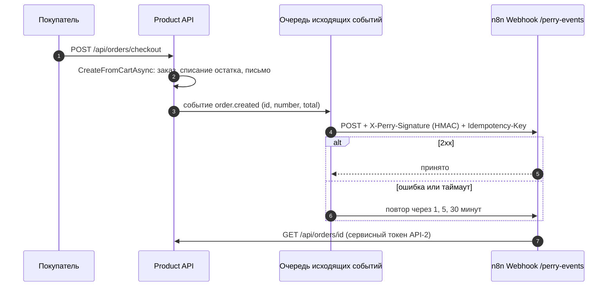
```mermaid
sequenceDiagram
  autonumber
  participant U as Покупатель
  participant P as Product API
  participant Q as Очередь исходящих событий
  participant N as n8n Webhook /perry-events
  U->>P: POST /api/orders/checkout
  P->>P: CreateFromCartAsync: заказ, списание остатка, письмо
  P->>Q: событие order.created (id, number, total)
  Q->>N: POST + X-Perry-Signature (HMAC) + Idempotency-Key
  alt 2xx
    N-->>Q: принято
  else ошибка или таймаут
    Q->>N: повтор через 1, 5, 30 минут
  end
  N->>P: GET /api/orders/id (сервисный токен API-2)
```

<p class="navlinks"><a href="#toc">↑ к оглавлению</a> · <a href="#effect">→ далее: Итоговая оценка эффекта</a></p>

---

## <a id="effect"></a>14. Итоговая оценка эффекта

Все цифры ⚠️ **примерная оценка** при [допущениях](#goals) (50 заказов в день) и **примерной ставке 200 грн/ч**.

| Поток | Ручных ч/мес | Экономия ч/мес | Экономия грн/мес | Дополнительно |
|---|---|---|---|---|
| [А. Склад и логистика](#stream-a) | 221,5 | **178,5** | **35 700** | меньше ошибок в ТТН |
| [Б. Каталог и контент](#stream-b) | 98,4 | **73,5** | **14 700** | чистые фильтры каталога |
| [В. Маркетинг](#stream-v) | 69 | **49** | **9 800** | ≈ 30 000 грн оборота от брошенных корзин ([В3](#v3)) |
| [Г. Поддержка](#stream-g) | 59 | **40** | **8 000** | ответ за секунды |
| [Д. Отчётность](#stream-d) | 25 | **21,5** | **4 300** | простои ловятся за 15 минут |
| **Итого** | **≈ 473** | **≈ 362,5** | **≈ 72 500** | |

Расходы ⚠️: сервер для n8n ≈ €10–20/мес, AI-вызовы ≈ $7–41/мес ([11.4](#agents-cost)), сервис удаления фона ❓. Вместе **< 3 %** от экономии.

### <a id="effect-ramp"></a>14.1. Как растёт экономия по месяцам

| Конец месяца | Что запущено | Экономия ч/мес (run-rate) |
|---|---|---|
| 1-й (недели 1–4) | [Д1](#d1), [Г1](#g1), [А5](#a5), [А3](#a3), [А4](#a4) | 13,5 + 25 + 22 + 30 + 64 = **154,5** |
| 2-й (недели 5–8) | + [А1](#a1), [А2](#a2), [Б1](#b1), [Б2](#b2), [Г2](#g2), [Г3](#g3), [В6](#v6), [В7](#v7) | + 130,5 = **285** ✅ цель 250 достигнута |
| 3-й (недели 9–12) | + [А6](#a6), [Б3](#b3), [Б4](#b4), [В1](#v1), [В2](#v2), [В4](#v4), [В5](#v5), [Д2](#d2) | + 77,5 = **362,5** |

### <a id="effect-500"></a>14.2. Честно про 500 часов

**При 50 заказах в день до 500 ч/мес не дотягиваем: получается ≈ 362.** Почему и что с этим делать:

- От числа заказов зависят [А3](#a3), [А4](#a4), [А5](#a5), [А6](#a6) и весь [поток Г](#stream-g): вместе **163,5 ч**. Остальные 199 ч от заказов почти не зависят.
- Чтобы выйти на 500, «заказная» часть должна вырасти до ≈ 301 ч, то есть в 1,84 раза: **≈ 90–95 заказов в день** ⚠️.
- Второй путь — добавить поток, которого в Perry нет, а в вакансии он **первый**: **бухгалтерия и финансы** (сверка оплат с банком, счета поставщикам, перенос данных между таблицами и учётной системой). Для магазина такого размера это ≈ 60–120 ч/мес ⚠️ ❓, но без доступа к реальным процессам считать это мы не можем.
- Цифру 500 из вакансии называем **ориентиром для магазина, где больше заказов или больше ручных отделов**. Говорить на собеседовании, что Perry «даст 500», нельзя: это было бы неправдой.

<p class="navlinks"><a href="#toc">↑ к оглавлению</a> · <a href="#plan">→ далее: План внедрения</a></p>

---

## <a id="plan"></a>15. План внедрения и портфолио

### <a id="plan-gantt"></a>15.1. График на 12 недель

Принцип: сначала [быстрые победы](#g-quickwin) на существующих эндпоинтах, потом то, что требует доработки API.

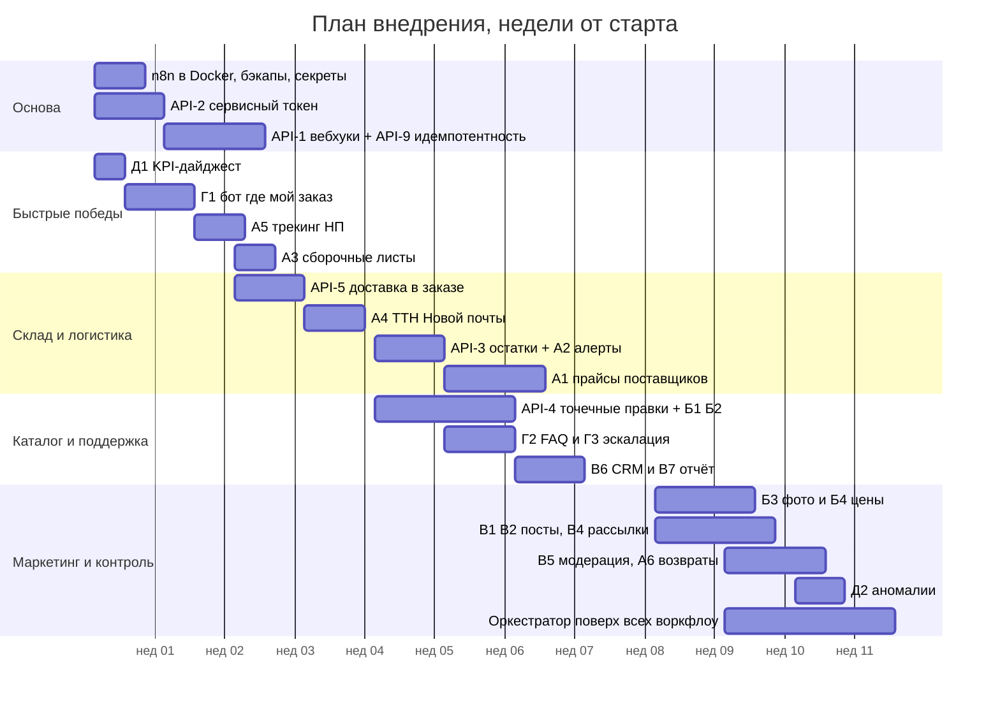
```mermaid
gantt
  title План внедрения, недели от старта
  dateFormat YYYY-MM-DD
  axisFormat нед %W
  tickInterval 1week
  section Основа
  n8n в Docker, бэкапы, секреты       :base1, 1970-01-05, 5d
  API-2 сервисный токен                :base2, 1970-01-05, 7d
  API-1 вебхуки + API-9 идемпотентность :base3, 1970-01-12, 10d
  section Быстрые победы
  Д1 KPI-дайджест                       :d1, 1970-01-05, 3d
  Г1 бот где мой заказ                  :g1, 1970-01-08, 7d
  А5 трекинг НП                         :a5, 1970-01-15, 5d
  А3 сборочные листы                    :a3, 1970-01-19, 4d
  section Склад и логистика
  API-5 доставка в заказе               :api5, 1970-01-19, 7d
  А4 ТТН Новой почты                    :a4, 1970-01-26, 6d
  API-3 остатки + А2 алерты             :a2, 1970-02-02, 7d
  А1 прайсы поставщиков                 :a1, 1970-02-09, 10d
  section Каталог и поддержка
  API-4 точечные правки + Б1 Б2          :b1, 1970-02-02, 14d
  Г2 FAQ и Г3 эскалация                 :g2, 1970-02-09, 7d
  В6 CRM и В7 отчёт                     :v7, 1970-02-16, 7d
  section Маркетинг и контроль
  Б3 фото и Б4 цены                     :b3, 1970-03-02, 10d
  В1 В2 посты, В4 рассылки              :v1, 1970-03-02, 12d
  В5 модерация, А6 возвраты             :v5, 1970-03-09, 10d
  Д2 аномалии                           :d2, 1970-03-16, 5d
  Оркестратор поверх всех воркфлоу      :orc, 1970-03-09, 17d
```

Каждую неделю: замер «до» (секундомер, 10 повторов ⚠️), запуск, через неделю — сверка с журналом запусков и пересчёт часов. Автоматизация, которой не пользуются, **не считается** ([вакансия](#vacancy) прямо об этом говорит).

### <a id="portfolio"></a>15.2. Что сделать первым для портфолио

Три воркфлоу, которые Сергей может собрать в **локальном n8n против локального Perry API** (`dotnet run` → `http://host.docker.internal:5272`) и показать на собеседовании. Для каждого — формула «было → стало → часы → деньги».

#### <a id="pf-1"></a>ПФ-1. Утренний KPI-дайджест в Telegram

Основа — [Д1](#d1). Работает **без изменений в коде Perry**.

1. **Schedule Trigger** 09:00 → 2. **HTTP Request** `POST /api/dev/admin-login` ([код](https://github.com/Teslyar75/My_Amazon2/blob/bcaec5fc8ab617830197b5fe69a976c6f214cb3e/src/Perry.Api/Controllers/DevAdminAuthController.cs#L39-L74)) → 3. **HTTP Request** `GET /api/orders/admin?fromUtc=…&toUtc=…` с `Authorization: Bearer {{token}}` → 4. **Code**: заказы, выручка, `statusCounts`, сравнение со вчера → 5. **OpenAI**: 3 вывода → 6. **Telegram**.

**Что показать:** живое сообщение в Telegram; экран [заказов в админке](#scr-admin-orders) с теми же цифрами. **Было:** 30 мин в день открывать админку и считать. **Стало:** 0. **Итого:** 15 ч/мес ≈ 3 000 грн/мес ⚠️ на одного руководителя.

#### <a id="pf-2"></a>ПФ-2. Telegram-бот «Где мой заказ?»

Основа — [Г1](#g1).

1. **Telegram Trigger** → 2. **AI Agent** (память **Simple Memory**) с инструментом **HTTP Request Tool** `GET /api/orders/admin?orderId={{номер}}` → 3. **Code**: сверить email, перевести статус → 4. **Telegram** ответ; 5. ветка **IF** «не нашёл» → **Telegram** в чат оператора.

**Что показать:** диалог с ботом по реальному номеру из [«Мои заказы»](#scr-my-orders); честно сказать, что в бою нужен узкий эндпоинт [API-2](#api-2) вместо админского. **Итого:** ≈ 25 ч/мес ≈ 5 000 грн/мес ⚠️.

#### <a id="pf-3"></a>ПФ-3. AI-описание товара с одобрением человеком

Основа — [Б1](#b1). Показывает самое ценное для вакансии: **AI + API + человек в контуре**.

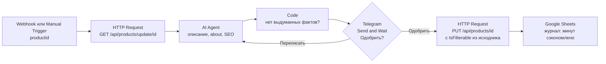
```mermaid
flowchart LR
  T["Webhook или Manual Trigger<br/>productId"] --> G["HTTP Request<br/>GET /api/products/update/id"]
  G --> AI["AI Agent<br/>описание, about, SEO"]
  AI --> CHK["Code<br/>нет выдуманных фактов?"]
  CHK --> APR{"Telegram<br/>Send and Wait<br/>Одобрить?"}
  APR -->|"Одобрить"| PUT["HTTP Request<br/>PUT /api/products/id<br/>с IsFilterable из исходника"]
  APR -->|"Переписать"| AI
  PUT --> LOG["Google Sheets<br/>журнал: минут сэкономлено"]
```

Важно для демо ✅: пока нет [API-4](#api-4), в `PUT` нужно **вернуть все поля товара**, а флаг `IsFilterable` проставить самому для «Color / Size / Fabric type»: его нет ни в `GET …/update/{id}` ([код](https://github.com/Teslyar75/My_Amazon2/blob/bcaec5fc8ab617830197b5fe69a976c6f214cb3e/src/Perry.Api/Controllers/ProductsController.cs#L221-L223)), ни в полной карточке `GET /api/products/{id}` ([код](https://github.com/Teslyar75/My_Amazon2/blob/bcaec5fc8ab617830197b5fe69a976c6f214cb3e/src/Perry.Api/Controllers/ProductsController.cs#L286-L288)). Иначе пропадут фильтры [каталога](#scr-catalog). Сам этот нюанс — хороший рассказ на собеседовании: «я знаю бэкенд и вижу, где автоматизация может сломать данные».

**Итого:** 25 → 7 мин на товар, ≈ 29 ч/мес ≈ 5 800 грн/мес ⚠️ при 100 товарах.

<p class="navlinks"><a href="#toc">↑ к оглавлению</a> · <a href="#tech">→ далее: Технические требования</a></p>

---

## <a id="tech"></a>16. Технические требования

| Тема | Что нужно |
|---|---|
| **Сервер** | VPS 2 vCPU / 4 ГБ RAM / 40 ГБ SSD ⚠️ (≈ €10–20/мес), Docker Compose: n8n + PostgreSQL для n8n (не SQLite) + обратный прокси с HTTPS (Caddy или Nginx). Perry API уже собирается в Docker ([docker-compose.yml](https://github.com/Teslyar75/My_Amazon2/blob/bcaec5fc8ab617830197b5fe69a976c6f214cb3e/docker-compose.yml#L29-L59)) |
| **Публичный адрес** | HTTPS-домен для вебхуков (Telegram и Perry). Локально — туннель (ngrok или Cloudflare Tunnel) ❓ |
| **Секреты** | ключи НП, AI, Telegram, сервисный секрет Perry — только в Credentials n8n и `.env`, не в git. В Perry секреты уже читаются из env ([Program.cs](https://github.com/Teslyar75/My_Amazon2/blob/bcaec5fc8ab617830197b5fe69a976c6f214cb3e/src/Perry.Api/Program.cs#L11-L25)), credential к Auth — тоже из env ([AuthInternalClient.cs](https://github.com/Teslyar75/My_Amazon2/blob/bcaec5fc8ab617830197b5fe69a976c6f214cb3e/src/Perry.Infrastructure/Services/AuthInternalClient.cs#L21-L25)). `N8N_ENCRYPTION_KEY` сохранить отдельно |
| **Безопасность** | вебхуки с подписью HMAC ([API-1](#api-1)); сервисный токен с минимальными правами ([API-2](#api-2)); 2FA в n8n; доступ к n8n только по HTTPS; Production Perry без `dev/admin-login` (в коде он уже возвращает 404 вне Development ✅, [код](https://github.com/Teslyar75/My_Amazon2/blob/bcaec5fc8ab617830197b5fe69a976c6f214cb3e/src/Perry.Api/Controllers/DevAdminAuthController.cs#L43-L45)); персональные данные в AI не отправляем ([R5](#r5)) |
| **Бэкапы** | ежедневный дамп PostgreSQL n8n и Perry, экспорт воркфлоу в git (JSON) раз в день, проверка восстановления раз в месяц |
| **Мониторинг** | [Д2](#d2): health Perry, Error Trigger n8n, алерты в Telegram |
| **Тесты** | новые эндпоинты [API-1…10](#api-gaps) покрываем xUnit, как существующие 15 тестов ([OrderServiceTests.cs](https://github.com/Teslyar75/My_Amazon2/blob/bcaec5fc8ab617830197b5fe69a976c6f214cb3e/tests/Perry.Tests/OrderServiceTests.cs)) |

<p class="navlinks"><a href="#toc">↑ к оглавлению</a> · <a href="#risks">→ далее: Риски</a></p>

---

## <a id="risks"></a>17. Риски

| № | Риск | Чем грозит | Что делаем |
|---|---|---|---|
| <a id="r1"></a>R1 | AI ошибается или выдумывает ([галлюцинации](#g-hallucination)) | неверное описание, цена в посте, обещание в чате | одобрение человеком ([11.2](#agents-hitl)), проверки в Code, ответы бота только из базы знаний |
| <a id="r2"></a>R2 | Ошибка в данных поставщика | обнулённые остатки, продажа того, чего нет | порог расхождения, одобрение, журнал и откат |
| <a id="r3"></a>R3 | Бот показывает чужой заказ | утечка персональных данных | сверка email, узкий эндпоинт [API-2](#api-2) |
| <a id="r4"></a>R4 | Меняется API «Новой почты» или соцсетей | воркфлоу падают | Error Trigger, алерты, версия API в одном месте |
| <a id="r5"></a>R5 | Персональные данные уходят в AI-модель | нарушение закона о защите данных | обезличивание: имена и телефоны подставляем после генерации |
| <a id="r6"></a>R6 | Парсинг сайтов конкурентов против их правил | блокировка, претензии | только разрешённые источники и фиды |
| <a id="r7"></a>R7 | Много ложных алертов | их перестают читать | 2 недели подбора порогов, сводка вместо потока |
| <a id="r8"></a>R8 | Автоматизацией не пользуются | часы на бумаге, а не в жизни | обучение команды, метрика использования ([метрики](#goals)) |
| <a id="r9"></a>R9 | Чужие зоны (Auth, админка) не готовы к изменениям | блок на API-2, API-10 | ранний разговор с командой ([вопросы](#questions)), временные обходы через dev-вход только локально |

<p class="navlinks"><a href="#toc">↑ к оглавлению</a> · <a href="#questions">→ далее: Открытые вопросы</a></p>

---

## <a id="questions"></a>18. Открытые вопросы (❓ требует уточнения)

1. <a id="q1"></a>Реальный объём: сколько заказов в день, SKU, поставщиков, обращений? Все цифры в [карте процессов](#map) — допущения.
2. <a id="q2"></a>Реальная стоимость часа сотрудников вместо примерных 200 грн/ч.
3. <a id="q3"></a>Даст ли Auth-сервис (Влад) отдельный сервисный аккаунт `n8n-automation` с ролью `Automation` ([API-2](#api-2))?
4. <a id="q4"></a>Можно ли n8n читать Admin Service (пользователи) и кто владелец изменений в админском бэкенде ([раздел 5](#admin-ux))?
5. <a id="q5"></a>Может ли Auth слать вебхук «пользователь зарегистрирован» для приветственной серии ([В4](#v4))?
6. <a id="q6"></a>Что точно значит каждый статус заказа (`Received` = «бывший Paid» или «получено клиентом»?) и как они сопоставляются со статусами НП ([А5](#a5))?
7. <a id="q7"></a>Будут ли ячейки хранения на складе для сборочных листов ([А3](#a3))?
8. <a id="q8"></a>Где брать вес и габариты товара для ТТН ([А4](#a4))?
9. <a id="q9"></a>Какая CRM: своя, HubSpot, Pipedrive, KeyCRM или таблица ([В6](#v6))?
10. <a id="q10"></a>Какой платёжный провайдер и будет ли его вебхук «оплачено» ([G2](#growth))?
11. <a id="q11"></a>Точные имена методов справочников НП и лимит номеров в одном запросе трекинга ([А4](#a4), [А5](#a5)).
12. <a id="q12"></a>Есть ли доступ к финансовым процессам для потока «финансы», без которого 500 ч/мес недостижимы ([14.2](#effect-500))?

<p class="navlinks"><a href="#toc">↑ к оглавлению</a> · <a href="#final">→ далее: Итоговая схема</a></p>

---

## <a id="final"></a>19. Итоговая схема: как всё работает от заказа до доставки

Это вся [система автоматизации](#system) на одном рисунке: путь одного заказа от клика «Place order» до отзыва и следующей рассылки. В центре — **AI-агент-оркестратор**: он получает события, запускает воркфлоу n8n, ходит в API Perry и во внешние сервисы. **Красные узлы со скруглёнными краями — места, где решает человек.** Пунктир — то, чего в Perry ещё нет и нужно добавить.

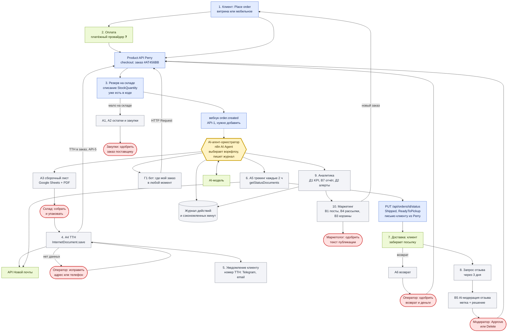
```mermaid
flowchart TB
  classDef human fill:#ffe1e1,stroke:#d43b3b,color:#5a1010,stroke-width:2px
  classDef perry fill:#e3ecff,stroke:#2f5fd0,color:#10224f
  classDef ext fill:#eef9d6,stroke:#6a9a12,color:#243400
  classDef ai fill:#fff3c4,stroke:#c79a00,color:#3d2f00,stroke-width:3px
  classDef wf fill:#f3f4f8,stroke:#6b7280,color:#1f2937

  C1["1. Клиент: Place order<br/>витрина или мобильное"]:::perry
  PAY["2. Оплата<br/>платёжный провайдер ❓"]:::ext
  API["Product API Perry<br/>checkout: заказ #AT456BB"]:::perry
  RES["3. Резерв на складе<br/>списание StockQuantity<br/>уже есть в коде"]:::perry
  EVT["вебхук order.created<br/>API-1, нужно добавить"]:::perry

  ORC{{"AI-агент-оркестратор<br/>n8n AI Agent<br/>выбирает воркфлоу,<br/>пишет журнал"}}:::ai

  WA3["А3 сборочный лист<br/>Google Sheets + PDF"]:::wf
  PICK(["Склад: собрать<br/>и упаковать"]):::human
  WA4["4. А4 ТТН<br/>InternetDocument.save"]:::wf
  NP["API Новой почты"]:::ext
  FIX(["Оператор: исправить<br/>адрес или телефон"]):::human
  NOTI["5. Уведомление клиенту<br/>номер ТТН: Telegram, email"]:::wf
  WA5["6. А5 трекинг каждые 2 ч<br/>getStatusDocuments"]:::wf
  ST["PUT /api/orders/id/status<br/>Shipped, ReadyToPickup<br/>письмо клиенту из Perry"]:::perry
  DEL["7. Доставка: клиент<br/>забирает посылку"]:::ext
  BOT["Г1 бот: где мой заказ<br/>в любой момент"]:::wf
  RET["А6 возврат"]:::wf
  RETH(["Оператор: одобрить<br/>возврат и деньги"]):::human
  REV["8. Запрос отзыва<br/>через 3 дня"]:::wf
  MOD["В5 AI-модерация отзыва<br/>метка + решение"]:::wf
  MODH(["Модератор: Approve<br/>или Delete"]):::human
  AN["9. Аналитика<br/>Д1 KPI, В7 отчёт, Д2 алерты"]:::wf
  MK["10. Маркетинг<br/>В1 посты, В4 рассылки, В3 корзины"]:::wf
  MKH(["Маркетолог: одобрить<br/>текст публикации"]):::human
  STK["А1, А2 остатки и закупки"]:::wf
  STKH(["Закупки: одобрить<br/>заказ поставщику"]):::human
  LLM["AI-модель"]:::ext
  LOG[("Журнал действий<br/>и сэкономленных минут")]:::wf

  C1 --> PAY --> API
  C1 --> API
  API --> RES --> EVT -.-> ORC
  ORC --> WA3 --> PICK --> WA4
  WA4 --> NP
  WA4 -->|"нет данных"| FIX --> WA4
  WA4 -->|"ТТН в заказ, API-5"| API
  WA4 --> NOTI
  ORC --> WA5 --> NP
  WA5 --> ST --> DEL
  DEL -->|"возврат"| RET --> RETH --> API
  DEL --> REV --> MOD --> MODH --> API
  ORC --> BOT
  BOT -->|"HTTP Request"| API
  ORC --> AN --> MK --> MKH
  MK -->|"новый заказ"| C1
  RES -->|"мало на складе"| STK --> STKH
  ORC <--> LLM
  ORC --> LOG
  AN --> LOG
```

### <a id="final-steps"></a>19.1. По шагам

1. **Заказ.** Клиент нажимает Place order на [checkout](#scr-checkout) или в [мобильном](#scr-mobile). Perry создаёт заказ с номером вида `#AT456BB` ([OrderService.cs](https://github.com/Teslyar75/My_Amazon2/blob/bcaec5fc8ab617830197b5fe69a976c6f214cb3e/src/Perry.Infrastructure/Services/OrderService.cs#L303-L321)). Чтобы дальше всё работало, на checkout нужны телефон и отделение НП ([API-5](#api-5), [G1](#growth)).
2. **Оплата.** Сейчас оплата демонстрационная ([G2](#growth)). В бою провайдер шлёт вебхук «оплачено», и заказ идёт дальше ❓ ([вопрос 10](#q10)).
3. **Резерв на складе.** Perry уже проверяет и списывает остаток, на нуле ставит `OutOfStock` ([код](https://github.com/Teslyar75/My_Amazon2/blob/bcaec5fc8ab617830197b5fe69a976c6f214cb3e/src/Perry.Infrastructure/Services/OrderService.cs#L344-L351)). Если остаток стал мал, оркестратор запускает [А2](#a2) → **человек одобряет закупку**.
4. **Накладная.** Событие [`order.created`](#api-1) попадает к оркестратору. Он запускает [А3](#a3) (сборочный лист → **склад собирает**), затем [А4](#a4) (ТТН через API НП). Нет данных → **оператор исправляет**.
5. **Уведомления.** Номер ТТН сохраняется в заказ и уходит клиенту в Telegram или по email ([А4](#a4), шаг 9). Письмо о смене статуса Perry шлёт сам ([код](https://github.com/Teslyar75/My_Amazon2/blob/bcaec5fc8ab617830197b5fe69a976c6f214cb3e/src/Perry.Infrastructure/Services/OrderService.cs#L387-L403)).
6. **Трекинг.** Каждые 2 часа [А5](#a5) спрашивает НП и двигает статус в Perry. В любой момент клиент может спросить [бота](#g1).
7. **Доставка.** Клиент забирает посылку. Возврат идёт по [А6](#a6) → **оператор одобряет деньги**.
8. **Запрос отзыва.** Через 3 дня после «получено» клиент получает просьбу оставить отзыв. Новый отзыв проходит [AI-модерацию](#v5) → **модератор подтверждает** в [админке](#scr-admin-reviews).
9. **Аналитика.** Всё, что произошло, попадает в [журнал](#agents-audit), [KPI-дайджест](#d1), [отчёт маркетинга](#v7) и [алерты](#d2).
10. **Маркетинг.** Из аналитики рождаются посты, рассылки и напоминания о корзине ([В1](#v1), [В4](#v4), [В3](#v3)) → **маркетолог одобряет** → клиент возвращается и делает новый заказ (шаг 1).

**Сколько человека остаётся в этом цикле:** собрать коробку, одобрить закупки, возвраты, публикации и спорные отзывы. Всё остальное — набор данных, переписывание и ответы на одни и те же вопросы — делает система. Это и есть те ≈ 362 часа в месяц из [раздела 14](#effect).

<p class="navlinks"><a href="#toc">↑ к оглавлению</a> · <a href="#sources">→ далее: Источники</a></p>

---

## <a id="sources"></a>20. Источники

**Проект Perry** (коммит `bcaec5f`):
- Репозиторий [Teslyar75/My_Amazon2](https://github.com/Teslyar75/My_Amazon2) и зеркало [ITSTEP-PERRY/Back_end_for_our_poroject](https://github.com/ITSTEP-PERRY/Back_end_for_our_poroject).
- [README.md](https://github.com/Teslyar75/My_Amazon2/blob/bcaec5fc8ab617830197b5fe69a976c6f214cb3e/README.md), [docs/README.md](https://github.com/Teslyar75/My_Amazon2/blob/bcaec5fc8ab617830197b5fe69a976c6f214cb3e/docs/README.md), [docs/стыки/AUTH-INTEGRATION.md](https://github.com/Teslyar75/My_Amazon2/blob/bcaec5fc8ab617830197b5fe69a976c6f214cb3e/docs/%D1%81%D1%82%D1%8B%D0%BA%D0%B8/AUTH-INTEGRATION.md), [project_defense/DEFENSE_BACKEND.md](https://github.com/Teslyar75/My_Amazon2/blob/bcaec5fc8ab617830197b5fe69a976c6f214cb3e/project_defense/DEFENSE_BACKEND.md).
- Скриншоты: [docs/screenshots/2026-10-04](https://github.com/Teslyar75/My_Amazon2/tree/bcaec5fc8ab617830197b5fe69a976c6f214cb3e/docs/screenshots/2026-10-04) (43 кадра); кадры спринта 19.09.2026 и мобильный скрин — из локальной копии `D:\Perry\My_Amazon2`.
- Диаграммы защиты: [project_defense/views_project](https://github.com/Teslyar75/My_Amazon2/tree/bcaec5fc8ab617830197b5fe69a976c6f214cb3e/project_defense/views_project) (18 PNG).

**Вакансия:** [work.ua/jobs/8532037](https://www.work.ua/jobs/8532037/) — AI Automation, Process Optimization Specialist, Race Expert (проверено 06.10.2026).

**Инструменты и API:**
- n8n: [цены](https://n8n.io/pricing/), [документация](https://docs.n8n.io/).
- Make: [цены](https://www.make.com/en/pricing), [изменения тарифов](https://help.make.com/adjustments-to-plans-and-pricing), обзор цен [jetadmin.io](https://www.jetadmin.io/blog/make-pricing/).
- «Новая почта»: [API для Украины](https://api-portal.novapost.com/methods/ua/api-docs-ua/eng), [трекинг](https://api-portal.novapost.com/methods/ua/api-docs-ua/ua/treking), [экспресс-накладная](https://api-portal.novapost.com/methods/ua/api-docs-ua/ua/ekspres-nakladna), [как получить ключ](https://novaposhta.ua/en/for-business/cooperation/integration/).
- OpenAI: [цены API](https://developers.openai.com/api/docs/pricing).

<p class="navlinks"><a href="#toc">↑ к оглавлению</a> · <a href="#glossary">→ далее: Глоссарий</a></p>

---

## <a id="glossary"></a>21. Глоссарий

| Термин | Простыми словами |
|---|---|
| <a id="g-ai"></a>**AI** (Artificial Intelligence) | искусственный интеллект; здесь — языковые модели, которые пишут тексты и понимают вопросы |
| <a id="g-llm"></a>**LLM** (Large Language Model) | большая языковая модель, «мозг» AI-агента (например, модели OpenAI) |
| <a id="g-api"></a>**API** (Application Programming Interface) | «вход» в программу для других программ: запрос по адресу → ответ в JSON |
| <a id="g-endpoint"></a>**Эндпоинт** (endpoint) | один конкретный адрес API, например `GET /api/orders` |
| <a id="g-webhook"></a>**Вебхук** (webhook) | «звонок» от одной системы другой: «случилось событие, вот данные». Обратное к опросу по расписанию |
| <a id="g-n8n"></a>**n8n** | конструктор автоматизаций из блоков-узлов; можно поставить на свой сервер |
| <a id="g-make"></a>**Make** | облачный конструктор автоматизаций, похожий на n8n, оплата за действия |
| <a id="g-workflow"></a>**Воркфлоу** (workflow) | цепочка шагов автоматизации в n8n; в Make называется «сценарий» |
| <a id="g-node"></a>**Узел** (node) | один блок воркфлоу: Webhook, HTTP Request, IF, Code, Telegram… |
| <a id="g-trigger"></a>**Триггер** (trigger) | узел, который запускает воркфлоу: по расписанию (Schedule Trigger), по вебхуку, по сообщению |
| <a id="g-execution"></a>**Execution** | один запуск воркфлоу n8n целиком; единица оплаты в облаке n8n |
| <a id="g-credit"></a>**Credit** (Make) | единица оплаты в Make: одно действие одного модуля |
| <a id="g-self-host"></a>**Self-host** | поставить программу на свой сервер, а не пользоваться чужим облаком |
| <a id="g-jwt"></a>**JWT** (JSON Web Token) | подписанный «пропуск» с данными пользователя (id, роль), который выдаёт Auth-сервис |
| <a id="g-swagger"></a>**Swagger** | страница с описанием всех эндпоинтов API, где их можно попробовать |
| <a id="g-spa"></a>**SPA** (Single Page Application) | сайт, который загружается один раз и дальше меняет экраны без перезагрузки |
| <a id="g-sku"></a>**SKU** | артикул, уникальный код товара (на [рис. 3](#scr-product) — DJ-088) |
| <a id="g-facet"></a>**Фасет** (facet) | фильтр каталога по характеристике: бренд, ткань, размер, цвет |
| <a id="g-ttn"></a>**ТТН** | товарно-транспортная накладная «Новой почты», номер посылки для трекинга |
| <a id="g-seo"></a>**SEO** | оптимизация под поисковики: заголовки, описания, ключевые слова |
| <a id="g-utm"></a>**UTM** | метки в ссылке, по которым видно, откуда пришёл покупатель |
| <a id="g-crm"></a>**CRM** | система учёта клиентов и сделок |
| <a id="g-kpi"></a>**KPI** | ключевые показатели: заказы, выручка, средний чек, отмены |
| <a id="g-prompt"></a>**Промпт** (prompt) | инструкция для AI-модели: роль, задача, правила |
| <a id="g-hallucination"></a>**Галлюцинация** | когда AI уверенно пишет то, чего нет в данных |
| <a id="g-prompt-injection"></a>**Prompt injection** | попытка через текст сообщения заставить AI нарушить правила («забудь инструкции и…») |
| <a id="g-rag"></a>**RAG** | AI отвечает, сначала найдя подходящие куски в базе знаний |
| <a id="g-orchestrator"></a>**Оркестратор** | главный AI-агент, который сам решает, какие воркфлоу вызвать, и собирает результат |
| <a id="g-mcp"></a>**MCP** (Model Context Protocol) | стандарт, по которому AI-агент подключает внешние инструменты |
| <a id="g-hitl"></a>**Human-in-the-loop (HITL)** | «человек в контуре»: автоматизация готовит, человек одобряет |
| <a id="g-hmac"></a>**HMAC-подпись** | секретная подпись запроса: получатель проверяет, что вебхук пришёл именно от Perry |
| <a id="g-idempotency"></a>**Идемпотентность** | повтор одного и того же запроса не создаёт дубль (вторую ТТН) |
| <a id="g-quickwin"></a>**Quick win** | быстрая победа: дешёвая задача с заметным эффектом |

<p class="navlinks"><a href="#toc">↑ к оглавлению</a> · <a href="#short">→ к началу: Коротко</a></p>

