# Скриншоты Perry (для README)

Скриншоты рабочей витрины и админки (`http://localhost:5122`).  
Картинки товаров в seed — placeholder с picsum.photos (для демо бэкенда).

---

## 1. Главная страница

**Файл:** [`01-home.png`](./01-home.png)  
**URL:** `/`

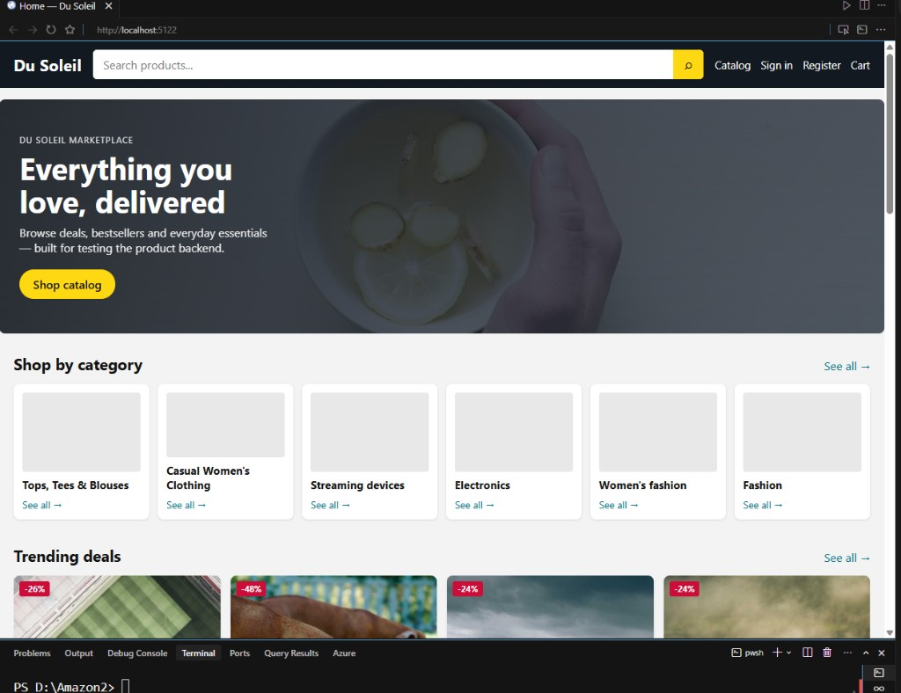

Hero «Everything you love, delivered», блок Shop by category, Trending deals. Шапка: поиск, Catalog, Sign in, Register, Cart.

---

## 2. Каталог (Product List)

**Файл:** [`02-catalog.png`](./02-catalog.png)  
**URL:** `/Products`

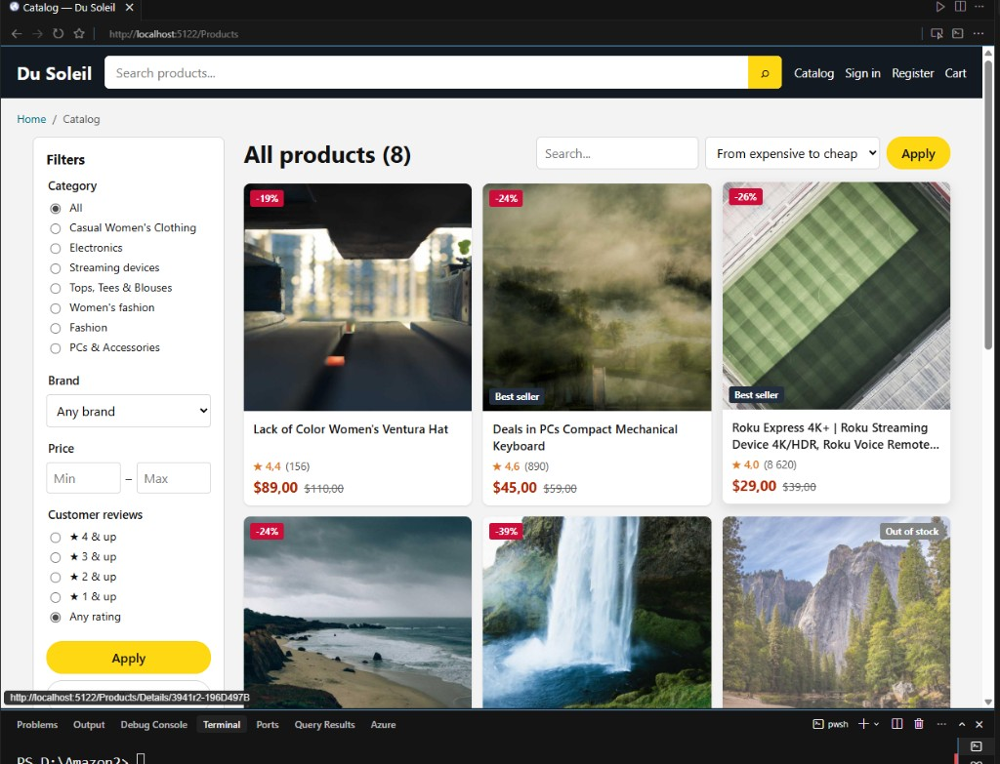

Сайдбар фильтров: Category, Brand, Price, Customer reviews. Сетка товаров со скидками, рейтингом, бейджами Best seller / Out of stock.

---

## 3. Вход покупателя

**Файл:** [`03-login.png`](./03-login.png)  
**URL:** `/Account/Login`

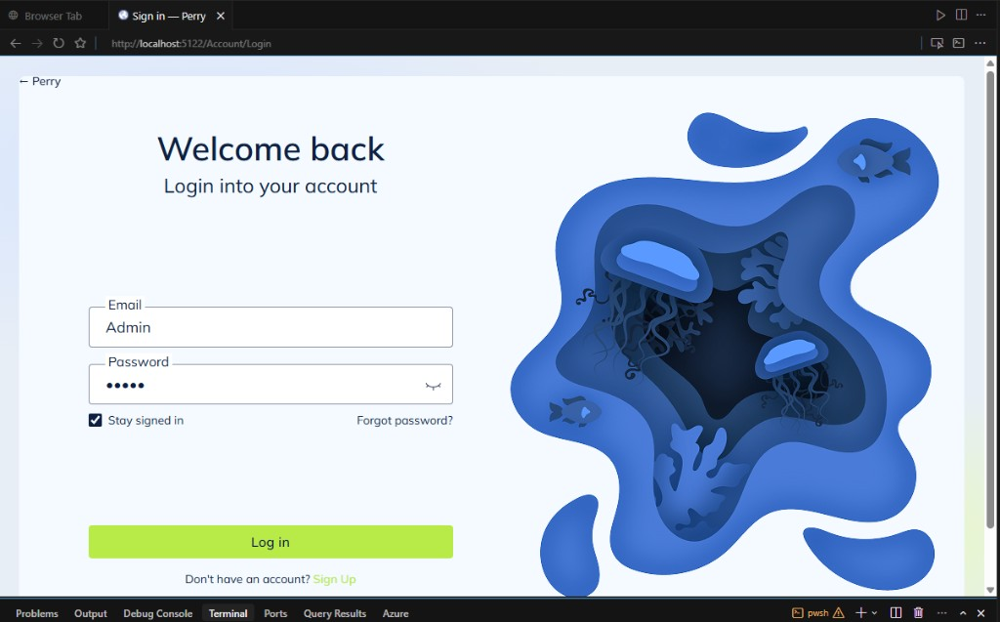

UI из perry-front: «Welcome back», Email / Password, Stay signed in, кнопка Log in, иллюстрация справа. Layout `_AuthLayout` (без старой Amazon-шапки).

---

## 4. Админ — Dashboard

**Файл:** [`04-admin-dashboard.png`](./04-admin-dashboard.png)  
**URL:** `/Admin`

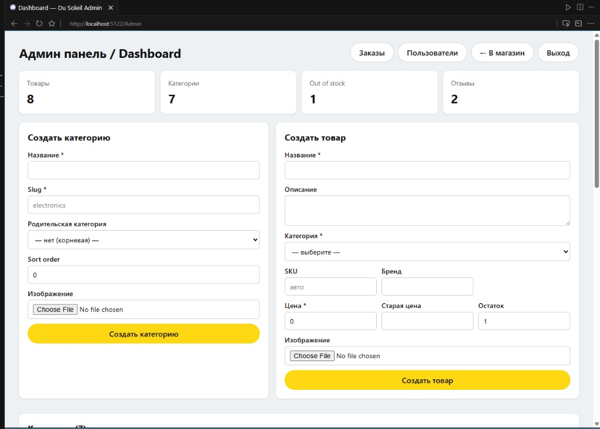

Статистика (товары, категории, out of stock, отзывы). Формы «Создать категорию» и «Создать товар». Ссылки: Заказы, Пользователи, В магазин, Выход.

---

## 5. Админ — списки категорий и товаров

**Файл:** [`05-admin-catalog.png`](./05-admin-catalog.png)  
**URL:** `/Admin` (нижняя часть)

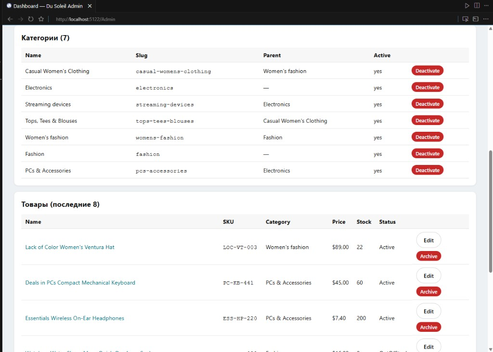

Таблица категорий (Deactivate) и товаров (Edit / Archive).

---

## 6. Админ — пользователи

**Файл:** [`06-admin-users.png`](./06-admin-users.png)  
**URL:** `/Admin/Users`

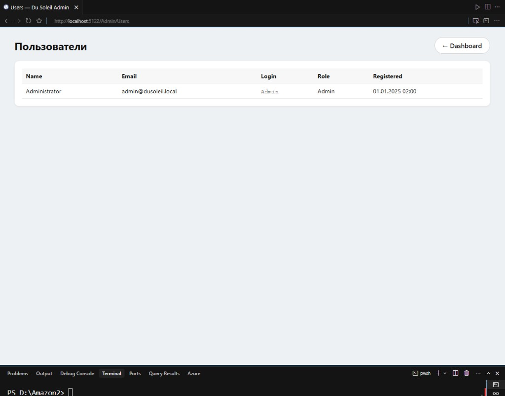

Список пользователей: Name, Email, Login, Role, Registered (seed Admin).

---

## 7. Карточка товара (PDP)

**Файл:** [`07-product-details.png`](./07-product-details.png)  
**URL:** `/Products/Details/{id}`

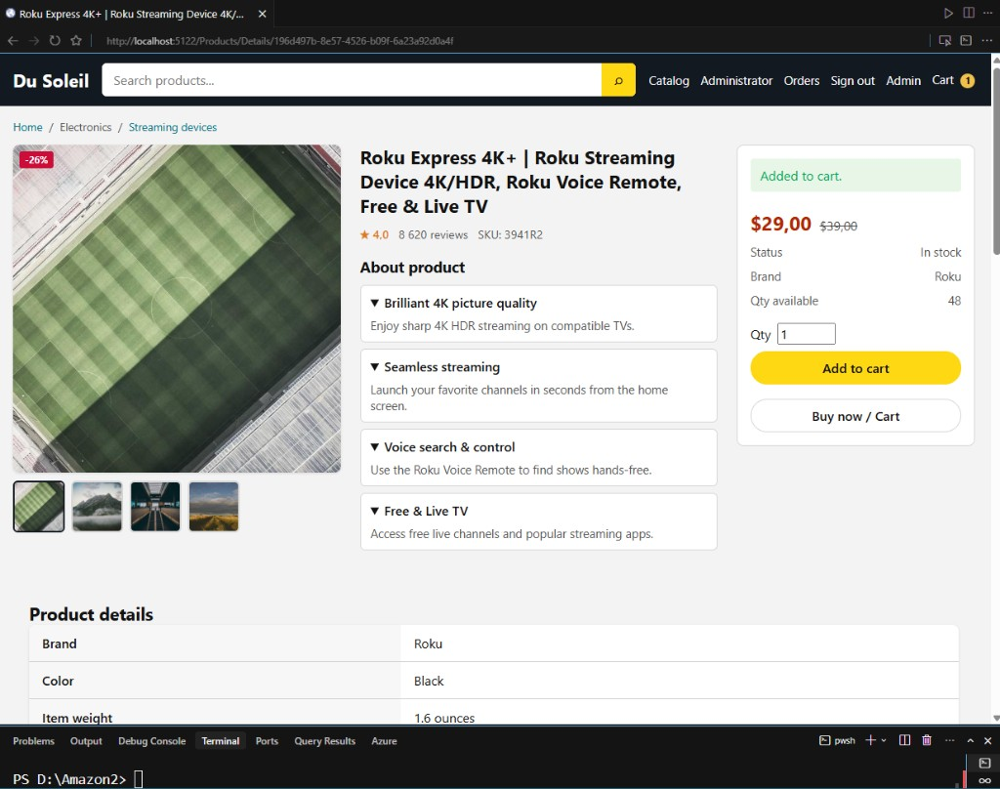

Галерея, About product, цена/скидка, Add to cart («Added to cart»), specs (Brand, Color, Weight). Корзина в шапке с бейджем.

---

## 8. Корзина (обновление количества)

**Файл:** [`08-cart-update.png`](./08-cart-update.png)  
**URL:** `/Cart`

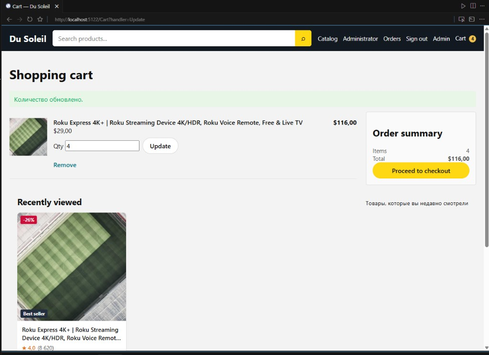

Сообщение «Количество обновлено», Qty / Update / Remove, Order summary, Proceed to checkout, блок Recently viewed.

---

## 9. Профиль

**Файл:** [`09-profile.png`](./09-profile.png)  
**URL:** `/Account/Profile`

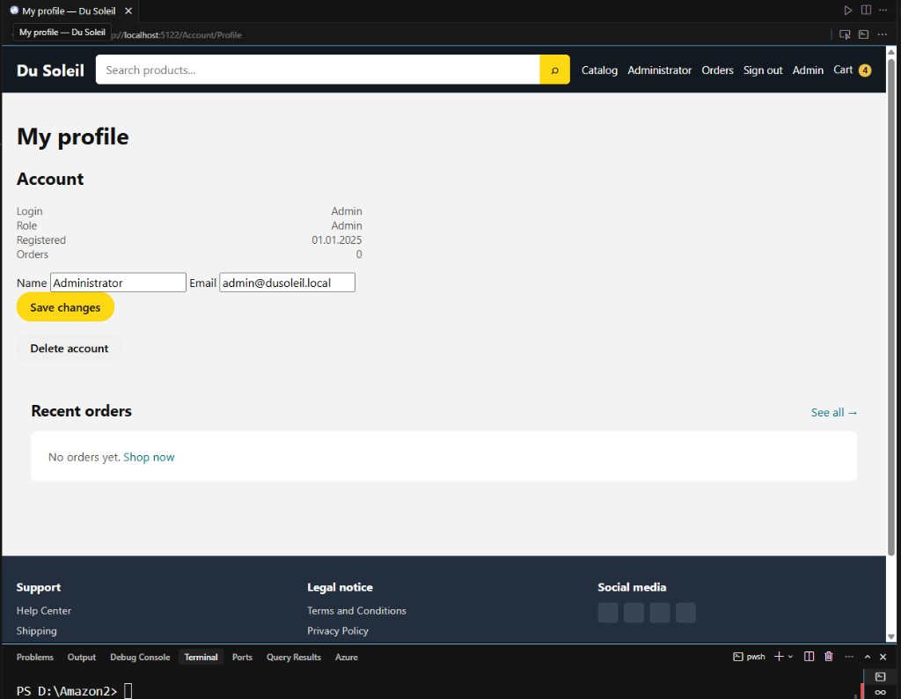

Данные аккаунта, правка Name/Email, Save changes, Delete account, Recent orders.

---

## 10. Рекомендации на PDP

**Файл:** [`10-related-products.png`](./10-related-products.png)  
**URL:** `/Products/Details/...` (блоки внизу)

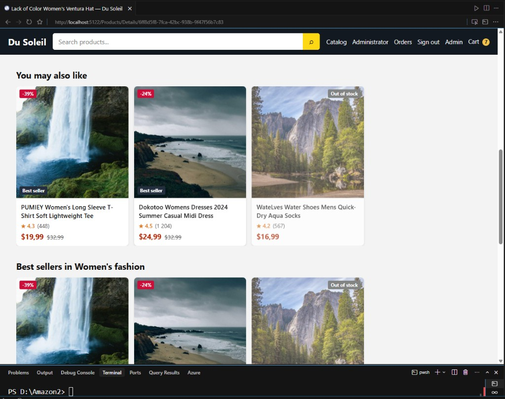

Секции «You may also like» и «Best sellers in …» с бейджами скидки / Out of stock.

---

## 11. Корзина (несколько позиций)

**Файл:** [`11-cart-full.png`](./11-cart-full.png)  
**URL:** `/Cart`

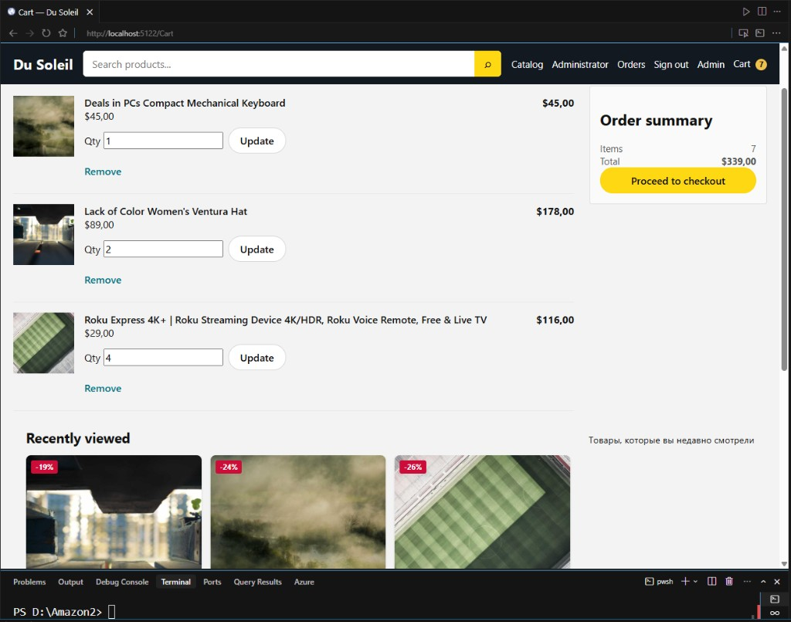

Несколько товаров, итог Items / Total, checkout, Recently viewed под корзиной.
